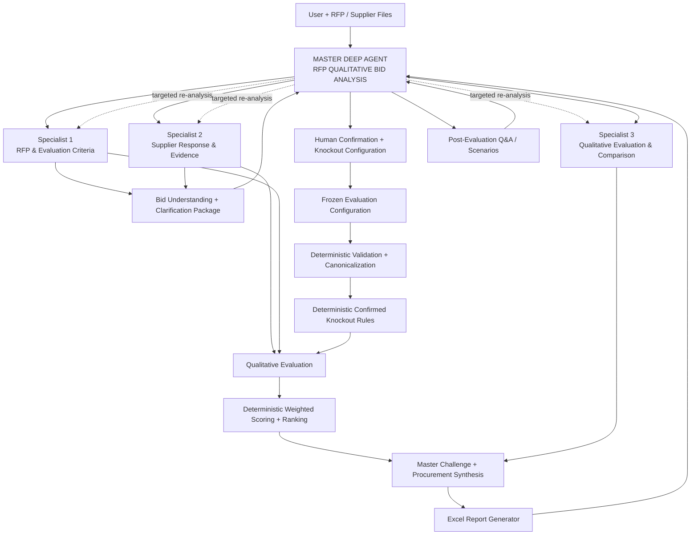

# 03. Solution Overview

**Document Version:** 1.2

**Status:** Deep Agent + Human-in-the-Loop Architecture Baseline

**Parent Document:** Software Design Specification (SDS)

---

# Purpose

This chapter defines the high-level architecture of the RFP Qualitative Bid Analysis Agent.

The solution uses one **Master Deep Agent** and three direct specialist sub-agents. The Master plans and orchestrates work dynamically; specialist agents perform bounded semantic tasks; deterministic processing performs validation, confirmed knockout rules, calculations and ranking.

A formal **Bid Understanding / Human Confirmation Gate** occurs between discovery and evaluation.

---

# Core Architecture



**Important:** the three specialist agents are not a fixed three-step pipeline. The Master decides which specialists are required and whether independent tasks can run in parallel. The Master has at most three direct specialist sub-agents in this V1 architecture.

---

# Architectural Layers

## Layer 1 — Master Deep Agent

Owns:

- user intent
- planning
- task decomposition
- delegation
- tool selection
- dependency management
- reconciliation
- clarification package creation
- specialist challenge/QC
- final synthesis

It does not own deterministic arithmetic, ranking or silent modification of confirmed business rules.

## Layer 2 — Specialist Agents

### Specialist 1 — RFP & Evaluation Criteria Analyst

Answers: **What are we supposed to evaluate?**

Extracts sections, questions, criteria, weights, scoring rubric, candidate knockouts, acceptance-condition candidates and provenance.

### Specialist 2 — Supplier Response & Evidence Analyst

Answers: **What did each supplier actually submit?**

Extracts supplier identity, responses, evidence, source locations, missing responses and mapping confidence. Supplier wording is preserved.

### Specialist 3 — Qualitative Evaluation & Comparison Analyst

Answers: **How well does each supplier perform against the confirmed framework?**

Produces qualitative assessments, evidence-backed score recommendations, strengths, weaknesses, risks, gaps and differentiators.

## Layer 3 — Human Configuration Gate

The system presents its current understanding and asks the human evaluator to:

- confirm/correct the understanding
- confirm or modify scoring/weighting assumptions
- confirm/remove candidate knockouts
- add missing knockout requirements
- define/confirm acceptance conditions
- provide material special instructions

## Layer 4 — Deterministic Evaluation

Performs:

1. validation
2. canonical mapping
3. confirmed knockout execution
4. deterministic score calculations
5. weighting
6. ranking

## Layer 5 — Master Synthesis + Reporting

The Master interprets the structured results and produces procurement-level conclusions. The report generator only renders the approved result into the standard workbook format.

---

# Operating Principle

```text
DISCOVER
   ↓
EXPLAIN WHAT WAS UNDERSTOOD
   ↓
HUMAN CONFIRMS / CORRECTS
   ↓
CONFIGURE KNOCKOUTS
   ↓
FREEZE EVALUATION CONFIGURATION
   ↓
EVALUATE
   ↓
VALIDATE / APPLY RULES / CALCULATE / RANK
   ↓
MASTER CHALLENGES RESULTS
   ↓
SYNTHESIZE
   ↓
REPORT
```

---

# Human-Governed Knockout Principle

The architecture deliberately separates three responsibilities:

```text
AI discovers candidate knockout requirements
        ↓
Human confirms the business rule
        ↓
Deterministic logic executes the confirmed rule
```

The agent shall never convert a merely preferred requirement into a knockout without human confirmation.

If the human confirms that no knockouts apply, the configuration explicitly contains an empty knockout rule set.

---

# Bid Clarification Package

Before evaluation, the Master produces a structured package containing:

- uploaded files and inferred roles
- supplier identities
- evaluation sections/questions
- scoring scale and rubric detected
- detected weights
- potential knockout candidates
- proposed acceptance conditions where inferable
- source references
- explicit vs inferred information
- material ambiguities
- missing information
- items requiring human confirmation

The package is the human governance checkpoint, not the final evaluation.

---

# Deterministic Boundary

The LLM is not authoritative for:

- arithmetic
- weighted-score calculations
- ranking
- confirmed knockout execution
- changing an approved rule

The LLM is authoritative only within its assigned semantic responsibilities and must provide evidence/provenance for material judgements.

---

# Report Contract

The standard output workbook contains exactly four primary tabs for V1:

1. **Executive Summary**
2. **Supplier Profiles**
3. **Q&A Scorecard**
4. **Score Legend**

The report generator shall preserve the approved reference workbook's visual hierarchy and formatting logic, including title bands, section bands, supplier headers, wrapped text, score presentation, strengths/weaknesses blocks and dynamic scaling.

The Score Legend shall describe the methodology actually used for the evaluation run. It shall not contain a generic claim that scoring was based on LLM domain benchmarks unless that was explicitly approved.

---

# Dynamic Execution Cases

| User request | Master behaviour |
|---|---|
| Explain RFP criteria | Use Criteria Specialist only if required |
| Extract supplier responses | Use Supplier Specialist |
| Full bid analysis | Criteria + Supplier, then Evaluation Specialist |
| Compare already-evaluated suppliers | Use stored evaluation state; avoid re-extraction |
| Change weights | Create a new evaluation scenario and deterministically recalculate |
| Clarify knockout ambiguity | Return to human configuration gate |
| Missing source information | Request only the affected input/information |

---

# Architecture Constraints

- One Master Deep Agent.
- Maximum three direct specialist sub-agents in V1.
- Specialists have bounded responsibilities.
- Human confirmation is mandatory before the first evaluation run is frozen.
- Confirmed configuration is immutable during that run.
- Deterministic calculations and ranking are outside LLM authority.
- Source data is preserved.
- Provenance and material uncertainty are retained.
- Reporting does not perform evaluation logic.

---

# Summary

The solution is a **Human-Governed Agentic Bid Evaluation system**:

> **AI interprets the evidence. Human confirms the evaluation rules. Deterministic logic executes the decision. AI explains the outcome.**

This is the Version 1.2 architectural baseline.
