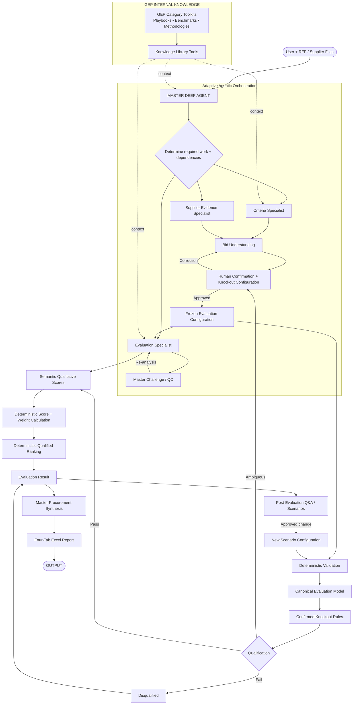

# 03. Solution Overview

**Document Version:** 1.3

**Status:** Deep Agent + GEP Knowledge + Human-in-the-Loop Architecture Baseline

## Purpose

The RFP Qualitative Bid Analysis Agent uses one Master Deep Agent, three bounded specialist sub-agents, GEP Knowledge Library tools, a formal Bid Understanding/Human Confirmation Gate and deterministic evaluation processing.

## Core Architecture



The three specialists are not a fixed sequential pipeline. The Master dynamically selects them and may run independent work in parallel.

## GEP Knowledge Layer

GEP category toolkits and internal knowledge are exposed through the Knowledge Library tools. They are a **domain-context capability**, not a fourth agent.

Knowledge may provide:

- category context
- approved methodologies
- evaluation guidance
- benchmarks
- best-practice references
- procurement terminology
- negotiation context

The knowledge layer must never silently override the RFP or human-confirmed evaluation configuration.

```text
GEP Knowledge
     ↓
Context / Benchmark / Guidance
     ↓
AI Interpretation
     ↓
Human Confirmation if business-rule impact exists
     ↓
Evaluation Configuration
```

## Authority Model

```text
1. Human-confirmed Evaluation Configuration — run authority
2. RFP / sourcing documents — source evaluation requirements
3. GEP Knowledge — contextual guidance and benchmarks
4. AI inference — only where supported and non-authoritative
```

Supplier evidence remains source truth and is not supplemented by GEP knowledge during extraction.

## Architectural Layers

### Layer 1 — Master Deep Agent

Intent, planning, delegation, tool/knowledge selection, dependencies, reconciliation, HITL, challenge/QC and final synthesis.

### Layer 2 — Specialist Agents

**Criteria:** what are we evaluating?

**Supplier:** what did each supplier actually submit?

**Evaluation:** how well does each supplier perform against the confirmed framework?

### Layer 3 — Knowledge Capability

Relevant GEP internal knowledge retrieved through Knowledge Library tools.

### Layer 4 — Human Configuration Gate

Human confirms the agent's understanding, scoring/weights and knockout requirements.

### Layer 5 — Deterministic Evaluation

Validation, canonical mapping, confirmed knockout execution, arithmetic, weighting and ranking.

### Layer 6 — Synthesis + Reporting

Master explains the results; the report generator renders the approved results.

## Operating Principle

```text
DISCOVER
   ↓
ENRICH WITH RELEVANT GEP KNOWLEDGE
   ↓
EXPLAIN WHAT WAS UNDERSTOOD
   ↓
HUMAN CONFIRMS / CORRECTS
   ↓
CONFIGURE KNOCKOUTS
   ↓
FREEZE CONFIGURATION
   ↓
SEMANTIC EVALUATION
   ↓
DETERMINISTIC RULES / CALCULATIONS / RANKING
   ↓
MASTER CHALLENGE
   ↓
SYNTHESIS
   ↓
REPORT
```

## Human-Governed Knockout Principle

```text
AI discovers candidate knockout requirements
        ↓
Human confirms the business rule
        ↓
Deterministic logic executes the confirmed rule
```

If the human confirms no knockouts, the rule set is explicitly empty.

## Deterministic Boundary

Semantic supplier assessment is AI reasoning and therefore not mathematically deterministic. Once the human-confirmed configuration and structured semantic score outputs are fixed, all validation, knockout execution, arithmetic, weighting and ranking are deterministic and reproducible.

## Report Contract

Exactly four primary tabs:

1. **Executive Summary**
2. **Supplier Profiles**
3. **Q&A Scorecard**
4. **Score Legend**

Formatting follows the approved reference workbook. The report generator cannot alter evaluation logic.

## Dynamic Execution Cases

| Request | Behaviour |
|---|---|
| RFP criteria | Criteria Specialist + relevant knowledge |
| Supplier extraction | Supplier Specialist, source-first |
| Full bid analysis | Criteria + Supplier → HITL → Evaluation + knowledge |
| Compare evaluated suppliers | Stored evaluation state |
| Explain score | Stored result + relevant evidence/knowledge |
| Change weight | New scenario + deterministic recalculation |
| Ambiguous knockout | Human configuration gate |
| Missing source information | Targeted clarification/retrieval |

## Summary

> **AI interprets supplier evidence using the confirmed framework and relevant GEP knowledge. Human confirms material evaluation rules. Deterministic logic executes the decision. AI explains the outcome.**

This is the Version 1.3 architecture baseline.
