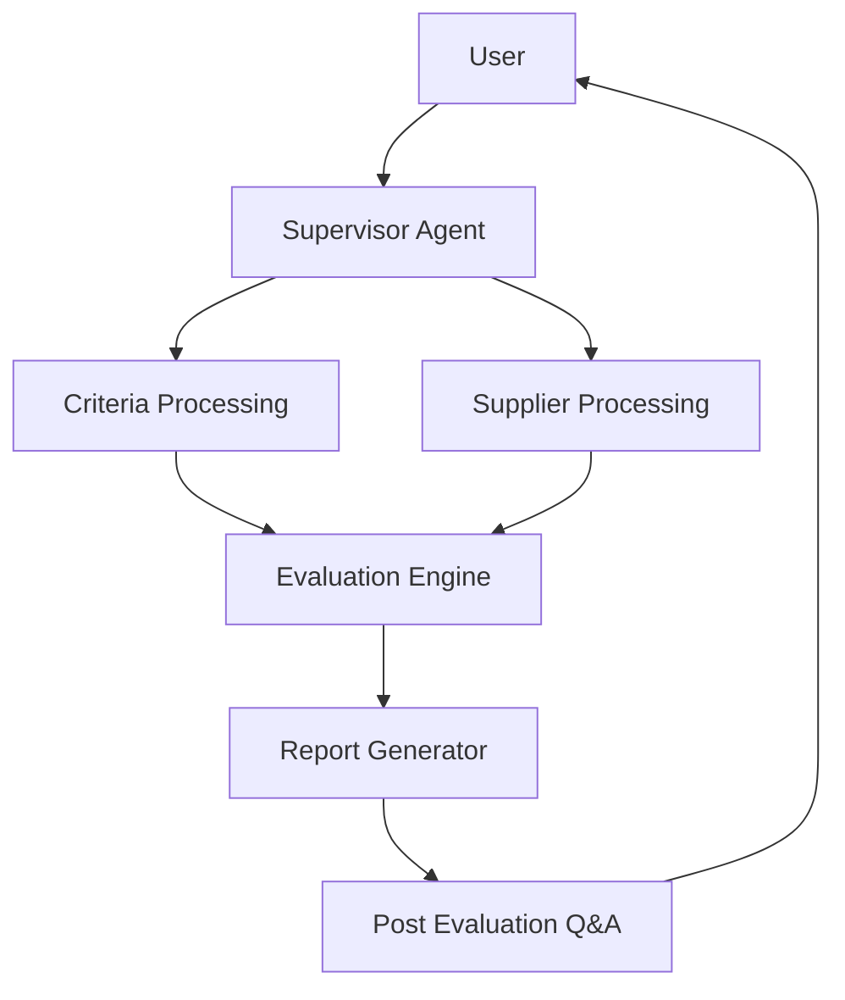
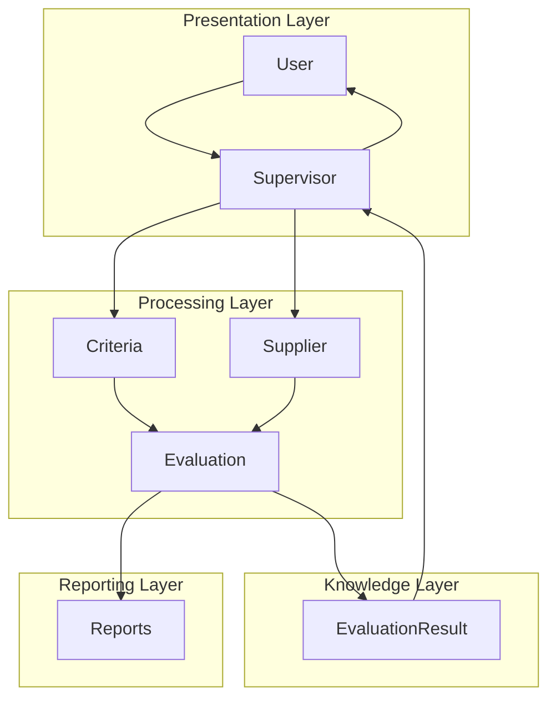
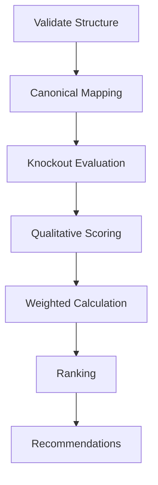
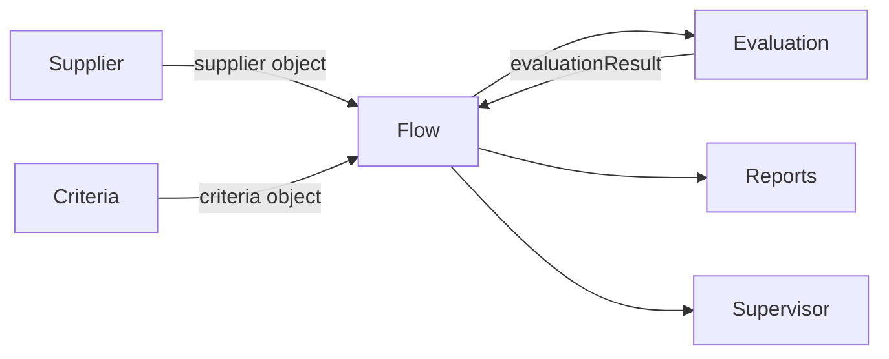
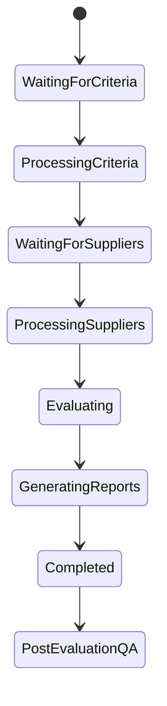
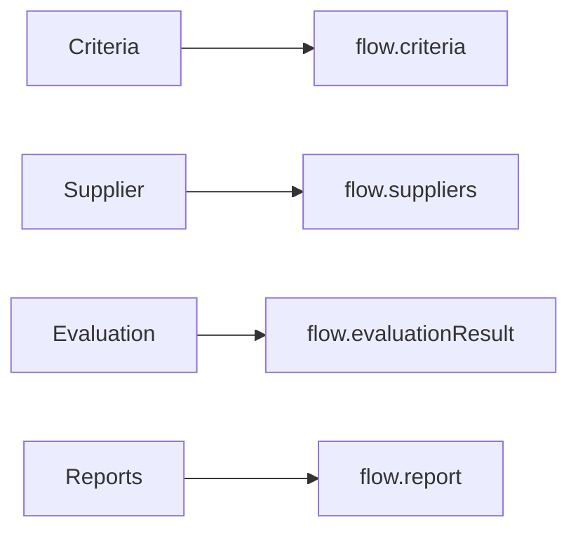
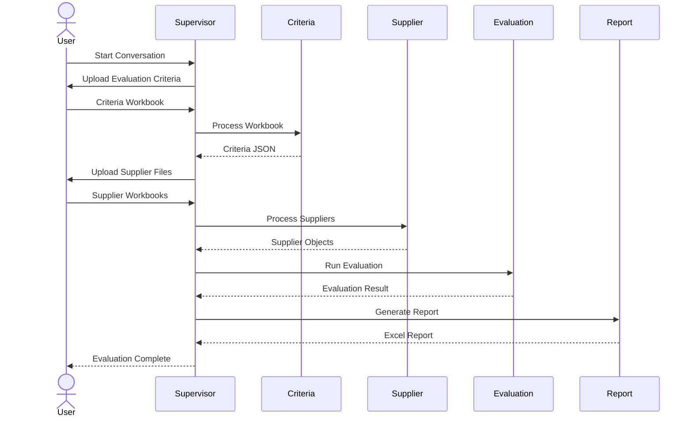

# 04. System Architecture

**Document Version:** 0.1

**Status:** Architecture Draft

**Parent Document:** Software Design Specification (SDS)

---

# Purpose

This document defines the complete system architecture of the RFP Qualitative Evaluation Agent.

It specifies:

- Major architectural components
- Responsibilities
- Interactions
- Information flow
- Ownership boundaries
- Processing lifecycle
- Architectural decisions

This chapter represents the highest-level technical view of the application.

Implementation details are intentionally excluded.

---

# Architectural Overview

The RFP Qualitative Evaluation Agent follows a modular, service-oriented architecture.

Each module owns one responsibility and communicates through explicit data contracts.

The application consists of three major layers.



---

# Layered Architecture

The solution is organised into four logical layers.



---

# Architectural Components

The solution contains six major components.

| Component | Responsibility |
|------------|----------------|
| Supervisor | Conversation orchestration |
| Criteria Processing | Extract evaluation criteria |
| Supplier Processing | Extract supplier responses |
| Evaluation Engine | Perform procurement evaluation |
| Report Generator | Produce deliverables |
| Post Evaluation Q&A | Answer analytical questions |

---

# Component Responsibilities

## Supervisor Agent

The Supervisor Agent is the only component that communicates directly with the user.

Responsibilities include:

- Greeting users
- Guiding conversations
- Collecting files
- Maintaining workflow state
- Initiating handoffs
- Returning results
- Managing follow-up questions

The Supervisor never performs procurement analysis.

---

## Criteria Processing

Responsible for transforming an uploaded Evaluation Criteria workbook into a structured JSON representation.

Produces

```

flow.criteria

```

Consumes

```

Evaluation Workbook

```

---

## Supplier Processing

Responsible for transforming supplier workbooks into structured supplier objects.

Produces

```

flow.suppliers[]

```

Consumes

```

Supplier Workbook

```

Each supplier workbook produces one supplier object.

---

## Evaluation Engine

The Evaluation Engine performs every procurement-specific activity.

Internal stages include:



The Evaluation Engine does not communicate with the user.

---

## Report Generator

Responsible for transforming evaluation results into consultant-ready deliverables.

Outputs include:

- Excel workbook
- Executive Summary
- Detailed Scorecards
- Comparative Rankings
- Recommendations

---

## Post Evaluation Q&A

Allows consultants to continue interacting with evaluation results after completion.

Example queries include:

- Compare suppliers
- Explain scores
- Regenerate rankings
- Modify weights
- Export reports

This module never performs extraction.

---

# Architectural Boundaries

Each component owns its internal implementation.

Components communicate only through Flow Variables.



Direct component-to-component communication is prohibited.

---

# Processing Lifecycle

The application progresses through several stages.



The Supervisor determines the current lifecycle stage using Flow Variables.

---

# Workflow Ownership

| Stage | Owner |
|---------|--------|
| Greeting | Supervisor |
| File Collection | Supervisor |
| Criteria Extraction | Criteria Processing |
| Supplier Extraction | Supplier Processing |
| Validation | Evaluation Engine |
| Scoring | Evaluation Engine |
| Ranking | Evaluation Engine |
| Reporting | Report Generator |
| Follow-up Questions | Supervisor + Q&A |

Ownership shall never overlap.

---

# Module Communication

Every module exchanges information through Flow Variables.



No module may directly inspect another module's internal implementation.

---

# High-Level Conversation Flow



---

# Design Constraints

The architecture intentionally enforces the following constraints.

## Single Responsibility

Each component performs exactly one responsibility.

---

## Explicit Data Contracts

Every component exchanges structured objects.

---

## Deterministic Processing

Business logic remains deterministic wherever possible.

---

## Explainable Decisions

Every recommendation must include supporting evidence.

---

## Conversation Isolation

Conversation management remains independent from procurement evaluation.

---

# Architectural Decisions

| Decision | Rationale |
|-----------|-----------|
| Supervisor controls workflow | Simplifies conversation management |
| Separate extraction modules | Different workbook structures |
| Canonical Mapping | Single source of truth |
| Deterministic validation | Repeatable outcomes |
| Separate Report Generator | Reporting independent of evaluation |
| Persistent Evaluation Result | Enables conversational follow-up |

---

# Summary

The RFP Qualitative Evaluation Agent is intentionally designed as a modular conversational system.

The Supervisor orchestrates the user experience.

Independent processing modules perform specialised responsibilities.

The Evaluation Engine provides deterministic, explainable procurement analysis.

The resulting architecture is scalable, maintainable, reusable and suitable for enterprise deployment.
