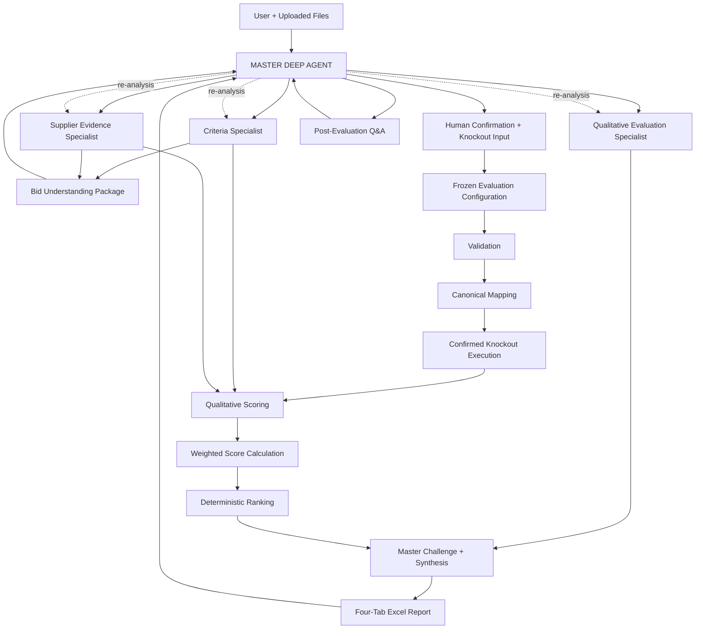
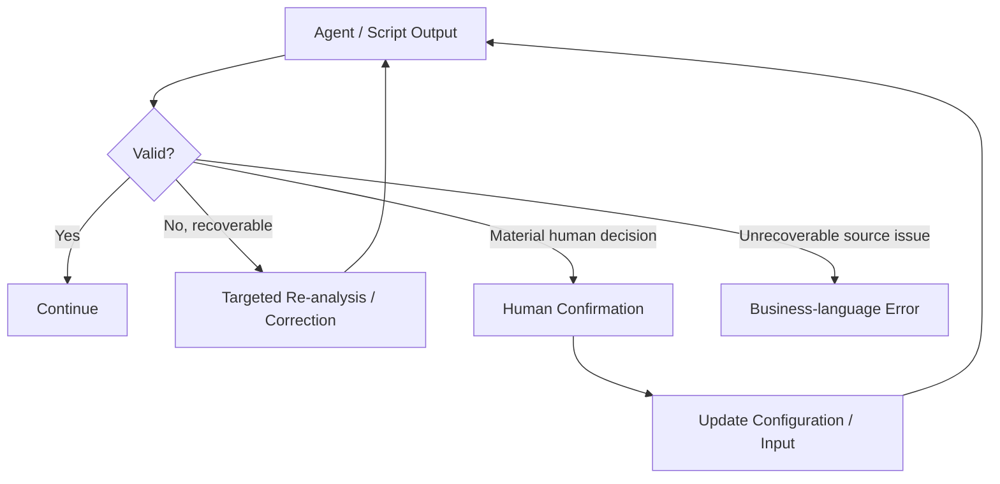

# 04. System Architecture

**Document Version:** 1.2

**Status:** Architecture Baseline Frozen

**Parent Document:** Software Design Specification (SDS)

---

# Purpose

This document defines the production architecture of the RFP Qualitative Bid Analysis Agent.

The architecture uses one Master Deep Agent with three direct specialist sub-agents, a formal human confirmation gate, explicit Flow Variable contracts and deterministic evaluation processing.

---

# Architectural Overview



---

# Component Model

| Component | Type | Primary responsibility |
|---|---|---|
| Master Deep Agent | Deep Agent | Planning, delegation, reconciliation, HITL, synthesis |
| Criteria Specialist | Sub-agent | RFP/evaluation framework understanding |
| Supplier Specialist | Sub-agent | Supplier response/evidence extraction |
| Evaluation Specialist | Sub-agent | Qualitative evaluation/comparison |
| Human Confirmation Gate | Conversation/control | Confirm evaluation understanding and knockout rules |
| Validation | Script | Deterministic structural validation |
| Canonical Mapping | Script | Deterministic normalized evaluation model |
| Knockout Execution | Script | Execute confirmed acceptance conditions |
| Qualitative Scoring | Agent | Semantic assessment against approved rubric |
| Weighted Calculation | Script | Deterministic arithmetic |
| Ranking | Script | Deterministic qualified ranking |
| Report Generator | Export capability | Render approved result into workbook |
| Post-Evaluation Q&A | Master/tool workflow | Explain and analyze stored results |

---

# Master Deep Agent

The Master owns:

- request interpretation
- execution planning
- dynamic specialist delegation
- tool use
- parallelism where tasks are independent
- dependency management
- bid-understanding synthesis
- human confirmation interaction
- specialist challenge/QC
- final procurement synthesis

The Master shall not silently alter a confirmed evaluation configuration.

The Master has at most three direct specialist sub-agents in this architecture.

---

# Specialist Boundaries

## Criteria Specialist

Input: discovered RFP/evaluation sources.

Output: criteria, sections, questions, weights, rubric, candidate knockouts, provenance and inference indicators.

No supplier scoring.

## Supplier Specialist

Input: discovered supplier sources.

Output: supplier identity, raw responses, evidence, provenance, unanswered questions and mapping confidence.

No evaluation, scoring or ranking.

## Evaluation Specialist

Input: confirmed evaluation framework + supplier evidence.

Output: qualitative assessments, score recommendations, rationale, evidence, strengths, weaknesses, risks and comparisons.

It does not execute arithmetic, weighting or ranking.

---

# Human Confirmation Gate

The first-pass output is a **Bid Clarification Package**.

The human evaluator confirms/corrects:

- file roles
- supplier identities
- evaluation sections/questions
- scoring scale/rubric
- weights
- candidate knockout requirements
- additional knockout requirements
- acceptance conditions
- material special instructions

The configuration is not considered executable until the human confirms it.

---

# Evaluation Configuration

`flow.evaluationConfiguration` is the authoritative business-rule object for one evaluation run.

It contains:

- configuration version
- approval status
- confirmed scoring methodology
- confirmed weights
- knockout rules
- acceptance conditions
- included/excluded criteria
- human confirmation metadata
- source/assumption notes

Once approved, it is frozen for that run.

A changed weighting or business rule creates a new scenario/version rather than silently overwriting the original.

---

# Deterministic Evaluation Boundary

The deterministic layer performs:

```text
Validation
↓
Canonical Mapping
↓
Confirmed Knockout Execution
↓
Score Arithmetic
↓
Weighted Calculation
↓
Qualified Ranking
```

Semantic scoring remains an agent responsibility, but the numeric calculations use the agent's structured score outputs and confirmed configuration.

---

# Failure / Recovery Architecture



The system must isolate affected inputs where possible rather than restarting the entire evaluation.

---

# Post-Evaluation Architecture

Completed evaluation state is retained.

Follow-up questions use:

- evaluation configuration
- canonical evaluation data
- knockout results
- scoring results
- weighted scores
- ranking results
- generated report metadata

A request such as "Why is Supplier B ranked third?" should use stored results rather than re-running extraction.

A request such as "What if implementation weight changes to 30%?" creates a new scenario, recalculates deterministically and preserves the original run.

---

# Reporting Architecture

The standard report is a four-tab Excel workbook:

### 1. Executive Summary
Decision-maker view with ranking/status, overall and section-level results, critical findings and recommendation.

### 2. Supplier Profiles
Supplier-specific assessment, strengths, weaknesses, section scores and qualification status.

### 3. Q&A Scorecard
Question-level response, score and evaluator comment for each supplier, grouped by evaluation section.

### 4. Score Legend
Scoring scale/rubric and methodology actually used in the run.

Formatting is governed by the approved reference workbook design. Report generation is presentation-only and cannot modify evaluation results.

---

# Architectural Invariants

1. One Master Deep Agent.
2. Maximum three direct specialist sub-agents.
3. Specialist responsibilities do not overlap.
4. Human confirmation precedes the first evaluation run.
5. Confirmed configuration is frozen for the run.
6. Knockouts are executed only from confirmed rules.
7. LLMs do not own arithmetic, weighting or ranking.
8. Source responses are preserved verbatim during extraction.
9. Every material result retains provenance/evidence.
10. Every shared object has one producer.
11. Report generation cannot change business results.
12. Scenario changes preserve the original run.

---

# Summary

The architecture is a controlled combination of agentic orchestration and deterministic procurement processing. The Master Deep Agent handles flexible planning and reasoning; three bounded specialists perform domain tasks; the human evaluator governs material rules; and deterministic processing produces reproducible evaluation outcomes.
