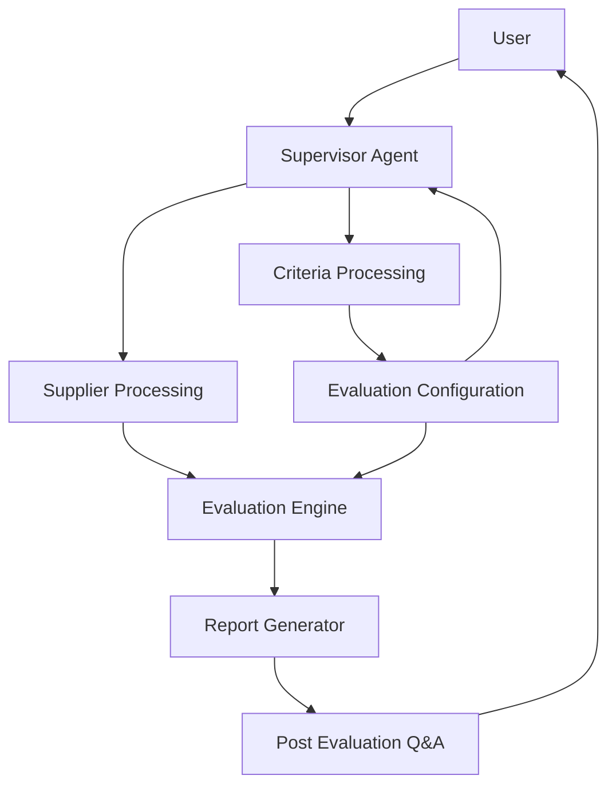
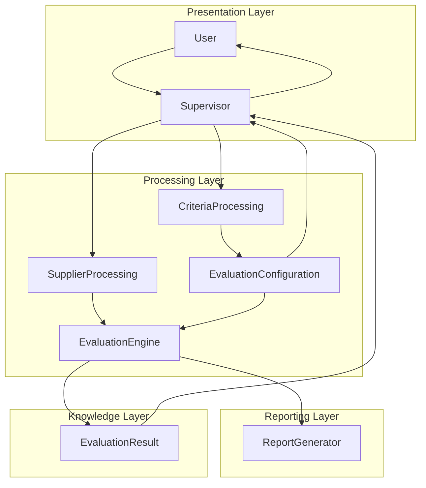
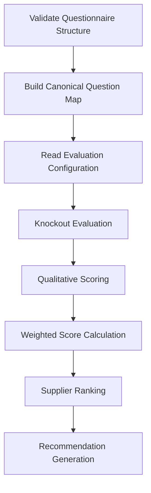
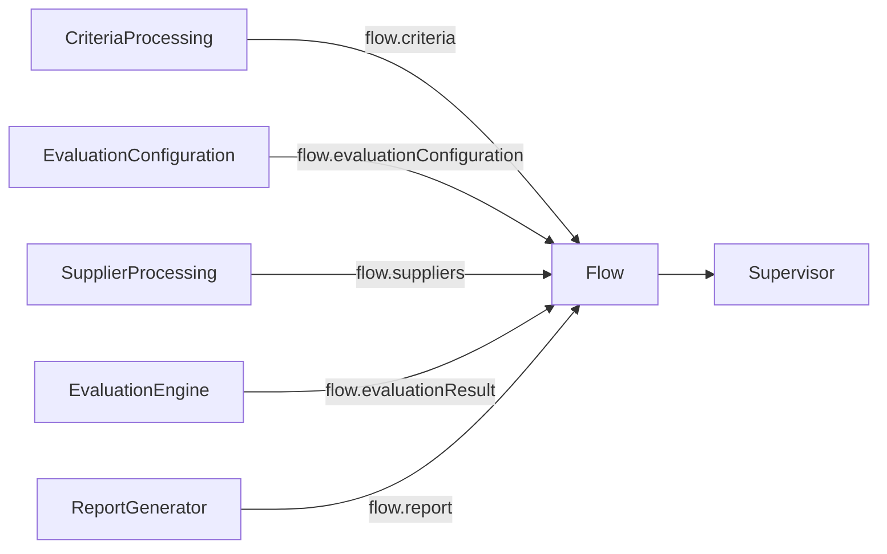
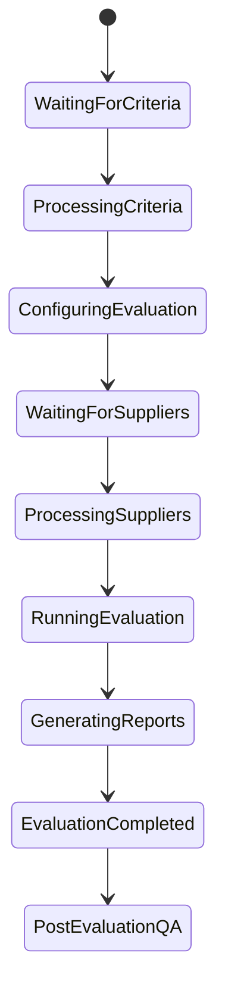
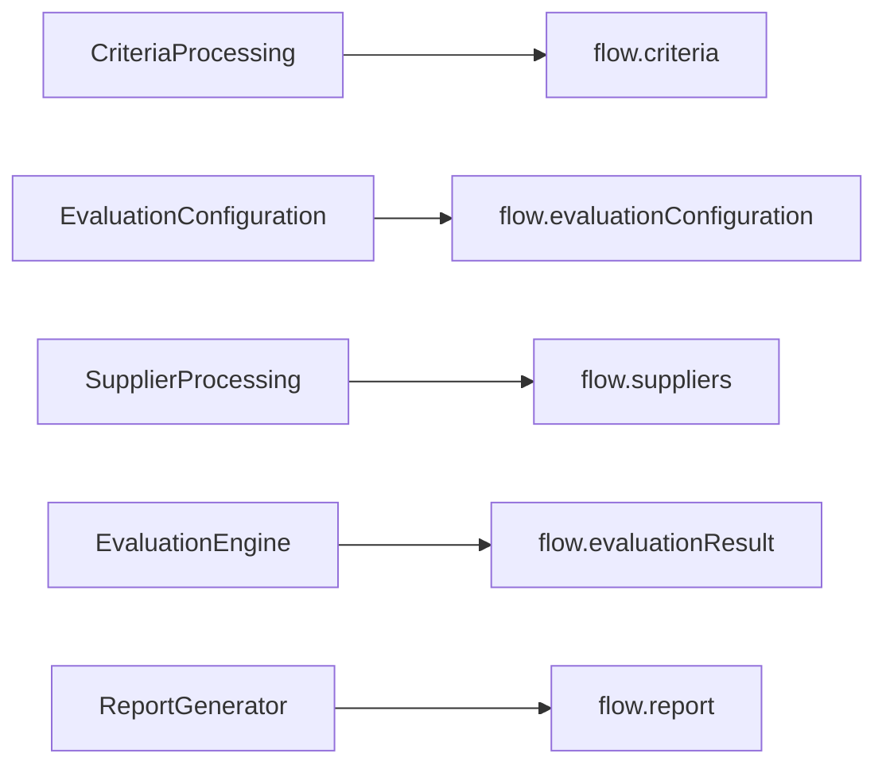
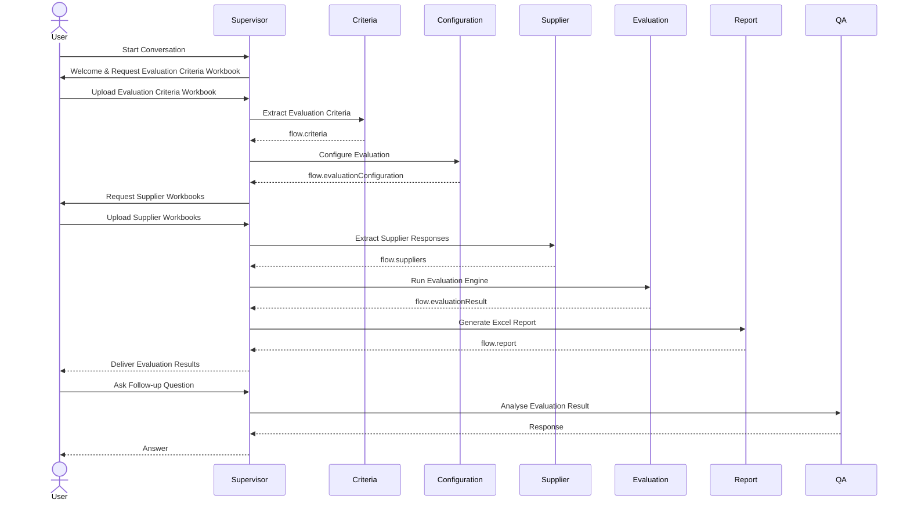

# 04. System Architecture

**Document Version:** 1.0

**Status:** Architecture Frozen

**Parent Document:** Software Design Specification (SDS)

---

# Purpose

This document defines the complete system architecture of the RFP Qualitative Evaluation Agent.

It specifies:

- Major architectural components
- Responsibilities
- Information flow
- Workflow ownership
- Architectural boundaries
- Module interactions
- Processing lifecycle
- Design rationale

This chapter represents the highest-level technical view of the application.

Implementation details are intentionally excluded and are covered in later chapters.

---

# Architectural Overview

The RFP Qualitative Evaluation Agent follows a modular, service-oriented architecture.

The solution separates conversational orchestration from procurement evaluation.

Each module owns a single responsibility and communicates only through well-defined Flow Variables.

The application consists of seven primary components.



---

# Layered Architecture

The application is organised into four logical layers.



---

# System Components

The solution consists of seven independent components.

| Component | Responsibility |
|------------|----------------|
| Supervisor Agent | Conversation orchestration |
| Criteria Processing | Extract evaluation criteria |
| Evaluation Configuration | Configure evaluation rules |
| Supplier Processing | Extract supplier responses |
| Evaluation Engine | Execute procurement evaluation |
| Report Generator | Generate reports |
| Post Evaluation Q&A | Conversational analysis |

---

# Component Responsibilities

## 1. Supervisor Agent

The Supervisor Agent is the central orchestration component.

It owns the complete conversational lifecycle.

The Supervisor is responsible for:

- Greeting users
- Explaining the workflow
- Collecting required files
- Determining conversation state
- Managing workflow progression
- Performing handoffs
- Receiving module outputs
- Returning responses
- Supporting follow-up analysis

The Supervisor **never performs procurement evaluation itself**.

Its only responsibility is orchestration.

---

## 2. Criteria Processing Module

The Criteria Processing module transforms an uploaded Evaluation Criteria workbook into a structured JSON representation.

Responsibilities include:

- Reading the workbook
- Identifying sections
- Extracting questions
- Extracting question numbers
- Extracting evaluation guidance
- Extracting weights
- Extracting scoring guidance
- Detecting knockout candidates
- Producing structured criteria

Produces

```
flow.criteria
```

Consumes

```
Evaluation Criteria Workbook
```

The extracted criteria remain immutable throughout the sourcing event.

---

## 3. Evaluation Configuration Module

The Evaluation Configuration module acts as the bridge between extracted criteria and supplier evaluation.

Unlike the Criteria Processing module, this module is interactive.

It allows procurement consultants to review and configure evaluation settings before supplier evaluation begins.

Responsibilities include:

- Reviewing extracted criteria
- Confirming extracted question weights
- Configuring knockout questions
- Defining expected answers for knockout questions
- Excluding questions from evaluation (future capability)
- Configuring evaluation settings
- Producing the final evaluation configuration

Produces

```
flow.evaluationConfiguration
```

Consumes

```
flow.criteria
```

The Evaluation Configuration object contains all business-approved evaluation rules.

The original criteria object is never modified.

This separation allows:

- Source data to remain immutable
- User preferences to remain configurable
- Future re-evaluation without re-extraction

---

## 4. Supplier Processing Module

The Supplier Processing module transforms supplier workbooks into structured supplier objects.

Responsibilities include:

- Reading supplier workbooks
- Extracting supplier responses
- Preserving workbook structure
- Preserving question numbering
- Preserving section ordering
- Identifying unanswered questions
- Producing supplier objects

Produces

```
flow.suppliers[]
```

Consumes

```
Supplier Workbook
```

Each uploaded workbook produces exactly one supplier object.

The module performs no evaluation.

---

## 5. Evaluation Engine

The Evaluation Engine performs all procurement-specific analysis.

This module never communicates with the user.

Its responsibilities include:

- Questionnaire validation
- Canonical mapping
- Knockout evaluation
- Qualitative scoring
- Weighted calculations
- Supplier ranking
- Recommendation generation

Internal workflow:



The Evaluation Engine is intentionally isolated from conversation management.

Only structured data enters the engine.

Only structured evaluation results leave the engine.

---
## 6. Report Generator

The Report Generator transforms the evaluation results into consultant-ready deliverables.

The Report Generator performs no evaluation.

Its sole responsibility is presentation.

Responsibilities include:

- Building the final Excel workbook
- Creating executive summaries
- Creating detailed supplier scorecards
- Producing comparative supplier rankings
- Highlighting knockout results
- Summarising strengths and weaknesses
- Presenting procurement recommendations
- Producing client-ready deliverables

Consumes

```
flow.evaluationResult
```

Produces

```
flow.report
```

The reporting layer is intentionally isolated from the Evaluation Engine.

Changes to report formatting shall never affect procurement evaluation logic.

---

## 7. Post Evaluation Q&A

The Post Evaluation Q&A module enables consultants to continue interacting with completed evaluation results.

Rather than repeating supplier evaluation, this module reasons over previously generated evaluation data.

Example user interactions include:

- Compare Supplier A and Supplier B.
- Explain Question 4 scoring.
- Show all knockout failures.
- Why was Supplier C ranked lower?
- Regenerate the report.
- Change question weights.
- Exclude Question 5.
- Recalculate supplier rankings.
- Export another report.

The Post Evaluation Q&A module never performs:

- Workbook extraction
- Questionnaire validation
- Supplier scoring

Instead, it consumes:

```
flow.evaluationResult
```

and

```
flow.report
```

to answer consultant questions.

---

# Architectural Boundaries

Every module owns its internal implementation.

Modules communicate exclusively through Flow Variables.

No module is permitted to access another module's internal implementation directly.



This architectural boundary provides:

- Loose coupling
- Independent testing
- Easier maintenance
- Reusable modules
- Predictable data flow

---

# Processing Lifecycle

The application progresses through several well-defined lifecycle stages.



Each state represents a distinct business milestone.

Only the Supervisor Agent is responsible for determining the current lifecycle state.

---

# Workflow Ownership

Each stage within the architecture has a clearly defined owner.

| Workflow Stage | Owner |
|----------------|-------|
| Greeting User | Supervisor |
| Collect Evaluation Criteria | Supervisor |
| Extract Evaluation Criteria | Criteria Processing |
| Configure Evaluation Rules | Evaluation Configuration |
| Collect Supplier Workbooks | Supervisor |
| Extract Supplier Responses | Supplier Processing |
| Validate Questionnaire | Evaluation Engine |
| Canonical Mapping | Evaluation Engine |
| Knockout Evaluation | Evaluation Engine |
| Qualitative Scoring | Evaluation Engine |
| Weighted Score Calculation | Evaluation Engine |
| Supplier Ranking | Evaluation Engine |
| Recommendation Generation | Evaluation Engine |
| Report Generation | Report Generator |
| Post-Evaluation Analysis | Supervisor + Post Evaluation Q&A |

Ownership shall never overlap.

This ensures every module maintains a single responsibility.

---

# Module Communication

Every module exchanges information exclusively through Flow Variables.



The following design rules apply:

- Modules never call internal functions belonging to other modules.
- Modules never modify another module's output.
- Modules communicate only through documented data contracts.
- Shared objects remain immutable unless explicitly owned by the producing module.

---

# High-Level Conversation Flow

The Supervisor orchestrates the complete user journey.



---

# Design Constraints

The architecture intentionally enforces the following engineering constraints.

## Single Responsibility

Every module performs one clearly defined responsibility.

Responsibilities shall never overlap.

---

## Explicit Data Contracts

Every interaction between modules occurs through documented JSON structures.

Implicit data sharing is prohibited.

---

## Deterministic Business Logic

Business rules shall always produce repeatable results.

Examples include:

- Validation
- Ranking
- Weight calculations
- Report generation

Large Language Models shall only be used where semantic reasoning is required.

---

## Explainability

Every procurement decision must be explainable.

Users must always be able to answer:

- Why was this supplier selected?
- Why was this supplier eliminated?
- Which response affected the score?
- Which evaluation criteria were considered?

---

## Immutable Source Data

The extracted Evaluation Criteria remain immutable.

User configuration is stored separately within:

```
flow.evaluationConfiguration
```

This separation preserves the original source data while allowing runtime configuration.

---

## Conversation Isolation

Conversation management remains completely isolated from procurement evaluation.

The Supervisor orchestrates conversations.

The Evaluation Engine performs procurement analysis.

Neither component should assume the responsibilities of the other.

---

# Architectural Decisions

| Decision | Rationale |
|-----------|-----------|
| Supervisor controls workflow | Centralises conversation orchestration |
| Separate Criteria Processing | Evaluation workbook has a unique structure |
| Separate Evaluation Configuration | Business rules are configurable without modifying extracted criteria |
| Separate Supplier Processing | Supplier workbooks require independent extraction |
| Canonical Question Map | Establishes a single source of truth |
| Deterministic Validation | Ensures repeatable validation outcomes |
| Separate Evaluation Engine | Keeps procurement logic isolated |
| Separate Report Generator | Reporting changes do not affect evaluation logic |
| Persistent Evaluation Result | Enables conversational follow-up without reprocessing |

---

# Summary

The RFP Qualitative Evaluation Agent has been intentionally designed as a modular, conversation-driven procurement evaluation platform.

The Supervisor Agent manages the complete user experience while remaining independent from procurement analysis.

Evaluation Criteria are first extracted and then transformed into an explicit Evaluation Configuration, allowing business users to review, adjust and approve evaluation rules before supplier assessment begins.

Supplier responses are independently extracted, validated and combined with the approved evaluation configuration to create a canonical representation of the sourcing event.

The Evaluation Engine performs deterministic validation, knockout evaluation, qualitative scoring, weighted aggregation, supplier ranking and recommendation generation.

The Report Generator produces consultant-ready deliverables, while the Post Evaluation Q&A module enables interactive analysis without repeating the evaluation process.

This architecture provides:

- Clear separation of responsibilities
- Deterministic business logic
- Explainable AI-assisted evaluation
- Modular implementation
- Enterprise-grade maintainability
- Extensibility for future enhancements
- A stable foundation for production deployment

This document constitutes the frozen high-level architecture for Version 1.0 of the RFP Qualitative Evaluation Agent and shall serve as the architectural baseline for all subsequent implementation activities.
