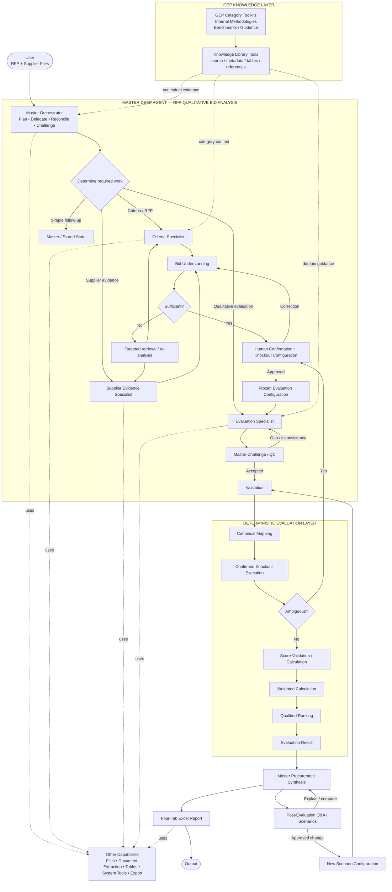
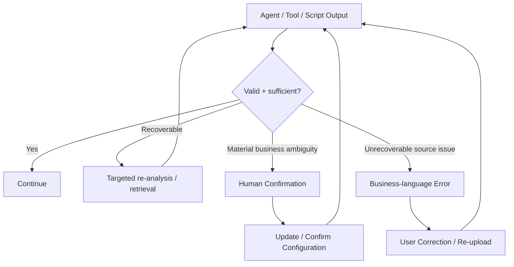

# 04. System Architecture

**Document Version:** 1.3

**Status:** Architecture Baseline — Deep Agent + GEP Knowledge + HITL + Deterministic Evaluation

**Parent Document:** Software Design Specification (SDS)

## Purpose

This document defines the production architecture of the RFP Qualitative Bid Analysis Agent.

The architecture uses one Master Deep Agent with three direct specialist sub-agents, a formal human confirmation gate, GEP internal knowledge accessed through Knowledge Library tools, explicit Flow Variable contracts and deterministic evaluation processing.

## Architectural Overview



## Component Model

| Component | Type | Primary responsibility |
|---|---|---|
| Master Deep Agent | Deep Agent | Planning, delegation, reconciliation, HITL, challenge/QC, synthesis |
| Criteria Specialist | Sub-agent | RFP/evaluation framework understanding |
| Supplier Specialist | Sub-agent | Supplier response/evidence extraction |
| Evaluation Specialist | Sub-agent | Qualitative evaluation/comparison |
| GEP Knowledge Library | Knowledge capability | Category toolkits, internal methodologies, benchmarks and guidance |
| Human Confirmation Gate | Conversation/control | Confirm evaluation understanding and knockout rules |
| Validation | Script | Deterministic structural/configuration validation |
| Canonical Mapping | Script | Deterministic normalized evaluation model |
| Knockout Execution | Script | Execute confirmed acceptance conditions |
| Qualitative Scoring | Agent | Semantic assessment against approved rubric + relevant GEP context |
| Weighted Calculation | Script | Deterministic arithmetic |
| Ranking | Script | Deterministic qualified ranking |
| Report Generator | Export capability | Render approved result into workbook |

## GEP Knowledge Architecture

GEP internal knowledge is a **contextual domain layer**, not a fourth specialist agent.

The knowledge library may contain:

- category toolkits
- category playbooks
- approved procurement methodologies
- evaluation guidance
- benchmarks
- negotiation guidance
- internal terminology and reference material

Relevant knowledge is retrieved through the platform Knowledge Library tools. Agents must follow the platform's knowledge-tool workflow instructions.

### Authority / precedence

```text
HUMAN-CONFIRMED EVALUATION CONFIGURATION
                ↑
                │ operational authority
                │
RFP / SOURCING DOCUMENTS
                ↑
                │ source evaluation requirements
                │
GEP KNOWLEDGE LIBRARY
                │ contextual guidance / benchmark
                ↓
AI SEMANTIC INTERPRETATION
```

GEP knowledge must **not silently override the RFP or human-confirmed configuration**. A toolkit may inform interpretation, benchmarking or recommended evaluation reasoning, but a new mandatory criterion, knockout, weight or acceptance condition requires human confirmation.

### Knowledge usage by specialist

| Component | Knowledge usage |
|---|---|
| Master | Category context, methodology, challenge/QC and synthesis |
| Criteria Specialist | Terminology, category context, evaluation guidance and candidate criteria/knockouts |
| Supplier Specialist | Minimal; extraction remains source-first to avoid contaminating supplier evidence |
| Evaluation Specialist | Highest use: category benchmarks, best-practice guidance and evaluation context |

## Master Deep Agent

The Master owns:

- request interpretation
- execution planning
- dynamic specialist delegation
- tool/knowledge selection
- parallelism where independent
- dependency management
- bid-understanding synthesis
- human confirmation interaction
- specialist challenge/QC
- final procurement synthesis

The Master shall not silently alter a confirmed evaluation configuration.

The Master has at most three direct specialist sub-agents.

## Specialist Boundaries

### Criteria Specialist
Determines what the RFP/evaluation framework requires. It may use GEP knowledge for contextual interpretation but cannot turn knowledge-only recommendations into authoritative criteria.

### Supplier Specialist
Determines what each supplier actually submitted. Supplier source text and provenance take precedence over all domain knowledge. It does not score or rank.

### Evaluation Specialist
Evaluates supplier responses against the confirmed framework, using relevant GEP category knowledge as contextual evidence. It produces semantic score recommendations and rationale but does not execute arithmetic, weighting, ranking or confirmed knockout rules.

## Human Confirmation Gate

The first-pass output is a **Bid Clarification Package** containing:

- file roles
- supplier identities
- evaluation sections/questions
- detected scoring scale/rubric
- detected weights
- candidate knockout requirements
- proposed acceptance conditions
- relevant GEP methodology/context used
- ambiguities
- missing information
- explicit facts vs inferred interpretations

The human confirms/corrects the package and confirms, removes, modifies or adds knockout requirements and acceptance conditions.

## Deterministic Boundary

```text
SOURCE + GEP KNOWLEDGE
        ↓
AI SEMANTIC INTERPRETATION
        ↓
HUMAN CONFIRMATION
        ↓
CONFIRMED EVALUATION CONFIGURATION
        ↓
DETERMINISTIC RULES / CALCULATIONS / RANKING
        ↓
AI PROCUREMENT SYNTHESIS
```

Semantic qualitative assessment is not mathematically deterministic. However, the **business-rule execution and overall numerical evaluation outcome are deterministic once the semantic score outputs and confirmed configuration are fixed**.

## Failure / Recovery



## Reporting

The standard report contains exactly four primary tabs:

1. Executive Summary
2. Supplier Profiles
3. Q&A Scorecard
4. Score Legend

The report generator is presentation-only and cannot alter evaluation results or methodology.

## Architectural Invariants

1. One Master Deep Agent.
2. Maximum three direct specialist sub-agents.
3. GEP knowledge is a capability layer, not a fourth agent.
4. Dynamic delegation rather than a rigid specialist pipeline.
5. Human confirmation precedes the first evaluation run.
6. Confirmed configuration is frozen for that run.
7. Candidate knockouts become rules only after human confirmation.
8. Deterministic validation, arithmetic, weighting and ranking.
9. Source responses remain source-faithful.
10. GEP knowledge never silently overrides the RFP or confirmed configuration.
11. Every material result retains evidence/provenance.
12. Scenario changes preserve the original run.
