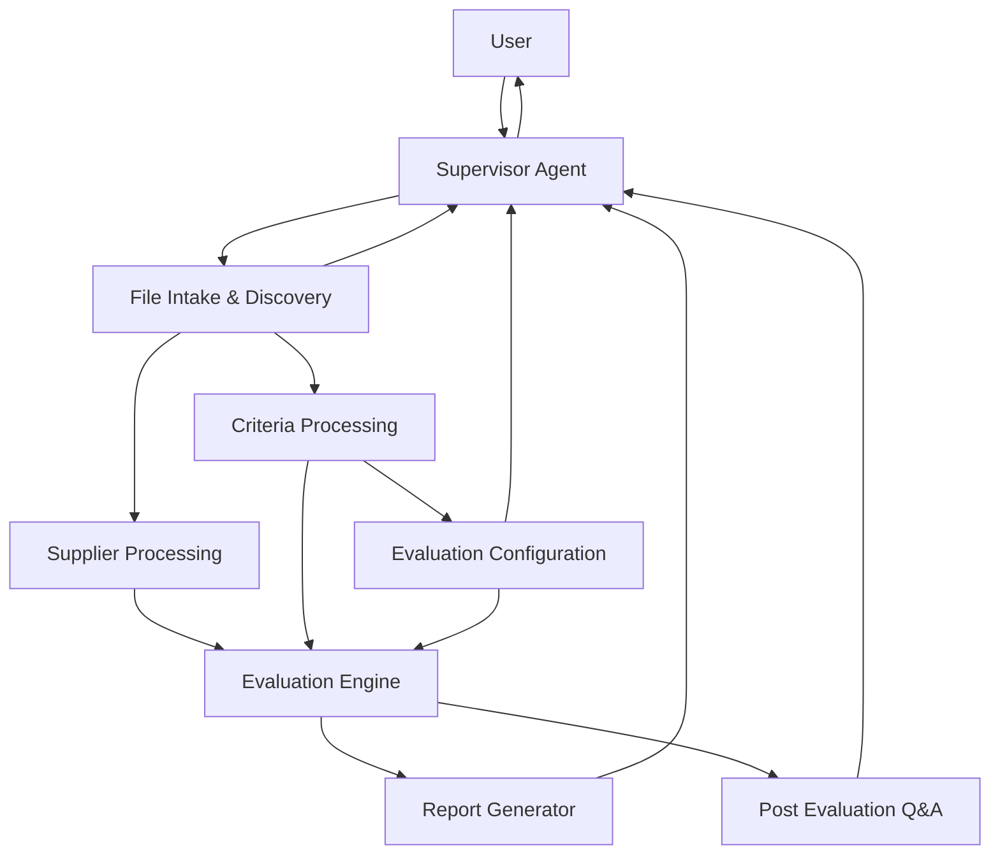
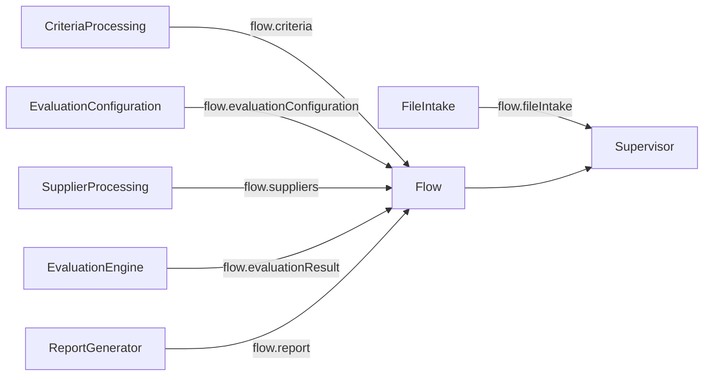
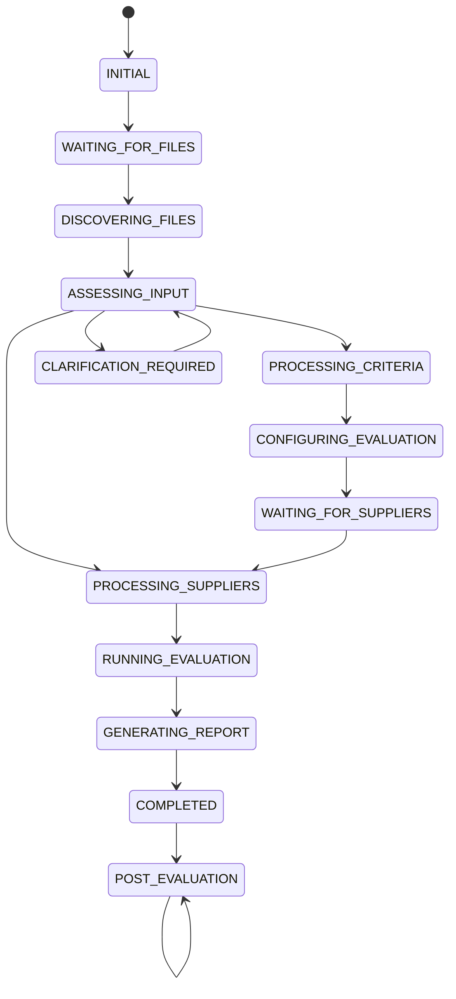

# 04. System Architecture

**Document Version:** 1.1

**Status:** Architecture Baseline Updated

**Parent Document:** Software Design Specification (SDS)

---

# Purpose

This document defines the complete system architecture of the RFP Qualitative Evaluation Agent.

Version 1.1 introduces a **File Intake and Discovery** capability so floor users can upload available Excel files without being required to understand or conform to internal workbook templates.

The architecture remains modular, service-oriented, conversation-driven and deterministic wherever possible.

---

# Architectural Overview

The solution separates conversational orchestration, file interpretation, procurement processing, evaluation and reporting.



---

# Layered Architecture

```text
Presentation Layer
    User
    Supervisor

Input Intelligence Layer
    File Intake & Discovery

Processing Layer
    Criteria Processing
    Evaluation Configuration
    Supplier Processing

Evaluation Layer
    Evaluation Engine

Reporting / Knowledge Layer
    Report Generator
    Post-Evaluation Q&A
```

---

# System Components

The solution consists of eight primary components.

| Component | Responsibility |
|---|---|
| Supervisor Agent | Conversation orchestration and lifecycle management |
| File Intake & Discovery | Understand uploaded files and workbook structures |
| Criteria Processing | Normalize evaluation criteria |
| Evaluation Configuration | Configure business-approved evaluation rules |
| Supplier Processing | Normalize supplier responses |
| Evaluation Engine | Execute procurement evaluation |
| Report Generator | Generate consultant-ready deliverables |
| Post Evaluation Q&A | Analyze completed evaluations conversationally |

---

# 1. Supervisor Agent

The Supervisor is the central conversational orchestration component.

Responsibilities:

- Greeting users
- Explaining the workflow
- Inviting users to upload available files
- Maintaining `flow.conversationState`
- Invoking File Intake & Discovery
- Determining whether sufficient information exists to proceed
- Asking targeted clarification questions only when required
- Initiating downstream processing
- Receiving module outputs
- Returning results
- Supporting follow-up analysis

The Supervisor never performs procurement evaluation itself.

---

# 2. File Intake & Discovery

## Purpose

Translate flexible user-provided Excel files into structured information about what each file and sheet represents.

## Responsibilities

- Accept one or more files
- Inspect workbook metadata
- Discover sheets
- Classify file roles
- Classify sheet roles
- Detect evaluation criteria
- Detect supplier submissions
- Detect combined workbooks
- Identify supplier names
- Detect supporting information
- Preserve provenance
- Assign classification confidence
- Identify material ambiguity
- Identify missing required business information

## File Classifications

```text
evaluation_criteria
supplier_submission
combined_evaluation_and_supplier
supporting_document
unknown
```

## Sheet Classifications

```text
evaluation_criteria
supplier_response
technical_response
commercial_response
company_profile
references
coverage
instructions
supporting_information
irrelevant
unknown
```

## Output

```text
flow.fileIntake
```

The module does not score suppliers, calculate results or modify source data.

---

# 3. Criteria Processing

The Criteria Processing module consumes discovered criteria sources and creates the normalized criteria object.

Responsibilities include:

- Extract sections
- Extract questions/requirements
- Preserve source numbering
- Create stable internal IDs where necessary
- Extract weights
- Extract scoring guidance
- Extract rubrics
- Identify knockout candidates
- Preserve source provenance

Produces:

```text
flow.criteria
```

The extracted criteria are immutable source data.

---

# 4. Evaluation Configuration

The Evaluation Configuration module acts as the business-rule layer between source criteria and evaluation.

Responsibilities:

- Review criteria
- Configure weights
- Configure knockout questions
- Define acceptance conditions
- Exclude questions where permitted
- Approve evaluation configuration

Produces:

```text
flow.evaluationConfiguration
```

The original criteria remain immutable.

---

# 5. Supplier Processing

The Supplier Processing module consumes discovered supplier sources and produces normalized supplier objects.

Responsibilities:

- Extract supplier responses
- Preserve response wording
- Preserve question references
- Preserve section context
- Detect unanswered questions
- Identify supplier names
- Preserve provenance

Produces:

```text
flow.suppliers[]
```

The module performs no evaluation.

---

# 6. Evaluation Engine

The Evaluation Engine performs procurement-specific analysis only after input normalization.

Internal workflow:

```text
Validate Questionnaire Structure
        ↓
Build Canonical Question Map
        ↓
Apply Evaluation Configuration
        ↓
Knockout Evaluation
        ↓
Qualitative Scoring
        ↓
Weighted Score Calculation
        ↓
Supplier Ranking
        ↓
Recommendation Generation
```

Produces:

```text
flow.evaluationResult
```

The Evaluation Engine shall not inspect raw workbook layouts directly.

---

# 7. Report Generator

Consumes:

```text
flow.evaluationResult
```

Produces:

```text
flow.report
```

Responsibilities:

- Executive summary
- Supplier ranking
- Detailed scorecards
- Knockout summary
- Strengths and weaknesses
- Recommendations
- Excel workbook

No procurement evaluation logic exists in the reporting layer.

---

# 8. Post Evaluation Q&A

Consumes:

```text
flow.evaluationResult
flow.report
```

Supports:

- Supplier comparisons
- Score explanations
- Knockout explanations
- Weight-change analysis
- Ranking regeneration
- Report regeneration

It does not repeat extraction unless explicitly requested after a material input change.

---

# Architectural Boundaries

Every module owns its internal implementation.

Modules communicate through documented Flow Variables.



No downstream evaluation module may directly inspect another module's internal implementation.

---

# Processing Lifecycle



---

# Workflow Ownership

| Workflow Stage | Owner |
|---|---|
| Greeting User | Supervisor |
| File Collection | Supervisor |
| File Classification | File Intake & Discovery |
| Sheet Classification | File Intake & Discovery |
| Criteria Extraction | Criteria Processing |
| Evaluation Configuration | Evaluation Configuration |
| Supplier Extraction | Supplier Processing |
| Questionnaire Validation | Evaluation Engine |
| Canonical Mapping | Evaluation Engine |
| Knockout Evaluation | Evaluation Engine |
| Qualitative Scoring | Evaluation Engine |
| Weighted Score Calculation | Evaluation Engine |
| Supplier Ranking | Evaluation Engine |
| Recommendation Generation | Evaluation Engine |
| Report Generation | Report Generator |
| Post-Evaluation Analysis | Supervisor + Q&A |

Ownership shall never overlap.

---

# Module Communication

Every module exchanges information through documented Flow Variables.

The following core objects are shared:

```text
flow.fileIntake
flow.criteria
flow.evaluationConfiguration
flow.suppliers
flow.validationResult
flow.canonicalQuestionMap
flow.knockoutResult
flow.scoringResult
flow.weightedScores
flow.rankingResult
flow.evaluationResult
flow.report
flow.conversationState
```

Each has exactly one producer.

---

# Design Constraints

## Zero-Template User Experience

The external user experience shall not depend on prescribed workbook names, sheet names or column names.

## Internal Schema Discipline

Once information enters downstream processing, it shall conform to documented internal contracts.

## Confidence-Aware Automation

Material classification and mapping uncertainty shall be retained and shall not silently propagate into procurement decisions.

## Human Oversight

Human confirmation shall be required for material ambiguity, not ordinary formatting differences.

## Deterministic Evaluation

Validation, calculations, weighting and ranking shall remain deterministic.

## Source Preservation

Original source information shall remain immutable and traceable.

---

# Summary

Version 1.1 introduces File Intake & Discovery as the controlled abstraction layer between flexible user-provided files and the strict internal procurement evaluation model.

This allows the agent to be deployed to floor users without requiring them to learn internal workbook conventions while preserving the original architecture's modularity, explainability, determinism and auditability.
