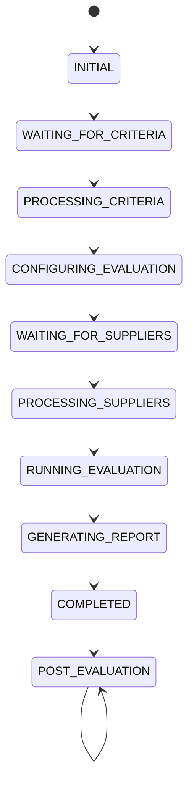

# 05. Conversation State Machine

**Document Version:** 1.0

**Status:** Architecture Frozen

**Parent Document:** Software Design Specification (SDS)

---

# Purpose

This document defines the complete conversational lifecycle of the RFP Qualitative Evaluation Agent.

Unlike traditional chatbots, the Supervisor Agent does not generate behaviour dynamically.

Instead, it behaves as a deterministic workflow orchestrator whose responses are governed by the current workflow state.

Every user interaction must occur within one defined conversation state.

Every transition between states must satisfy explicitly defined conditions.

No undefined state transitions are permitted.

---

# Design Principles

The Conversation State Machine has been designed using the following principles.

## Deterministic Conversation

The Supervisor should always know exactly what the next expected user action is.

The system should never ask unnecessary questions.

The system should never request information that is already available.

---

## Single Active State

At any point during execution the workflow shall exist in exactly one primary state.

No parallel conversation states are permitted.

---

## Explicit Transitions

Every transition between states must have:

- Trigger
- Preconditions
- Action
- Resulting State

---

## Recoverable Failures

Errors shall transition into dedicated recovery states rather than terminating the conversation.

---

# State Machine Overview



---

# Conversation States

## INITIAL

Purpose

Start a new sourcing evaluation session.

Supervisor Behaviour

- Greet the user.
- Explain the evaluation workflow.
- Request the Evaluation Criteria workbook.

Allowed User Actions

- Greeting
- Start Evaluation
- Upload Evaluation Criteria workbook

Next State

```
WAITING_FOR_CRITERIA
```

---

## WAITING_FOR_CRITERIA

Purpose

Collect the Evaluation Criteria workbook.

Expected Input

Exactly one Evaluation Criteria workbook.

Supervisor Behaviour

- Wait.
- Validate uploaded file.
- Reject unsupported uploads.
- Guide the user if no workbook is supplied.

Transition

```
PROCESSING_CRITERIA
```

---

## PROCESSING_CRITERIA

Purpose

Extract structured evaluation criteria.

Internal Modules

- Criteria Processing

Outputs

```
flow.criteria
```

Failure

Transition to

```
CRITERIA_ERROR
```

Success

Transition to

```
CONFIGURING_EVALUATION
```

---

## CONFIGURING_EVALUATION

Purpose

Finalize business evaluation rules before supplier evaluation.

Activities

- Review extracted weights.
- Configure knockout questions.
- Define expected knockout answers.
- Review evaluation settings.
- Approve configuration.

Produces

```
flow.evaluationConfiguration
```

Next State

```
WAITING_FOR_SUPPLIERS
```

---

## WAITING_FOR_SUPPLIERS

Purpose

Collect supplier workbooks.

Expected Input

One or more supplier response workbooks.

Minimum

One supplier.

Recommended

Six to ten suppliers.

Supervisor Behaviour

- Accept multiple uploads.
- Confirm number of suppliers received.
- Detect duplicate uploads.
- Reject unsupported files.

Next State

```
PROCESSING_SUPPLIERS
```

---

## PROCESSING_SUPPLIERS

Purpose

Extract supplier responses.

Activities

- Read workbook.
- Extract responses.
- Create supplier objects.

Produces

```
flow.suppliers[]
```

Failure

```
SUPPLIER_ERROR
```

Success

```
RUNNING_EVALUATION
```

---

## RUNNING_EVALUATION

Purpose

Execute the Evaluation Engine.

Internal Workflow

```text
Validate Questionnaire Structure

↓

Canonical Mapping

↓

Knockout Evaluation

↓

Qualitative Scoring

↓

Weighted Calculation

↓

Supplier Ranking

↓

Recommendation Generation
```

Produces

```
flow.evaluationResult
```

Next State

```
GENERATING_REPORT
```

---

## GENERATING_REPORT

Purpose

Create consultant-ready deliverables.

Activities

- Build Excel workbook.
- Create executive summary.
- Generate scorecards.
- Generate rankings.

Produces

```
flow.report
```

Next State

```
COMPLETED
```

---

## COMPLETED

Purpose

Notify the user that evaluation has finished.

Supervisor Behaviour

Present:

- Summary
- Ranking
- Download link
- Suggested follow-up questions

Next State

```
POST_EVALUATION
```

---

## POST_EVALUATION

Purpose

Support conversational analysis.

Examples

- Compare suppliers.
- Explain scores.
- Show knockout failures.
- Modify weights.
- Recalculate rankings.
- Regenerate reports.

This state remains active until the conversation ends.

---

# Error States

The Supervisor shall never terminate unexpectedly.

Dedicated recovery states shall be used.

## CRITERIA_ERROR

Entered when:

- Invalid workbook
- Extraction failure
- Corrupt file

Recovery

Ask the user to upload a corrected Evaluation Criteria workbook.

---

## SUPPLIER_ERROR

Entered when:

- Supplier extraction fails.
- Workbook is corrupted.
- Workbook structure is invalid.

Recovery

Request re-upload of the affected supplier workbook.

---

## EVALUATION_ERROR

Entered when:

- Validation fails.
- Canonical mapping fails.
- Evaluation cannot continue.

Recovery

Present detailed validation errors and allow correction.

---

# State Ownership

| State | Owner |
|--------|-------|
| INITIAL | Supervisor |
| WAITING_FOR_CRITERIA | Supervisor |
| PROCESSING_CRITERIA | Criteria Processing |
| CONFIGURING_EVALUATION | Evaluation Configuration |
| WAITING_FOR_SUPPLIERS | Supervisor |
| PROCESSING_SUPPLIERS | Supplier Processing |
| RUNNING_EVALUATION | Evaluation Engine |
| GENERATING_REPORT | Report Generator |
| COMPLETED | Supervisor |
| POST_EVALUATION | Supervisor + Post Evaluation Q&A |

---

# State Transition Rules

1. States shall transition only through documented paths.

2. The Supervisor shall never skip mandatory states.

3. Supplier evaluation shall never begin before Evaluation Configuration is approved.

4. Evaluation shall never begin without at least one supplier workbook.

5. Reports shall never be generated before evaluation completes.

6. Post-Evaluation analysis shall never trigger supplier extraction.

7. Source data shall remain immutable after extraction.

---

# Flow Variables Controlling State

The Supervisor determines the active state using Flow Variables.

| Variable | Purpose |
|----------|----------|
| flow.conversationState | Current workflow state |
| flow.criteria | Extracted criteria |
| flow.evaluationConfiguration | Approved evaluation rules |
| flow.suppliers | Extracted supplier objects |
| flow.evaluationResult | Final evaluation |
| flow.report | Generated report |

---

# Summary

The Conversation State Machine defines the complete behavioural model of the Supervisor Agent.

By constraining every interaction to explicit workflow states and deterministic transitions, the architecture achieves predictable behaviour, simplified implementation, and enterprise-grade maintainability.

This state machine forms the behavioural foundation for all future Supervisor prompts, handoff logic, and workflow orchestration.
