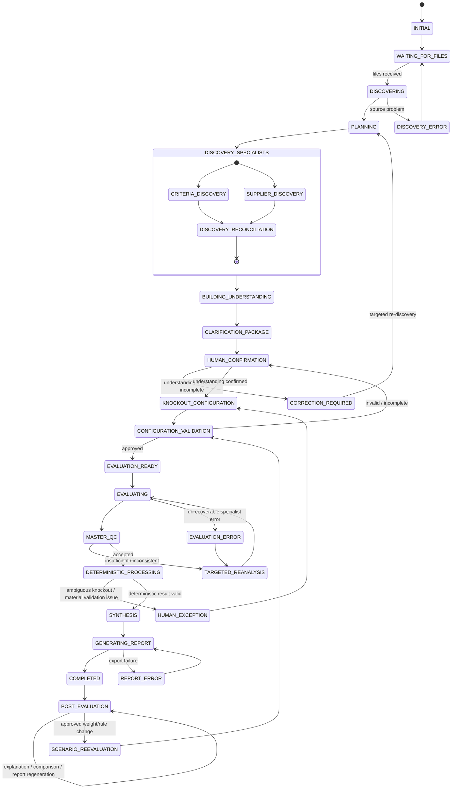

# 05. Conversation State Machine

**Document Version:** 1.2

**Status:** Deep Agent + Human Confirmation Baseline

**Parent Document:** Software Design Specification (SDS)

---

# Purpose

This document defines the conversational lifecycle of the RFP Qualitative Bid Analysis Agent.

The Master Deep Agent dynamically orchestrates specialist work, but the user journey contains a deterministic human-governed gate: the agent must present its current understanding before evaluation and obtain confirmation of material evaluation rules, including knockout requirements.

---

# State Machine

---

# State Definitions

## INITIAL
Start a new evaluation session and explain the available-file upload model.

## WAITING_FOR_FILES
Collect one or more relevant files. Users do not need to classify or reformat them.

## DISCOVERING
Inspect uploaded workbooks and available structures using the appropriate file/document capabilities.

## PLANNING
Master determines which specialists and tools are required and establishes dependencies.

## DISCOVERY_SPECIALISTS
Run Criteria Specialist and Supplier Specialist in parallel when independent, or sequentially when dependencies require it.

## BUILDING_UNDERSTANDING
Master reconciles discovered criteria, supplier identities, file roles and material evidence.

## CLARIFICATION_PACKAGE
Generate the structured Bid Clarification Package.

The package includes:

- file roles
- suppliers
- evaluation sections/questions
- scoring/rubric information
- weights
- potential knockout candidates
- proposed acceptance conditions
- material ambiguities
- missing information
- explicit vs inferred values

## HUMAN_CONFIRMATION
Present the package and request confirmation/correction of the agent's understanding.

## CORRECTION_REQUIRED
Human indicates that the understanding is incomplete or incorrect. Master incorporates the correction and re-runs only the affected discovery/analysis.

## KNOCKOUT_CONFIGURATION
Human confirms, removes, modifies or adds knockout requirements and acceptance conditions. Human may explicitly confirm that no knockouts apply.

## CONFIGURATION_VALIDATION
Deterministically validate that the configuration is internally coherent: required acceptance conditions, weights, score range, included criteria and supplier inputs are valid.

## EVALUATION_READY
The evaluation configuration is approved and frozen for the run.

## EVALUATING
Evaluation Specialist performs semantic qualitative assessment against the confirmed framework and supplier evidence.

## MASTER_QC
Master challenges specialist results for evidence sufficiency, source consistency and logical consistency.

## TARGETED_REANALYSIS
Master sends only the deficient task back to the relevant specialist/tool rather than restarting the whole workflow.

## DETERMINISTIC_PROCESSING
Run validation, canonical mapping, confirmed knockout execution, score arithmetic, weighting and ranking.

## HUMAN_EXCEPTION
Used for material ambiguity that cannot be safely resolved by deterministic processing, such as an ambiguous knockout interpretation.

## SYNTHESIS
Master combines confirmed configuration, qualitative assessments and deterministic results into procurement-level findings.

## GENERATING_REPORT
Generate the standard four-tab Excel workbook.

## COMPLETED
Present results and report reference.

## POST_EVALUATION
Answer questions using stored evaluation state.

## SCENARIO_REEVALUATION
Create a new configuration/result scenario for an approved change; preserve the original run.

---

# State Transition Rules

1. Evaluation shall never begin before human confirmation of material configuration.
2. Candidate knockouts are not confirmed knockouts until the human accepts them.
3. If the human says there are no knockouts, no knockout rules are created.
4. Confirmed configuration is frozen during the evaluation run.
5. A changed weight/rule creates a new scenario.
6. Material ambiguity is routed to human confirmation.
7. Specialist failures are isolated and retried/re-analyzed where possible.
8. Follow-up questions use stored results unless a new scenario is explicitly requested.
9. Report generation occurs only after final QC and deterministic processing.
10. Source information remains immutable.

---

# Error States

### DISCOVERY_ERROR
Affected file is identified and the user is asked for a replacement or clarification.

### SPECIALIST_ERROR
Master retries once or routes the affected task to targeted recovery.

### CONFIGURATION_ERROR
Configuration issues are returned to the human confirmation gate.

### VALIDATION_ERROR
Material structural issues prevent evaluation until corrected or explicitly resolved.

### EVALUATION_ERROR
Master identifies the failed evaluation component and requests targeted recovery.

### REPORT_ERROR
Evaluation remains intact; only report generation is retried.

---

# Follow-Up Examples

| User input | State behaviour |
|---|---|
| "Here are the files" | DISCOVERING |
| "Yes, this understanding is correct" | KNOCKOUT_CONFIGURATION |
| "Add ISO 27001 as a knockout" | CONFIGURATION_VALIDATION |
| "No knockout questions" | CONFIGURATION_VALIDATION with empty knockout set |
| "Supplier B's response is on another sheet" | CORRECTION_REQUIRED / targeted supplier analysis |
| "Why is Supplier C ranked #2?" | POST_EVALUATION |
| "Make implementation weight 30%" | SCENARIO_REEVALUATION |
| "Regenerate the report" | GENERATING_REPORT using stored evaluation result |
