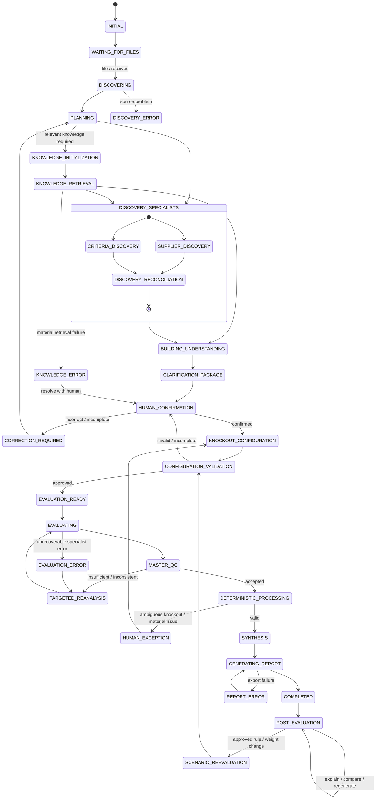

# 05. Conversation State Machine

**Document Version:** 1.4  
**Status:** Business workflow baseline with current knowledge-workflow rule  
**Updated:** 23 Aug 2026

## Purpose

The Master Deep Agent dynamically orchestrates specialist work and relevant GEP Knowledge Library retrieval. The user journey contains a mandatory human-governed configuration gate before the first evaluation run.

The state machine describes the intended business workflow. It does not by itself prove the exact QI Studio runtime implementation of each transition.

## State Machine

## Key States

**DISCOVERING:** inspect user files and identify likely roles.

**PLANNING:** Master determines specialists, tools, knowledge and dependencies.

**KNOWLEDGE_INITIALIZATION:** For any knowledge-related invocation, call `get-knowledge-workflow-instructions` first.

**KNOWLEDGE_RETRIEVAL:** after initialization, call `get_library_metadata` and then only the source-specific tools permitted by the returned knowledge metadata. For data-search sources, obtain schema through `get_data_search_fields` before executing the search.

**DISCOVERY_SPECIALISTS:** Criteria and Supplier specialists may run independently/parallel where possible.

**BUILDING_UNDERSTANDING:** reconcile source facts, supplier identities, criteria and relevant knowledge context.

**CLARIFICATION_PACKAGE:** generate the human-facing Bid Clarification Package.

**HUMAN_CONFIRMATION:** human confirms/corrects understanding and material evaluation configuration.

**KNOCKOUT_CONFIGURATION:** human confirms/removes/adds knockout requirements and acceptance conditions, including explicit confirmation of no knockouts where applicable.

**CONFIGURATION_VALIDATION:** deterministically validate the confirmed configuration.

**EVALUATION_READY:** configuration is approved/frozen.

**EVALUATING:** Evaluation Specialist performs semantic assessment using confirmed criteria, supplier evidence and relevant GEP context.

**MASTER_QC:** Master challenges evidence sufficiency and consistency.

**DETERMINISTIC_PROCESSING:** validation, canonical mapping, confirmed knockout execution, score arithmetic, weighting and ranking.

**POST_EVALUATION:** answer questions from stored state.

**SCENARIO_REEVALUATION:** create a new configuration/result scenario for an approved change.

## Knowledge Governance

GEP knowledge is contextual. It may inform interpretation, benchmarking and rationale but cannot silently become an evaluation rule.

If retrieved knowledge conflicts with the RFP or confirmed configuration:

1. Preserve the source requirement.
2. Surface the conflict.
3. Ask for human confirmation if material.
4. Do not silently change the rule.

## State Transition Rules

1. Evaluation never begins before human confirmation of material configuration.
2. Candidate knockouts are not authoritative until confirmed.
3. No-knockout confirmation produces an empty rule set.
4. Confirmed configuration is frozen for the run.
5. GEP knowledge cannot silently modify configuration.
6. Material knowledge-retrieval failure returns to human clarification when required.
7. Ambiguous knockouts return to human configuration.
8. Follow-ups use stored state unless a new scenario is explicitly requested.
9. Report generation occurs after deterministic processing and final QC.
10. Source evidence remains immutable.
