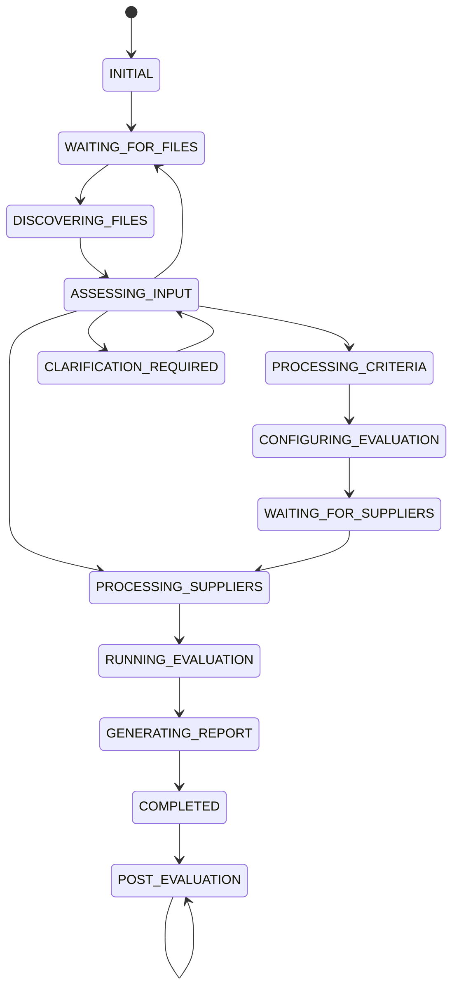

# 05. Conversation State Machine

**Document Version:** 1.1

**Status:** Architecture Baseline Updated

**Parent Document:** Software Design Specification (SDS)

---

# Purpose

This document defines the conversational lifecycle of the RFP Qualitative Evaluation Agent for a low-friction floor-user experience.

The Supervisor remains a deterministic workflow orchestrator. However, users are no longer required to identify or format files according to internal templates.

The state machine therefore begins with generic file intake and progressively determines what information is available.

---

# Design Principles

## Deterministic Conversation

The Supervisor should always know the current state and the next valid action.

## Single Active State

At any point the workflow has one primary conversation state.

## Explicit Transitions

Every transition has a trigger, precondition, action and resulting state.

## Minimal User Burden

The system shall infer information where possible and ask only targeted clarification questions when material ambiguity remains.

## Recoverable Failures

Errors transition into dedicated recovery states rather than terminating the conversation.

---

# State Machine Overview



---

# Conversation States

## INITIAL

Purpose

Start a new sourcing evaluation session.

Supervisor Behaviour

- Greet the user.
- Explain that they can upload the Excel files available to them.
- Do not require a prescribed filename, sheet or template.

Next State

```text
WAITING_FOR_FILES
```

---

## WAITING_FOR_FILES

Purpose

Collect one or more files from the user.

Expected Input

One or more reasonably relevant files, preferably Excel workbooks for the V1 use case.

Supervisor Behaviour

- Accept uploads.
- Avoid asking the user to classify files manually.
- If no files are supplied, explain what kind of business information is needed rather than prescribing a template.

Transition

```text
DISCOVERING_FILES
```

---

## DISCOVERING_FILES

Purpose

Understand the files and workbook structures.

Activities

- Inspect workbook metadata.
- Discover sheets.
- Classify file roles.
- Classify sheet roles.
- Identify supplier names.
- Identify evaluation criteria.
- Detect combined workbooks.
- Record confidence.

Produces

```text
flow.fileIntake
```

Failure

```text
FILE_DISCOVERY_ERROR
```

Success

```text
ASSESSING_INPUT
```

---

## ASSESSING_INPUT

Purpose

Determine whether enough information exists to proceed.

The system evaluates:

- Is an evaluation framework available?
- Are supplier responses available?
- Are material ambiguities present?
- Can files be mapped confidently?
- Is clarification required?

Possible transitions

```text
Criteria available + configuration required
        ↓
PROCESSING_CRITERIA
```

```text
Suppliers available + criteria already configured
        ↓
PROCESSING_SUPPLIERS
```

```text
Material ambiguity
        ↓
CLARIFICATION_REQUIRED
```

```text
Required information missing
        ↓
WAITING_FOR_FILES
```

---

## CLARIFICATION_REQUIRED

Purpose

Resolve a material ambiguity that cannot be safely inferred.

Examples

- Two files appear equally likely to be the evaluation framework.
- Supplier identity is ambiguous.
- Two conflicting scoring frameworks are present.
- A mandatory evaluation rule cannot be determined.

Supervisor Behaviour

Ask one targeted business-language question.

Do not ask the user to reformat files when the existing data can be interpreted.

After clarification:

```text
ASSESSING_INPUT
```

---

## PROCESSING_CRITERIA

Purpose

Extract normalized evaluation criteria.

Produces

```text
flow.criteria
```

Failure

```text
CRITERIA_ERROR
```

Success

```text
CONFIGURING_EVALUATION
```

---

## CONFIGURING_EVALUATION

Purpose

Finalize business evaluation rules.

Activities

- Review extracted criteria where needed.
- Configure weights.
- Configure knockout requirements.
- Define acceptance conditions.
- Approve configuration.

Produces

```text
flow.evaluationConfiguration
```

Next State

```text
WAITING_FOR_SUPPLIERS
```

If supplier files were already available and confidently classified, the Supervisor may transition directly to `PROCESSING_SUPPLIERS` after configuration approval.

---

## WAITING_FOR_SUPPLIERS

Purpose

Collect supplier response information when it is not already available.

Supervisor Behaviour

Ask the user to upload the supplier response files or the relevant workbook(s).

The user does not need to create or rename files.

Next State

```text
PROCESSING_SUPPLIERS
```

---

## PROCESSING_SUPPLIERS

Purpose

Extract normalized supplier response objects.

Produces

```text
flow.suppliers[]
```

Supports:

- Multiple suppliers
- Multiple files
- Incremental uploads
- Supplier identity detection

Failure

```text
SUPPLIER_ERROR
```

Success

```text
RUNNING_EVALUATION
```

---

## RUNNING_EVALUATION

Purpose

Execute the Evaluation Engine.

Pipeline

```text
Validate Questionnaire Structure
↓
Canonical Question Mapping
↓
Apply Evaluation Configuration
↓
Knockout Evaluation
↓
Qualitative Scoring
↓
Weighted Score Calculation
↓
Supplier Ranking
↓
Recommendation Generation
```

Produces

```text
flow.evaluationResult
```

Next State

```text
GENERATING_REPORT
```

---

## GENERATING_REPORT

Purpose

Generate consultant-ready deliverables.

Produces

```text
flow.report
```

Next State

```text
COMPLETED
```

---

## COMPLETED

Purpose

Present evaluation results.

Supervisor Behaviour

Present:

- Summary
- Qualified supplier ranking
- Knockout summary
- Key strengths and weaknesses
- Report reference

Next State

```text
POST_EVALUATION
```

---

## POST_EVALUATION

Purpose

Support conversational analysis of completed results.

Examples

- Compare suppliers.
- Explain scores.
- Explain knockout decisions.
- Change approved weights.
- Recalculate rankings.
- Regenerate reports.

The state remains active until the conversation ends.

---

# Error States

## FILE_DISCOVERY_ERROR

Entered when workbook inspection or file classification fails.

Recovery

- Explain that the files could not be interpreted.
- Identify the affected file.
- Request a replacement or clarification.

## CRITERIA_ERROR

Entered when criteria extraction fails.

Recovery

- Explain the issue in business language.
- Request another relevant evaluation/scoring file if necessary.

## SUPPLIER_ERROR

Entered when supplier extraction fails.

Recovery

- Identify affected supplier/file.
- Request re-upload only for the affected input.

## EVALUATION_ERROR

Entered when validation or evaluation cannot safely continue.

Recovery

- Present material validation issues.
- Allow the user to correct or clarify the underlying information.

---

# State Ownership

| State | Owner |
|---|---|
| INITIAL | Supervisor |
| WAITING_FOR_FILES | Supervisor |
| DISCOVERING_FILES | File Intake & Discovery |
| ASSESSING_INPUT | Supervisor |
| CLARIFICATION_REQUIRED | Supervisor |
| PROCESSING_CRITERIA | Criteria Processing |
| CONFIGURING_EVALUATION | Evaluation Configuration |
| WAITING_FOR_SUPPLIERS | Supervisor |
| PROCESSING_SUPPLIERS | Supplier Processing |
| RUNNING_EVALUATION | Evaluation Engine |
| GENERATING_REPORT | Report Generator |
| COMPLETED | Supervisor |
| POST_EVALUATION | Supervisor + Post Evaluation Q&A |

---

# State Transition Rules

1. The workflow shall have exactly one primary state.
2. The Supervisor shall never skip mandatory evaluation stages.
3. The system shall not require users to classify files when the system can classify them reliably.
4. Evaluation shall never begin without sufficient criteria, configuration and supplier information.
5. Material ambiguity shall be resolved before it can affect a procurement decision.
6. Reports shall never be generated before evaluation completes.
7. Post-Evaluation analysis shall not trigger unnecessary extraction.
8. Source data shall remain immutable after extraction.
9. Errors shall transition to recovery states rather than terminate the workflow.

---

# Flow Variables Controlling State

| Variable | Purpose |
|---|---|
| flow.conversationState | Current workflow state |
| flow.fileIntake | File and sheet discovery results |
| flow.criteria | Extracted evaluation criteria |
| flow.evaluationConfiguration | Approved evaluation rules |
| flow.suppliers | Extracted supplier objects |
| flow.evaluationResult | Final evaluation |
| flow.report | Generated report |

---

# Summary

Version 1.1 replaces the template-driven entry point with an intelligent file-intake lifecycle.

The Supervisor remains deterministic, but users are no longer forced to understand the internal file model. The system discovers, classifies and normalizes uploaded files before applying the controlled procurement evaluation pipeline.
