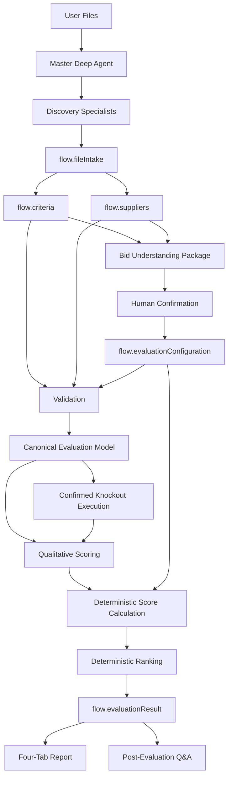
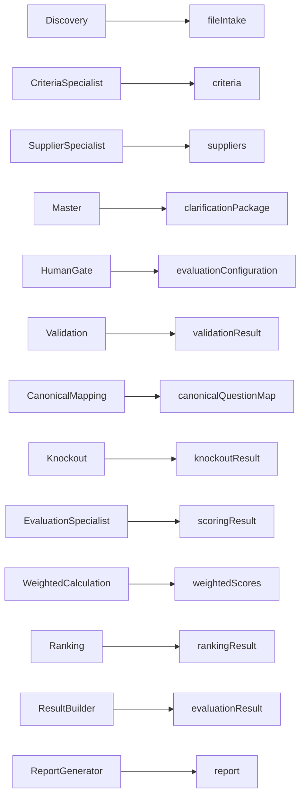

# 05A. Data Flow Architecture

**Document Version:** 1.2

**Status:** Deep Agent + HITL Data Contract Baseline

**Parent Document:** Software Design Specification (SDS)

---

# Purpose

This document defines how information moves through the RFP Qualitative Bid Analysis Agent.

The architecture separates source discovery, semantic normalization, human-confirmed configuration, qualitative reasoning and deterministic processing.

---

# High-Level Data Flow



---

# Core Data Objects

| Object | Producer | Mutable | Purpose |
|---|---|---:|---|
| fileIntake | Discovery | No after acceptance | File/sheet roles, entities, provenance and confidence |
| criteria | Criteria Specialist | No | Normalized source evaluation framework |
| suppliers | Supplier Specialist | No | Normalized supplier evidence/responses |
| clarificationPackage | Master | No | Human-readable current understanding and required confirmations |
| evaluationConfiguration | Human confirmation workflow | Only before freeze | Approved business rules for a run |
| validationResult | Validation | No | Structural findings |
| canonicalQuestionMap | Canonical Mapping | No | Single evaluation representation |
| knockoutResult | Knockout Script | No | Confirmed-rule outcomes |
| scoringResult | Evaluation Specialist | No | Semantic assessment/evidence |
| weightedScores | Weighted Calculation | No | Deterministic scores |
| rankingResult | Ranking Script | No | Deterministic qualified ranking |
| evaluationResult | Result Builder | No | Complete run result |
| report | Report Generator | No | Generated deliverable |

---

# Data Ownership

Every shared object has one producer. Consumers treat it as read-only.



---

# Stage 0 — Discovery

Input: user-uploaded files.

Output: `flow.fileIntake`.

The object records file identity, role, sheet inventory, sheet roles, supplier identity candidates, criteria indicators, confidence, ambiguity and provenance.

No score or procurement decision exists in this object.

---

# Stage 1 — Criteria and Supplier Normalization

Criteria Specialist produces `flow.criteria`.

Supplier Specialist produces `flow.suppliers`.

Both preserve source wording and provenance and distinguish explicit source facts from inferred mappings.

---

# Stage 2 — Bid Clarification Package

The Master combines the discovered outputs into `flow.clarificationPackage`.

The package exposes:

- what the agent believes the RFP/evaluation framework contains
- what suppliers were identified
- scoring and weights found
- candidate knockout requirements
- proposed acceptance conditions
- ambiguities
- missing information
- items requiring confirmation

This package is presented to the human evaluator.

---

# Stage 3 — Evaluation Configuration

Human confirmation creates `flow.evaluationConfiguration`.

The configuration is separate from source criteria and records:

- approved status
- configuration version
- scoring scale/rubric
- weights
- knockout rules
- acceptance conditions
- exclusions
- included sections
- confirmation metadata
- assumptions/notes

Once approved, the configuration is frozen for the run.

---

# Stage 4 — Validation

Consumes criteria, suppliers and confirmed configuration.

Produces `flow.validationResult`.

Errors prevent unreliable evaluation; warnings may be passed through.

---

# Stage 5 — Canonical Mapping

Consumes:

- criteria
- suppliers
- evaluation configuration
- validation result

Produces `flow.canonicalQuestionMap`.

This is the only evaluation representation consumed downstream.

---

# Stage 6 — Semantic Evaluation

The Evaluation Specialist consumes the canonical model and confirmed rubric and produces `flow.scoringResult` containing question-level assessments, evidence, reasoning, strengths and weaknesses.

The specialist's numerical score recommendation is treated as a structured semantic output; arithmetic remains deterministic.

---

# Stage 7 — Deterministic Processing

```text
Canonical Model
    ↓
Confirmed Knockout Rules
    ↓
Knockout Result
    ↓
Semantic Scores
    ↓
Deterministic Score Validation
    ↓
Weighted Scores
    ↓
Qualified Ranking
```

An ambiguous knockout routes to the human gate rather than being silently failed.

---

# Stage 8 — Master Challenge and Synthesis

The Master verifies:

- evidence coverage
- source consistency
- score rationale consistency
- knockout consistency
- ranking consistency

It can request targeted specialist re-analysis before final synthesis.

---

# Stage 9 — Reporting

`flow.evaluationResult` is rendered into the standard four-tab workbook:

1. Executive Summary
2. Supplier Profiles
3. Q&A Scorecard
4. Score Legend

The report generator cannot alter evaluation data.

---

# Stage 10 — Post-Evaluation

Stored evaluation state supports:

- supplier comparisons
- score explanations
- knockout explanations
- report regeneration
- approved re-weighting scenarios

Scenario changes create a new configuration/result lineage and preserve the original run.

---

# Immutability Rules

Immutable after acceptance:

- `flow.fileIntake`
- `flow.criteria`
- `flow.suppliers`
- `flow.validationResult`
- `flow.canonicalQuestionMap`
- `flow.knockoutResult`
- `flow.scoringResult`
- `flow.weightedScores`
- `flow.rankingResult`
- `flow.evaluationResult`
- `flow.report`

`flow.evaluationConfiguration` is editable only before approval/freeze or through a new scenario.

---

# Provenance Rules

Material values retain, where available:

- source file
- source sheet
- source location
- explicit/inferred indicator
- confidence

Supplier response text is never rewritten during extraction.

---

# Data Contract Rules

1. Every shared object has exactly one producer.
2. Consumers do not modify upstream objects.
3. Unknown source values are `null` rather than fabricated.
4. Arrays are always present.
5. Material uncertainty is explicit.
6. Human-confirmed rules are separate from source facts.
7. Scenario lineage is preserved.
