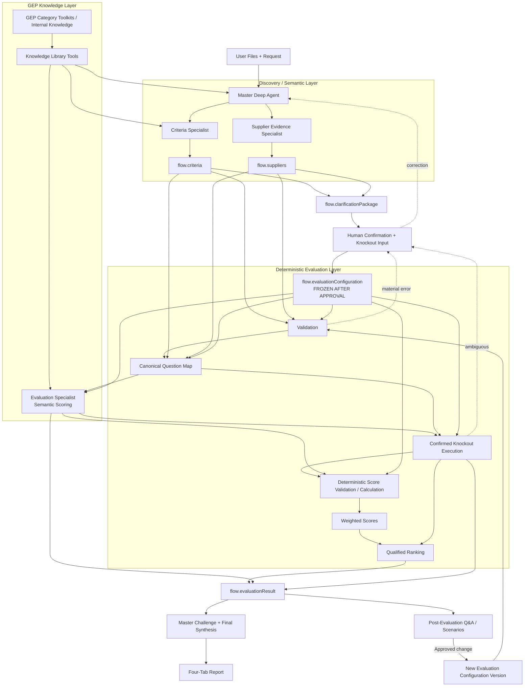
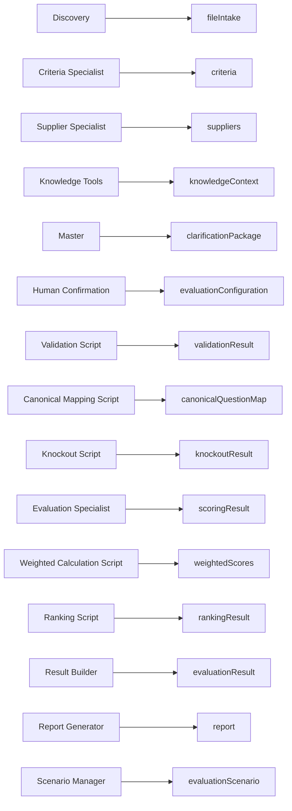

# 05A. Data Flow Architecture

**Document Version:** 1.3

**Status:** Deep Agent + GEP Knowledge + HITL Data Contract Baseline

## Purpose

This document defines how information moves through the RFP Qualitative Bid Analysis Agent. The architecture separates source discovery, GEP domain knowledge, semantic normalization, human-confirmed configuration, qualitative reasoning and deterministic processing.

## High-Level Data Flow



## Knowledge Flow Rule

GEP knowledge is retrieved through Knowledge Library tools and is supplied as **context** to the Master, Criteria Specialist and Evaluation Specialist where relevant.

```text
GEP Knowledge
     ↓
Category / Methodology Context
     ↓
AI Interpretation
     ↓
Human Confirmation where business-rule impact exists
     ↓
Evaluation Configuration
```

Knowledge is never copied into supplier evidence and never silently becomes a mandatory criterion, knockout, weight or acceptance condition.

## Core Data Objects

| Object | Producer | Mutable | Purpose |
|---|---|---:|---|
| fileIntake | Discovery | No after acceptance | File/sheet roles, entities, provenance and confidence |
| criteria | Criteria Specialist | No | Normalized source evaluation framework |
| suppliers | Supplier Specialist | No | Normalized supplier evidence/responses |
| knowledgeContext | Knowledge tools / Master | No | Relevant GEP contextual evidence and references |
| clarificationPackage | Master | No | Human-readable current understanding and required confirmations |
| evaluationConfiguration | Human confirmation workflow | Only before freeze | Approved business rules for a run |
| validationResult | Validation | No | Structural findings |
| canonicalQuestionMap | Canonical Mapping | No | Single evaluation representation |
| knockoutResult | Knockout Script | No | Confirmed-rule outcomes |
| scoringResult | Evaluation Specialist | No | Semantic assessment/evidence |
| weightedScores | Weighted Calculation | No | Deterministic scores |
| rankingResult | Ranking Script | No | Deterministic qualified ranking |
| evaluationResult | Result Builder | No | Complete run result |
| report | Report Generator | No | Generated deliverable |

## Data Ownership

Every shared object has one producer. Consumers treat it as read-only.



## Evaluation Configuration

`flow.evaluationConfiguration` is the authoritative business-rule object for one run. It contains the confirmed scoring methodology, weights, knockout rules, acceptance conditions, included/excluded criteria, special instructions and confirmation metadata.

If the human confirms no knockouts, `knockoutRules = []`.

Once approved, it is frozen. Changes create a new scenario/version.

## Semantic Evaluation

The Evaluation Specialist consumes:

- canonical supplier responses
- confirmed evaluation criteria
- confirmed rubric/weights
- relevant GEP category knowledge

It produces semantic assessments, score recommendations, evidence and rationale.

GEP knowledge is contextual. Supplier responses remain source truth.

## Deterministic Processing

```text
Canonical Model
    ↓
Confirmed Knockout Rules
    ↓
Knockout Result
    ↓
Semantic Score Outputs
    ↓
Score Validation / Arithmetic
    ↓
Weighted Scores
    ↓
Qualified Ranking
```

An ambiguous knockout routes to the human gate.

## Reporting

The standard report contains:

1. Executive Summary
2. Supplier Profiles
3. Q&A Scorecard
4. Score Legend

The report generator renders the approved result and cannot modify evaluation logic.

## Immutability Rules

Immutable after acceptance:

- `flow.fileIntake`
- `flow.criteria`
- `flow.suppliers`
- `flow.knowledgeContext`
- `flow.validationResult`
- `flow.canonicalQuestionMap`
- `flow.knockoutResult`
- `flow.scoringResult`
- `flow.weightedScores`
- `flow.rankingResult`
- `flow.evaluationResult`
- `flow.report`

`flow.evaluationConfiguration` is editable only before approval/freeze or through a new scenario.

## Provenance Rules

Material values retain, where available:

- source file
- source sheet
- source location
- explicit/inferred indicator
- confidence
- knowledge source/reference where GEP knowledge materially influenced interpretation

Supplier response text is never rewritten during extraction.

## Data Contract Rules

1. Every shared object has exactly one producer.
2. Consumers do not modify upstream objects.
3. Unknown source values are `null` rather than fabricated.
4. Arrays are always present.
5. Material uncertainty is explicit.
6. Human-confirmed rules are separate from source facts.
7. GEP knowledge context is separate from supplier evidence.
8. Scenario lineage is preserved.
