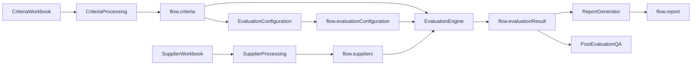
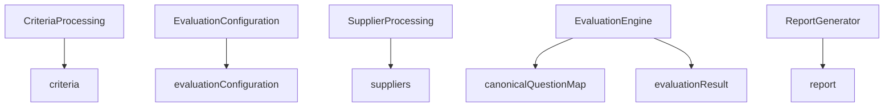
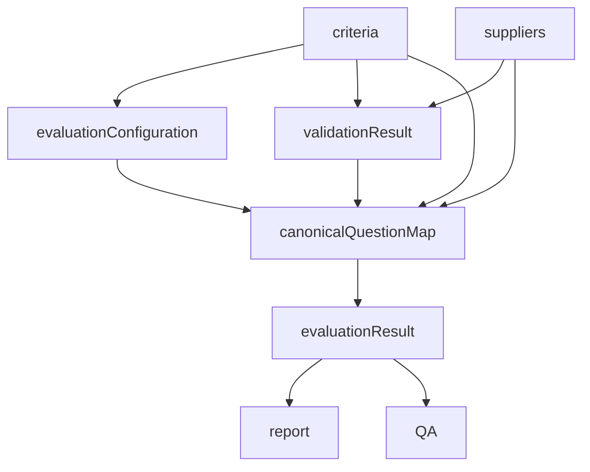

# 05A. Data Flow Architecture

**Document Version:** 1.0

**Status:** Architecture Frozen

**Parent Document:** Software Design Specification (SDS)

---

# Purpose

This document defines how information moves throughout the RFP Qualitative Evaluation Agent.

Unlike the System Architecture chapter, which defines software components, this document focuses on the lifecycle of business data.

Every module in the system communicates exclusively through Flow Variables.

No module directly accesses another module's internal implementation.

This document establishes the canonical data movement rules for Version 1.0.

---

# Data Flow Philosophy

The architecture follows a pipeline-based data flow model.

Every processing stage transforms business information into a richer representation without modifying previously generated source data.

The pipeline follows the sequence below.

```text
Raw Files

↓

Extracted Objects

↓

Configured Evaluation

↓

Validated Objects

↓

Canonical Objects

↓

Evaluation Results

↓

Reports

↓

Conversation Knowledge
```

Each stage produces data consumed by the next stage.

Previous stages remain immutable.

---

# High-Level Data Flow



---

# Core Data Objects

The system operates around six primary business objects.

| Object | Owner | Mutable |
|---------|-------|---------|
| criteria | Criteria Processing | No |
| evaluationConfiguration | Evaluation Configuration | Yes |
| suppliers | Supplier Processing | No |
| canonicalQuestionMap | Evaluation Engine | No |
| evaluationResult | Evaluation Engine | No |
| report | Report Generator | No |

Each object has a single owner.

Only the owning module may create or modify the object.

---

# Data Ownership

The architecture enforces strict ownership.



Ownership shall never overlap.

---

# Data Lifecycle

## Stage 1 — Criteria Extraction

Input

```
Evaluation Workbook
```

Output

```
flow.criteria
```

Characteristics

- Immutable
- Represents source data
- Never modified after extraction

---

## Stage 2 — Evaluation Configuration

Consumes

```
flow.criteria
```

Produces

```
flow.evaluationConfiguration
```

Characteristics

- Mutable
- Represents business-approved evaluation rules
- Can be regenerated without re-extracting criteria

---

## Stage 3 — Supplier Extraction

Consumes

```
Supplier Workbook
```

Produces

```
flow.suppliers[]
```

Characteristics

- Immutable
- One object per supplier
- Preserves workbook structure

---

## Stage 4 — Validation

Consumes

- flow.criteria
- flow.suppliers

Produces

```
validationResult
```

Purpose

Verify that supplier responses can be evaluated against the extracted criteria.

---

## Stage 5 — Canonical Mapping

Consumes

- flow.criteria
- flow.evaluationConfiguration
- flow.suppliers

Produces

```
canonicalQuestionMap
```

Purpose

Merge supplier responses and evaluation rules into a single evaluation model.

The canonical model becomes the single source of truth for all downstream evaluation.

---

## Stage 6 — Evaluation

Consumes

```
canonicalQuestionMap
```

Produces

```
flow.evaluationResult
```

The Evaluation Engine performs:

- Knockout Evaluation
- Qualitative Scoring
- Weighted Calculations
- Supplier Ranking
- Recommendation Generation

---

## Stage 7 — Reporting

Consumes

```
flow.evaluationResult
```

Produces

```
flow.report
```

No procurement logic exists within the reporting layer.

---

## Stage 8 — Post-Evaluation Analysis

Consumes

```
flow.evaluationResult

flow.report
```

Allows consultants to perform conversational analysis without repeating evaluation.

---

# Data Dependency Graph



---

# Immutability Rules

The following objects are immutable after creation.

| Object | Reason |
|----------|---------|
| criteria | Source data |
| suppliers | Source data |
| canonicalQuestionMap | Evaluation baseline |
| evaluationResult | Auditability |
| report | Historical output |

Only

```
flow.evaluationConfiguration
```

is mutable during the evaluation lifecycle.

This allows procurement consultants to modify business rules without changing source information.

---

# Data Contract Rules

Every shared object shall satisfy the following principles.

## Single Producer

Every object has exactly one producer.

---

## Multiple Consumers

Objects may have multiple consumers.

---

## Immutable Source Data

Source extraction objects shall never be modified.

---

## Explicit Contracts

All shared objects shall conform to documented JSON schemas.

---

## Version Stability

JSON contracts shall remain stable throughout Version 1.0.

Breaking changes require a new SDS version.

---

# Error Propagation

Errors propagate independently from business data.

```text
Supplier Extraction

↓

Supplier Error

↓

Supervisor

↓

User
```

Business objects remain unchanged.

---

# Design Decisions

| Decision | Rationale |
|-----------|-----------|
| Separate Criteria and Configuration | Preserve source data |
| Canonical Question Map | Single evaluation model |
| Immutable source objects | Auditability |
| Single Producer Rule | Prevent conflicting ownership |
| Flow Variables only | Loose coupling |

---

# Summary

The Data Flow Architecture defines the movement, ownership and lifecycle of every business object used by the RFP Qualitative Evaluation Agent.

By separating immutable source data from configurable business rules and evaluation outputs, the architecture ensures consistency, auditability and maintainability.

Every downstream component consumes well-defined data contracts, enabling modular implementation and predictable behaviour throughout the evaluation lifecycle.
