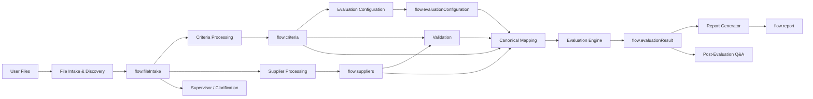
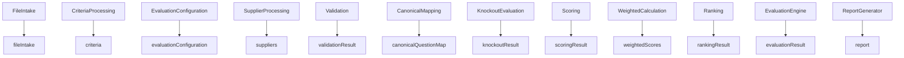
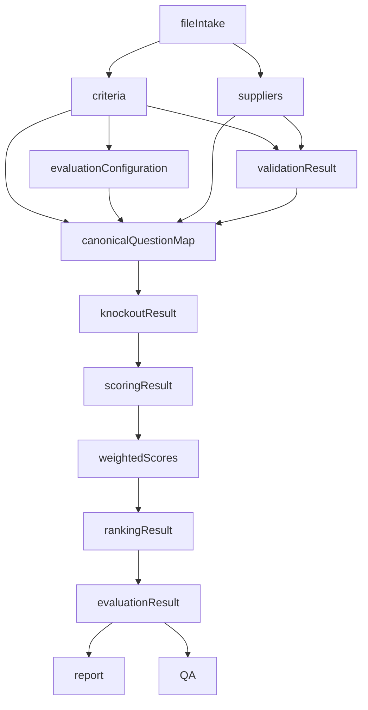

# 05A. Data Flow Architecture

**Document Version:** 1.1

**Status:** Architecture Baseline Updated

**Parent Document:** Software Design Specification (SDS)

---

# Purpose

This document defines how information moves through the RFP Qualitative Evaluation Agent when users provide flexible Excel inputs.

The architecture now separates **raw file discovery** from **business normalization**. Users may provide unfamiliar but reasonably structured workbooks; downstream evaluation still receives strict canonical objects.

Every module communicates through documented Flow Variables.

---

# Data Flow Philosophy

The pipeline follows:

```text
Raw Files
↓
File Intake & Discovery
↓
Discovered File/Sheet Objects
↓
Normalized Criteria + Suppliers
↓
Configured Evaluation
↓
Validated Objects
↓
Canonical Evaluation Model
↓
Evaluation Results
↓
Reports
↓
Conversation Knowledge
```

Source information remains traceable and immutable after acceptance into downstream processing.

---

# High-Level Data Flow



---

# Core Data Objects

| Object | Owner | Mutable | Purpose |
|---|---|---:|---|
| fileIntake | File Intake & Discovery | No after acceptance | Discovered file/sheet roles, entities, provenance and confidence |
| criteria | Criteria Processing | No | Normalized source evaluation criteria |
| evaluationConfiguration | Evaluation Configuration | Yes before evaluation | Business-approved rules |
| suppliers | Supplier Processing | No | Normalized supplier responses |
| validationResult | Validation | No | Structural compatibility findings |
| canonicalQuestionMap | Canonical Mapping | No | Single evaluation model |
| knockoutResult | Knockout Evaluation | No | Supplier knockout outcomes |
| scoringResult | Qualitative Scoring | No | Semantic scores and evidence |
| weightedScores | Weighted Calculation | No | Deterministic weighted scores |
| rankingResult | Supplier Ranking | No | Deterministic supplier ranking |
| evaluationResult | Evaluation Engine | No | Complete evaluation result |
| report | Report Generator | No | Generated deliverables |

---

# Data Ownership



Every object has one producer.

---

# Stage 0 — File Intake & Discovery

Input

```text
User-uploaded files
```

Output

```text
flow.fileIntake
```

The object records:

- file identity
- file name
- file type
- workbook metadata where available
- sheet inventory
- file classification
- sheet classifications
- detected supplier names
- detected event/criteria indicators
- confidence
- ambiguity flags
- provenance

The object does not contain supplier scores or evaluation decisions.

---

# Stage 1 — Criteria Extraction

Consumes

```text
flow.fileIntake
```

Output

```text
flow.criteria
```

The normalized criteria object preserves source provenance and distinguishes explicit source values from inferred values.

---

# Stage 2 — Evaluation Configuration

Consumes

```text
flow.criteria
```

Produces

```text
flow.evaluationConfiguration
```

This object contains business-approved evaluation rules and remains separate from source criteria.

---

# Stage 3 — Supplier Extraction

Consumes

```text
flow.fileIntake
```

Produces

```text
flow.suppliers[]
```

Each supplier object preserves response wording and source provenance.

---

# Stage 4 — Validation

Consumes

- flow.criteria
- flow.suppliers

Produces

```text
flow.validationResult
```

Validation distinguishes:

- errors that prevent reliable evaluation
- warnings that do not prevent evaluation
- mapping gaps requiring clarification

---

# Stage 5 — Canonical Mapping

Consumes

- flow.criteria
- flow.evaluationConfiguration
- flow.suppliers
- flow.validationResult

Produces

```text
flow.canonicalQuestionMap
```

The canonical model is the single source of truth for downstream evaluation.

---

# Stage 6 — Evaluation

Consumes

```text
flow.canonicalQuestionMap
```

Produces the controlled evaluation objects:

```text
flow.knockoutResult
flow.scoringResult
flow.weightedScores
flow.rankingResult
flow.evaluationResult
```

---

# Stage 7 — Reporting

Consumes

```text
flow.evaluationResult
```

Produces

```text
flow.report
```

No procurement logic exists within reporting.

---

# Stage 8 — Post-Evaluation Analysis

Consumes

```text
flow.evaluationResult
flow.report
```

Supports conversational analysis without repeating extraction or scoring unless explicitly requested after an approved change.

---

# Data Dependency Graph



---

# Immutability Rules

The following are immutable after creation/acceptance:

- flow.fileIntake
- flow.criteria
- flow.suppliers
- flow.validationResult
- flow.canonicalQuestionMap
- flow.knockoutResult
- flow.scoringResult
- flow.weightedScores
- flow.rankingResult
- flow.evaluationResult
- flow.report

Only `flow.evaluationConfiguration` is intentionally configurable before evaluation or during an approved re-evaluation cycle.

---

# Provenance Rules

Material extracted fields should retain enough provenance to identify:

- source file
- source sheet where available
- source row/column or source location where available
- whether the value was explicit or inferred
- confidence where inference was used

This is essential for explainable procurement evaluation.

---

# Data Contract Rules

1. Every shared object has exactly one producer.
2. Consumers treat shared objects as read-only.
3. Source data is never overwritten by inferred values.
4. Unknown values use `null` rather than fabricated content.
5. Arrays exist even when empty.
6. Material uncertainty is represented explicitly.
7. All downstream evaluation operates on normalized contracts.

---

# Summary

Version 1.1 introduces `flow.fileIntake` as the controlled boundary between flexible user files and the strict procurement data model.

This enables a low-friction user experience without weakening internal data discipline, provenance, explainability or deterministic evaluation.
