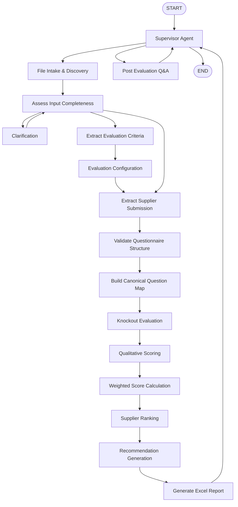

# 06. Overall Orchestration

**Document Version:** 1.1

**Status:** Architecture Baseline Updated

**Parent Document:** Software Design Specification (SDS)

---

# Purpose

This document defines the complete orchestration for the RFP Qualitative Evaluation Agent, including the zero-template user experience.

The Supervisor owns conversation and workflow state. File Intake & Discovery interprets uploaded files. Specialized modules normalize and evaluate the data.

---

# Design Philosophy

## 1. Supervisor Driven

The Supervisor owns the user journey, state management, routing and clarification.

## 2. File-Agnostic Entry

Users upload available files. The system determines their business roles.

## 3. Modular Execution

Each module has exactly one responsibility.

## 4. Explicit Handoffs

Every module receives and returns documented contracts.

## 5. Flow Variable Driven

Shared business data is exchanged through Flow Variables.

## 6. Deterministic Evaluation

The Evaluation Engine remains deterministic except for semantic scoring.

---

# Complete Orchestration



---

# Processing Stages

| Stage | Owner |
|---|---|
| Conversation Initiation | Supervisor |
| File Intake & Discovery | File Intake & Discovery |
| Input Completeness Assessment | Supervisor |
| Clarification | Supervisor |
| Criteria Preparation | Criteria Processing + Evaluation Configuration |
| Supplier Preparation | Supplier Processing |
| Evaluation | Evaluation Engine |
| Report Generation | Report Generator |
| Result Delivery | Supervisor |
| Post-Evaluation Analysis | Supervisor + Q&A |

---

# Stage 1 — Conversation Initiation

Entry condition:

```text
Conversation Started
```

Supervisor:

- Greets the user.
- Explains that available Excel files can be uploaded without a prescribed template.
- Sets `flow.conversationState = WAITING_FOR_FILES`.

---

# Stage 2 — File Intake & Discovery

Input:

```text
One or more uploaded files
```

The File Intake module:

1. Inspects files.
2. Discovers workbook sheets.
3. Classifies files.
4. Classifies sheets.
5. Identifies suppliers.
6. Identifies evaluation criteria.
7. Records confidence and provenance.

Output:

```text
flow.fileIntake
```

---

# Stage 3 — Input Completeness Assessment

The Supervisor determines whether the current session has enough information.

Possible outcomes:

### Criteria available, suppliers not yet available

```text
Criteria Processing
→ Evaluation Configuration
→ Waiting / Supplier Processing
```

### Suppliers available, criteria already configured

```text
Supplier Processing
→ Evaluation
```

### Material ambiguity

```text
Clarification
→ Re-assess
```

### Required information missing

```text
Request additional relevant file(s)
```

The system should not ask users to classify or reformat files unless required.

---

# Stage 4 — Criteria Preparation

Sequence:

```text
flow.fileIntake
↓
Extract Evaluation Criteria
↓
flow.criteria
↓
Evaluation Configuration
↓
flow.evaluationConfiguration
```

The criteria source remains immutable.

---

# Stage 5 — Supplier Preparation

Sequence:

```text
flow.fileIntake
↓
Extract Supplier Submission
↓
flow.suppliers[]
```

Supports:

- multiple supplier files
- multiple suppliers within a workbook where detectable
- incremental uploads
- duplicate detection

---

# Stage 6 — Evaluation

Sequence:

```text
Validate Questionnaire Structure
↓
Build Canonical Question Map
↓
Knockout Evaluation
↓
Qualitative Scoring
↓
Weighted Score Calculation
↓
Supplier Ranking
↓
Recommendation Generation
```

Produces:

```text
flow.evaluationResult
```

---

# Stage 7 — Report Generation

Consumes:

```text
flow.evaluationResult
```

Produces:

```text
flow.report
```

---

# Stage 8 — Post-Evaluation Analysis

The Supervisor can route follow-up questions to Q&A using:

```text
flow.evaluationResult
flow.report
```

No extraction is repeated unless explicitly required by a new input or approved re-evaluation.

---

# Supervisor Handoffs

| Handoff | Destination |
|---|---|
| handoff_fileDiscovery | File Intake & Discovery |
| handoff_extractCriteria | Criteria Processing |
| handoff_configureEvaluation | Evaluation Configuration |
| handoff_extractSuppliers | Supplier Processing |
| handoff_runEvaluation | Evaluation Engine |
| handoff_generateReport | Report Generator |
| handoff_postEvaluationQA | Post Evaluation Q&A |

No module directly invokes another module's internal implementation.

---

# Flow Variable Updates

| Variable | Producer |
|---|---|
| flow.conversationState | Supervisor |
| flow.fileIntake | File Intake & Discovery |
| flow.criteria | Criteria Processing |
| flow.evaluationConfiguration | Evaluation Configuration |
| flow.suppliers | Supplier Processing |
| flow.validationResult | Validation |
| flow.canonicalQuestionMap | Canonical Mapping |
| flow.knockoutResult | Knockout Evaluation |
| flow.scoringResult | Qualitative Scoring |
| flow.weightedScores | Weighted Calculation |
| flow.rankingResult | Ranking |
| flow.evaluationResult | Evaluation Engine |
| flow.report | Report Generator |

---

# Entry Conditions

| Module | Entry Condition |
|---|---|
| File Intake & Discovery | One or more uploaded files |
| Criteria Processing | Criteria source confidently identified |
| Evaluation Configuration | flow.criteria exists |
| Supplier Processing | Supplier source confidently identified |
| Evaluation Engine | Criteria + Configuration + Suppliers available and validation allows evaluation |
| Report Generator | Evaluation completed |
| Q&A | Evaluation completed |

---

# Exit Conditions

| Module | Exit Condition |
|---|---|
| File Intake & Discovery | flow.fileIntake created |
| Criteria Processing | flow.criteria created |
| Evaluation Configuration | flow.evaluationConfiguration approved |
| Supplier Processing | flow.suppliers populated |
| Evaluation Engine | flow.evaluationResult created |
| Report Generator | flow.report generated |
| Post-Evaluation Q&A | Conversation continues or ends |

---

# Failure Handling

File Discovery failure

→ identify affected file
→ explain in business language
→ request replacement or clarification

Criteria Processing failure

→ return to Supervisor
→ request another relevant evaluation/scoring source if necessary

Supplier Processing failure

→ identify affected supplier/file
→ request targeted re-upload

Evaluation failure

→ present validation issues
→ await correction/clarification

Workflow execution shall not terminate unexpectedly.

---

# Design Constraints

- Users are not required to classify files manually.
- Users are not required to follow prescribed file names.
- Users are not required to use prescribed sheet or column names.
- Internal normalized contracts remain strict.
- Criteria and supplier source data remain immutable.
- Material ambiguity must be resolved before it can affect evaluation.
- Supplier Processing never scores.
- Report Generation never scores.
- Every module owns exactly one responsibility.
- Every shared object has one producer.

---

# Summary

The orchestration now separates the flexible user-facing intake experience from the controlled procurement evaluation pipeline.

This preserves the original architecture while making the solution suitable for real floor users who should be able to upload the Excel files they already have rather than conform to a technical template.
