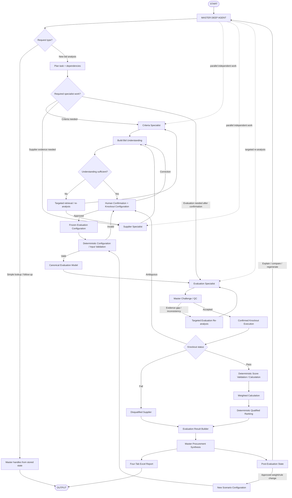

# 06. Overall Orchestration

**Document Version:** 1.2

**Status:** Implementation Architecture Baseline

**Parent Document:** Software Design Specification (SDS)

---

# Purpose

This document defines the end-to-end orchestration of the RFP Qualitative Bid Analysis Agent.

The Master Deep Agent owns adaptive orchestration. Three direct specialists perform bounded semantic work. A human confirmation gate establishes the evaluation configuration. Deterministic processing executes rules and calculations.

---

# Master Execution Model



The Master may skip unnecessary specialists for narrow requests and may execute independent discovery tasks in parallel.

---

# Stage 1 — Start and Intake

The user uploads available RFP/evaluation and supplier files.

No prescribed filenames, sheet names or internal templates are required for V1.

---

# Stage 2 — Master Planning

The Master determines:

- request type
- required source understanding
- required specialists
- dependencies
- tools required
- whether work can run in parallel
- required output

The Master must not assume that all three specialists are needed for every request.

---

# Stage 3 — Discovery

### Criteria Specialist
Produces the normalized evaluation framework and candidate knockout information.

### Supplier Specialist
Produces supplier response/evidence objects.

The Master reconciles the two outputs.

---

# Stage 4 — Bid Understanding Package

The Master creates a human-facing package containing:

- identified files and roles
- suppliers
- evaluation sections/questions
- scoring scale/rubric
- weights
- candidate knockouts
- proposed acceptance conditions
- ambiguities
- missing information
- explicit/inferred distinctions

This is the required human governance checkpoint.

---

# Stage 5 — Human Confirmation

The human evaluator:

1. confirms/corrects the understanding
2. confirms/modifies scoring/weights
3. confirms/removes candidate knockouts
4. adds additional knockout requirements
5. defines/confirms acceptance conditions
6. provides material special instructions

If the human states that there are no knockouts, the system records an explicit empty knockout set.

---

# Stage 6 — Freeze Configuration

The approved `flow.evaluationConfiguration` becomes immutable for the evaluation run.

A new weight/rule request after this point creates a new scenario.

---

# Stage 7 — Deterministic Validation and Canonicalization

Validation checks:

- required criteria
- supplier coverage
- question mapping
- scoring range
- weight integrity
- knockout rule completeness
- acceptance-condition completeness

Canonicalization produces the single downstream evaluation model.

---

# Stage 8 — Qualitative Evaluation

The Evaluation Specialist assesses each supplier response against the approved rubric and evidence.

Outputs include:

- question-level score recommendation
- reasoning
- evidence
- strengths
- weaknesses
- risks
- gaps
- comparisons

No arithmetic/ranking is performed here.

---

# Stage 9 — Master Challenge

The Master checks whether:

- evidence actually supports the assessment
- supplier response provenance is intact
- score recommendations follow the rubric
- there are unexplained gaps
- different specialists disagree

If not, the Master requests targeted re-analysis.

---

# Stage 10 — Deterministic Evaluation

The system then executes:

```text
Confirmed Knockout Rules
↓
Knockout Results
↓
Score Validation
↓
Weighted Score Calculation
↓
Qualified Supplier Ranking
```

A failed knockout disqualifies a supplier from qualified ranking.

An ambiguous knockout returns to the human gate.

---

# Stage 11 — Final Synthesis

The Master synthesizes:

- confirmed configuration
- knockout outcomes
- qualitative assessments
- weighted scores
- ranking
- strengths/weaknesses
- risks
- negotiation opportunities

The Master explains the results but cannot alter deterministic scores/ranking without an explicit new scenario.

---

# Stage 12 — Report

The output workbook contains:

1. **Executive Summary**
2. **Supplier Profiles**
3. **Q&A Scorecard**
4. **Score Legend**

The formatting follows the approved reference workbook design.

---

# Stage 13 — Post-Evaluation

The Master can answer follow-up questions from stored state.

Supported scenarios include:

- supplier comparison
- score explanation
- knockout explanation
- report regeneration
- approved weight changes
- approved scenario re-ranking

---

# Handoff Philosophy

The Master uses delegation rather than a rigid hard-coded sequence.

The three direct specialists are:

| Specialist | Core question |
|---|---|
| Criteria Analyst | What are we evaluating? |
| Supplier Evidence Analyst | What did each supplier submit? |
| Evaluation Analyst | How well does each supplier perform? |

The Master can invoke one, two or all three depending on the request.

---

# Failure Handling

| Failure | Recovery |
|---|---|
| File discovery issue | Targeted file clarification/re-upload |
| Criteria ambiguity | Targeted criteria re-analysis or human confirmation |
| Supplier mapping issue | Targeted supplier re-analysis |
| Evaluation evidence gap | Targeted Evaluation Specialist re-analysis |
| Configuration invalid | Return to human confirmation |
| Knockout ambiguity | Return to human confirmation |
| Deterministic validation failure | Correct input/configuration before continuing |
| Report failure | Retry report generation without re-running evaluation |

---

# Orchestration Invariants

1. One Master Deep Agent.
2. Maximum three direct specialist sub-agents.
3. Dynamic delegation, not fixed specialist execution.
4. Human confirmation before the first evaluation run.
5. Confirmed configuration is frozen.
6. Knockouts are human-confirmed and deterministically executed.
7. Arithmetic/weighting/ranking are deterministic.
8. Specialist outputs are challenged before final synthesis.
9. Source data is preserved.
10. Report generation is presentation-only.
