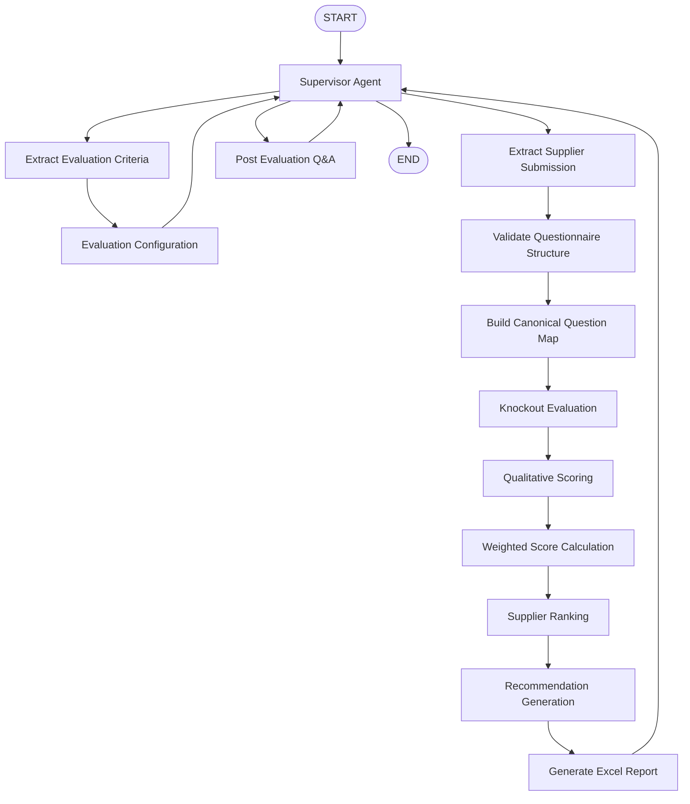

# 06. Overall Orchestration

**Document Version:** 1.0

**Status:** Architecture Frozen

**Parent Document:** Software Design Specification (SDS)

---

# Purpose

This document defines the complete orchestration executed by the RFP Qualitative Evaluation Agent.

It specifies:

- Overall workflow
- Module sequencing
- Supervisor handoffs
- Node ownership
- Processing stages
- Flow Variable updates
- Entry and exit conditions

This document serves as the implementation blueprint for the QI Studio orchestration.

---

# Design Philosophy

The orchestration follows four fundamental principles.

## 1. Supervisor Driven

The Supervisor Agent owns the complete user journey.

It determines:

- What the user should do next
- Which module should execute
- Which Flow Variables already exist
- Whether evaluation can proceed

No other module interacts directly with the user.

---

## 2. Modular Execution

Every module performs exactly one business responsibility.

Modules never invoke each other directly.

Instead, execution is coordinated by the Supervisor.

---

## 3. Explicit Handoffs

Every transition between modules occurs through a documented handoff.

Each handoff has:

- Trigger
- Preconditions
- Inputs
- Outputs
- Destination

---

## 4. Flow Variable Driven

Workflow progression is determined exclusively through Flow Variables.

The Supervisor never infers workflow state from conversation history.

---

# Complete Orchestration



---

# Processing Stages

The orchestration consists of seven major stages.

| Stage | Owner |
|---------|--------|
| Conversation Initiation | Supervisor |
| Criteria Preparation | Criteria Processing + Evaluation Configuration |
| Supplier Preparation | Supplier Processing |
| Evaluation | Evaluation Engine |
| Report Generation | Report Generator |
| Result Delivery | Supervisor |
| Post-Evaluation Analysis | Supervisor + Q&A |

---

# Stage 1 — Conversation Initiation

Owner

Supervisor

Entry Condition

```
Conversation Started
```

Responsibilities

- Welcome user
- Explain workflow
- Request Evaluation Criteria workbook

Produces

```
flow.conversationState = WAITING_FOR_CRITERIA
```

---

# Stage 2 — Criteria Preparation

Owner

Criteria Processing

Sequence

```text
Upload Workbook

↓

Extract Criteria

↓

Create flow.criteria

↓

Invoke Evaluation Configuration
```

Produces

```
flow.criteria
```

---

# Stage 3 — Evaluation Configuration

Owner

Evaluation Configuration Module

Sequence

```text
Review Criteria

↓

Confirm Weights

↓

Configure Knockout Questions

↓

Configure Expected Answers

↓

Approve Evaluation Configuration
```

Produces

```
flow.evaluationConfiguration
```

Completion Condition

Evaluation configuration approved.

---

# Stage 4 — Supplier Preparation

Owner

Supplier Processing

Sequence

```text
Upload Supplier Workbooks

↓

Extract Supplier Responses

↓

Create Supplier Objects

↓

Store flow.suppliers[]
```

Supports

- One supplier
- Multiple suppliers
- Incremental uploads

---

# Stage 5 — Evaluation

Owner

Evaluation Engine

Pipeline

```text
Validate Questionnaire Structure

↓

Canonical Question Mapping

↓

Apply Evaluation Configuration

↓

Knockout Evaluation

↓

Qualitative Scoring

↓

Weighted Score Calculation

↓

Supplier Ranking

↓

Recommendation Generation
```

Produces

```
flow.evaluationResult
```

---

# Stage 6 — Report Generation

Owner

Report Generator

Consumes

```
flow.evaluationResult
```

Produces

```
flow.report
```

Deliverables

- Executive Summary
- Supplier Ranking
- Detailed Scores
- Knockout Summary
- Recommendations
- Excel Workbook

---

# Stage 7 — Post-Evaluation Analysis

Owner

Supervisor + Q&A

Supported Activities

- Compare suppliers
- Explain scores
- Explain knockout decisions
- Modify weights
- Recalculate rankings
- Regenerate reports
- Export reports

No supplier extraction occurs during this stage.

---

# Supervisor Handoffs

The Supervisor is responsible for initiating all module execution.

| Handoff | Destination |
|----------|-------------|
| handoff_extractCriteria | Criteria Processing |
| handoff_configureEvaluation | Evaluation Configuration |
| handoff_extractSuppliers | Supplier Processing |
| handoff_runEvaluation | Evaluation Engine |
| handoff_generateReport | Report Generator |
| handoff_postEvaluationQA | Post Evaluation Q&A |

No module may invoke another module directly.

---

# Flow Variable Updates

| Variable | Producer |
|-----------|----------|
| flow.criteria | Criteria Processing |
| flow.evaluationConfiguration | Evaluation Configuration |
| flow.suppliers | Supplier Processing |
| flow.evaluationResult | Evaluation Engine |
| flow.report | Report Generator |
| flow.conversationState | Supervisor |

Each Flow Variable has exactly one producer.

---

# Entry Conditions

| Module | Entry Condition |
|----------|----------------|
| Criteria Processing | Criteria workbook uploaded |
| Evaluation Configuration | flow.criteria exists |
| Supplier Processing | Supplier workbook uploaded |
| Evaluation Engine | Criteria, Configuration and Suppliers available |
| Report Generator | Evaluation completed |
| Q&A | Evaluation completed |

---

# Exit Conditions

| Module | Exit Condition |
|----------|----------------|
| Criteria Processing | flow.criteria created |
| Evaluation Configuration | flow.evaluationConfiguration created |
| Supplier Processing | flow.suppliers populated |
| Evaluation Engine | flow.evaluationResult created |
| Report Generator | flow.report generated |
| Post Evaluation Q&A | Conversation continues or ends |

---

# Failure Handling

Every orchestration stage shall fail independently.

Examples

Criteria Processing failure

↓

Return to Supervisor

↓

Request corrected workbook

Supplier Processing failure

↓

Identify failed supplier

↓

Request re-upload

Evaluation failure

↓

Display validation errors

↓

Await correction

Workflow execution shall never terminate unexpectedly.

---

# Design Constraints

The orchestration enforces the following constraints.

- Criteria must be configured before supplier evaluation.
- Evaluation Configuration remains independent from Criteria Extraction.
- Supplier Processing never performs evaluation.
- Report Generation never performs scoring.
- Source data remains immutable.
- Every module owns exactly one responsibility.
- Every module communicates exclusively through Flow Variables.
- Every transition is orchestrated by the Supervisor.

---

# Summary

The Overall Orchestration defines the complete execution model for the RFP Qualitative Evaluation Agent.

The Supervisor Agent orchestrates every interaction while specialised modules perform independent responsibilities.

The workflow progresses through a deterministic sequence of extraction, configuration, evaluation, reporting and post-evaluation analysis.

This orchestration serves as the implementation blueprint for the QI Studio workflow and provides a stable foundation for all subsequent node-level specifications.
