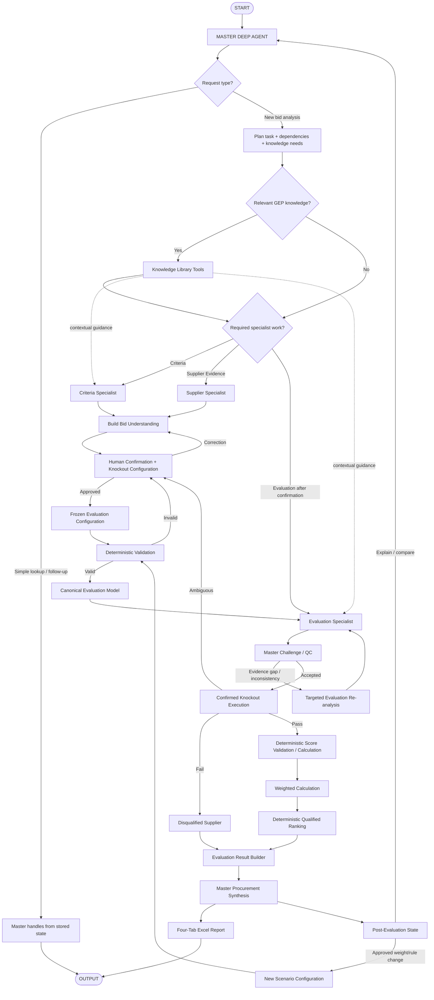

# 06. Overall Orchestration

**Document Version:** 1.3

**Status:** Implementation Architecture Baseline — Deep Agent + GEP Knowledge

## Purpose

The Master Deep Agent owns adaptive orchestration. Three direct specialists perform bounded semantic work. GEP Knowledge Library tools provide internal category/domain context. Human confirmation establishes material evaluation rules. Deterministic processing executes rules and calculations.

## Master Execution Model

## Knowledge Use Policy

GEP knowledge is retrieved only when relevant to the task. It may inform:

- category terminology
- category best practice
- evaluation interpretation
- benchmarking
- procurement methodology
- negotiation context
- challenge/QC

It must not silently override:

- the RFP
- supplier source evidence
- human-confirmed evaluation configuration

The Supplier Specialist is source-first and should generally avoid using GEP knowledge to alter extracted supplier responses.

## Stage Model

### 1. Start / Intake
User supplies available RFP/evaluation and supplier files.

### 2. Master Planning
Master determines request type, specialists, dependencies, required tools and relevant knowledge.

### 3. Discovery
Criteria and Supplier specialists normalize source material. Independent tasks may run in parallel.

### 4. Knowledge Enrichment
Relevant GEP knowledge is retrieved through the Knowledge Library tools and supplied as contextual input to the appropriate agent.

### 5. Bid Understanding
Master creates the Bid Clarification Package.

### 6. Human Confirmation
Human confirms/corrects understanding, scoring/weights and knockout rules/acceptance conditions.

### 7. Freeze Configuration
Approved `flow.evaluationConfiguration` becomes immutable for the run.

### 8. Validation / Canonicalization
Deterministically validate and build the single downstream evaluation model.

### 9. Qualitative Evaluation
Evaluation Specialist assesses supplier responses using confirmed criteria, evidence and relevant GEP context.

### 10. Master Challenge
Master checks evidence sufficiency, rubric alignment, provenance and consistency. It requests targeted re-analysis when necessary.

### 11. Deterministic Evaluation
Execute confirmed knockouts, score validation/calculation, weighting and ranking.

### 12. Synthesis
Master explains the result and procurement implications without changing deterministic outputs.

### 13. Report
Generate the four-tab workbook using the approved reference formatting logic.

### 14. Post-Evaluation
Use stored state for explanation/comparison. Approved rule/weight changes create new scenarios.

## Failure Handling

| Failure | Recovery |
|---|---|
| File discovery | Targeted clarification/re-upload |
| Knowledge retrieval | Retry; if material, surface to human |
| Criteria ambiguity | Targeted re-analysis / human confirmation |
| Supplier mapping | Targeted supplier re-analysis |
| Evaluation evidence gap | Targeted Evaluation Specialist re-analysis |
| Configuration invalid | Return to human confirmation |
| Knockout ambiguity | Return to human confirmation |
| Deterministic failure | Correct input/configuration; do not continue silently |
| Report failure | Retry report generation without rerunning evaluation |

## Orchestration Invariants

1. One Master Deep Agent.
2. Maximum three direct specialist sub-agents.
3. GEP knowledge is a capability layer, not a fourth agent.
4. Dynamic delegation, not fixed specialist execution.
5. Human confirmation before evaluation.
6. Confirmed configuration is frozen.
7. Candidate knockouts require human confirmation.
8. Knockouts, arithmetic, weighting and ranking execute deterministically.
9. Supplier source evidence is preserved.
10. GEP knowledge never silently overrides source or configuration.
11. Specialist outputs are challenged before synthesis.
12. Report generation is presentation-only.
