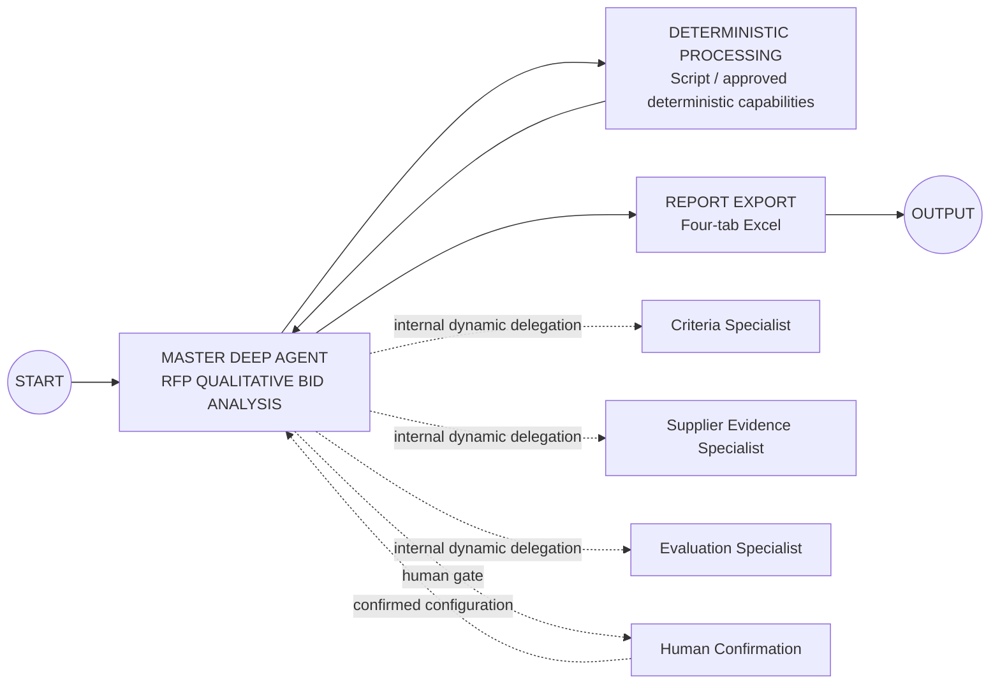
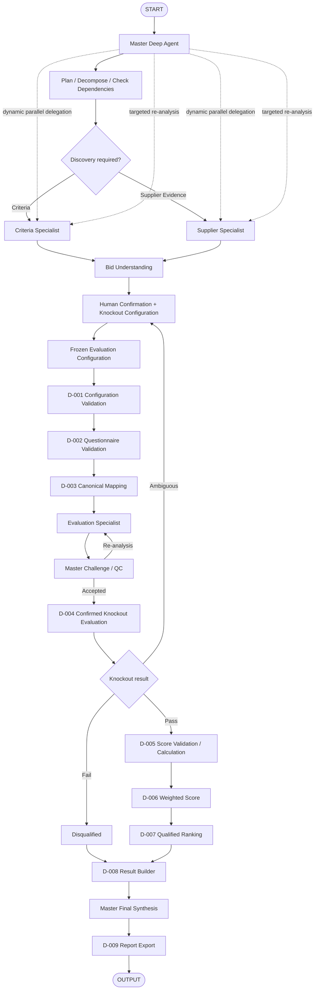

# 07. QI Studio Orchestration Blueprint

**Document Version:** 1.2

**Status:** Implementation Baseline — Deep Agent Architecture

**Parent Document:** Software Design Specification (SDS)

---

# Purpose

This document defines the implementable QI Studio architecture for the RFP Qualitative Bid Analysis Agent.

The canvas should remain compact: the primary orchestration intelligence lives inside one Master Deep Agent. The Master has three direct specialist sub-agents available and dynamically delegates work. Deterministic processing is used for validation, confirmed knockout rules, calculations and ranking.

---

# Canvas-Level Architecture



The Deep Agent contains the specialist delegation and HITL interaction internally. The canvas does not need a separate node for every logical stage.

---

# Deep Agent Responsibilities

The Master Deep Agent shall:

- understand user intent
- plan work
- inspect available tools/capabilities when necessary
- delegate to the appropriate specialist(s)
- use parallel execution for independent work where available
- respect task dependencies
- synthesize discovery results
- generate the Bid Clarification Package
- obtain human confirmation
- continue only after configuration approval
- challenge specialist outputs
- request targeted re-analysis
- produce final procurement synthesis

The Master shall not silently change a confirmed evaluation configuration.

---

# Specialist 1 — RFP & Evaluation Criteria Analyst

### Mission
Determine what the RFP/evaluation framework requires.

### Responsibilities

- identify sections
- identify questions/requirements
- preserve numbering
- extract weights
- extract scoring rubric
- identify mandatory language
- identify candidate knockout requirements
- propose acceptance-condition candidates
- preserve provenance
- distinguish explicit facts from inference

### Must not

- evaluate suppliers
- score supplier responses
- rank suppliers
- invent mandatory rules

---

# Specialist 2 — Supplier Response & Evidence Analyst

### Mission
Determine what each supplier actually submitted.

### Responsibilities

- identify supplier
- identify response boundaries
- extract response text verbatim
- preserve section/question mapping
- capture evidence/provenance
- detect missing responses
- detect duplicate supplier files
- report mapping confidence

### Must not

- rewrite source responses
- score responses
- rank suppliers
- create knockout rules

---

# Specialist 3 — Qualitative Evaluation & Comparison Analyst

### Mission
Evaluate supplier responses against the **confirmed** evaluation framework.

### Responsibilities

- assess response quality
- apply the approved rubric semantically
- recommend criterion-level scores
- provide evidence and rationale
- identify strengths/weaknesses
- identify risks/gaps
- compare suppliers

### Must not

- change the confirmed rubric
- change weights
- execute knockout rules
- perform authoritative arithmetic/ranking

---

# Human-in-the-Loop Gate

The Master shall produce a **Bid Clarification Package** before the first evaluation run.

The package must communicate:

- what files were identified
- what each file appears to represent
- suppliers identified
- evaluation sections/questions
- scoring scale/rubric detected
- weights detected
- candidate knockouts
- proposed acceptance conditions
- ambiguities
- missing information
- explicit vs inferred information

The user can:

- confirm
- correct
- add information
- add/remove/modify knockout requirements
- define/modify acceptance conditions
- approve the configuration

The Master must not start evaluation until material configuration is approved.

---

# Evaluation Configuration Contract

The confirmed configuration becomes:

```text
flow.evaluationConfiguration
```

It is frozen for the run.

A new configuration after evaluation creates a new scenario/version.

---

# Deterministic Node Inventory

| ID | Node | Type | Responsibility |
|---|---|---|---|
| D-001 | Configuration Validation | Script | Validate confirmed rules/configuration |
| D-002 | Questionnaire Validation | Script | Validate structural coverage |
| D-003 | Canonical Mapping | Script | Build canonical model |
| D-004 | Knockout Evaluation | Script | Execute confirmed acceptance conditions |
| D-005 | Score Validation / Calculation | Script | Validate score ranges and calculate totals |
| D-006 | Weighted Score Calculation | Script | Apply weights |
| D-007 | Supplier Ranking | Script | Rank qualified suppliers |
| D-008 | Evaluation Result Builder | Script | Assemble deterministic result contract |
| D-009 | Report Export | Export capability | Render four-tab workbook |

---

# Recommended Execution Pattern



---

# Dynamic Delegation Rules

The Master should use the following logic:

### Criteria-only request
Use Criteria Specialist; do not invoke Supplier/Evaluation Specialist unless required.

### Supplier extraction request
Use Supplier Specialist.

### Full bid analysis
Use Criteria + Supplier discovery, human confirmation, then Evaluation Specialist.

### Follow-up explanation
Use stored evaluation state; avoid unnecessary re-extraction.

### Weight-change scenario
Create new configuration/version and invoke deterministic recalculation.

### Material ambiguity
Pause at the human confirmation gate.

---

# Tool Governance

Tools are capabilities, not agents.

The Master or specialist should use:

- file/attachment capabilities for uploaded inputs
- document extraction for supported workbook/document formats
- knowledge/table tools when required
- export capabilities for final workbook generation
- system tool discovery only when the required capability is not already available/known

Tool discovery shall not be used as a mandatory step for every request.

---

# Error Handling

Agent failure:

- retry once where appropriate
- if still unsuccessful, isolate the affected task and return a structured recovery path

Script failure:

- return structured error
- do not silently continue with partial deterministic results

Configuration failure:

- return to human confirmation

Ambiguous knockout:

- return to human confirmation

Report failure:

- retry report generation without rerunning evaluation

---

# Implementation Rules

1. One Master Deep Agent.
2. Three direct specialist sub-agents maximum.
3. Dynamic delegation inside the Master.
4. Human confirmation is a formal state/gate.
5. Candidate knockouts are not authoritative until confirmed.
6. Confirmed rules are executed deterministically.
7. Arithmetic and ranking are deterministic.
8. Source responses remain verbatim during extraction.
9. Specialist outputs are structured and evidence-backed.
10. Report generation cannot alter evaluation data.
11. Every deterministic stage returns explicit status/errors.
12. The architecture should be tested incrementally: Master → Criteria → Supplier → HITL → Evaluation → Deterministic → Report.

---

# Implementation Freeze

This document is the V1.2 QI Studio implementation baseline. Deviations require a documented platform constraint, defect finding, or approved business requirement.
