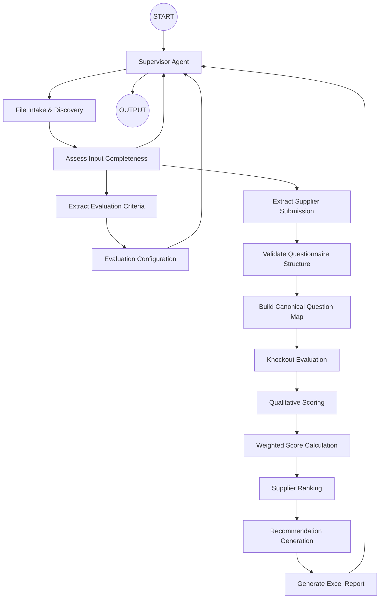

# 07. QI Studio Orchestration Blueprint

**Document Version:** 1.1

**Status:** Implementation Baseline Updated

**Parent Document:** Software Design Specification (SDS)

---

# Purpose

This document defines the implementation blueprint of the RFP Qualitative Evaluation Agent within GEP Quantum Intelligence Studio (QI Studio).

Version 1.1 adds File Intake & Discovery so users can upload available Excel files without knowing internal templates.

The blueprint remains intentionally modular and testable. Each node has a single responsibility.

---

# Design Objectives

- Low-friction user experience
- Simple orchestration
- Single responsibility per node
- Deterministic execution
- Minimal LLM usage
- Easy debugging
- Easy maintenance
- Reusable nodes
- Enterprise scalability
- Explicit data contracts
- Confidence-aware automation

---

# High-Level Orchestration



---

# Node Inventory

| ID | Node | Type |
|---|---|---|
| N-001 | START | Start |
| N-002 | Supervisor | Agent |
| N-003 | File Intake & Discovery | Agent |
| N-004 | Assess Input Completeness | Script / Rule |
| N-005 | Extract Evaluation Criteria | Agent |
| N-006 | Evaluation Configuration | Agent |
| N-007 | Extract Supplier Submission | Agent |
| N-008 | Validate Questionnaire Structure | Script |
| N-009 | Build Canonical Question Map | Script |
| N-010 | Knockout Evaluation | Script |
| N-011 | Qualitative Scoring | Agent |
| N-012 | Weighted Score Calculation | Script |
| N-013 | Supplier Ranking | Script |
| N-014 | Recommendation Generation | Agent / Script depending implementation |
| N-015 | Generate Excel Report | Agent |
| N-016 | OUTPUT | Output |

---

# Node Execution Order

```text
START
↓
Supervisor
↓
File Intake & Discovery
↓
Assess Input Completeness
↓
┌─────────────────────────────────────┐
│ Criteria available?                 │
│ Supplier data available?            │
│ Material ambiguity?                 │
└─────────────────────────────────────┘
↓
Criteria Processing / Clarification / Supplier Processing
↓
Evaluation Configuration
↓
Supplier Processing
↓
Validate Questionnaire Structure
↓
Build Canonical Question Map
↓
Knockout Evaluation
↓
Qualitative Scoring
↓
Weighted Score Calculation
↓
Supplier Ranking
↓
Recommendation Generation
↓
Generate Excel Report
↓
Supervisor
↓
OUTPUT
```

---

# Node Responsibilities

## N-001 START

Accepts user message and uploaded files.

The start interface shall not require the user to declare file roles.

---

## N-002 Supervisor

Responsibilities:

- Conversation orchestration
- State management
- User guidance
- File intake invocation
- Clarification
- Handoffs
- Result delivery
- Post-evaluation Q&A routing

The Supervisor does not classify workbook content itself when File Intake & Discovery can perform that responsibility.

Produces:

```text
flow.conversationState
```

---

## N-003 File Intake & Discovery

Type:

Agent

Purpose:

Understand uploaded files before business processing.

Consumes:

```text
User files
```

Produces:

```text
flow.fileIntake
```

Responsibilities:

- Discover workbook sheets
- Classify file roles
- Classify sheet roles
- Identify supplier names
- Identify evaluation frameworks
- Detect combined workbooks
- Detect supporting documents
- Record confidence
- Record ambiguity
- Preserve provenance

It must not score suppliers.

---

## N-004 Assess Input Completeness

Type:

Script / Rule

Purpose:

Determine whether the current session contains sufficient information to proceed.

Inputs:

```text
flow.fileIntake
flow.criteria
flow.evaluationConfiguration
flow.suppliers
flow.conversationState
```

Outputs:

```text
inputAssessment
```

Possible outcomes:

```text
PROCEED_CRITERIA
PROCEED_SUPPLIERS
WAIT_FOR_FILES
CLARIFY
READY_FOR_EVALUATION
```

This node must not make semantic interpretations; it uses the structured discovery output and explicit business rules.

---

## N-005 Extract Evaluation Criteria

Type:

Agent

Consumes:

```text
flow.fileIntake
```

Produces:

```text
flow.criteria
```

Responsibilities:

- Extract sections
- Extract questions/requirements
- Preserve source numbering
- Extract weights
- Extract guidance/rubrics
- Identify knockout candidates
- Preserve provenance
- Distinguish explicit vs inferred values

---

## N-006 Evaluation Configuration

Type:

Agent

Consumes:

```text
flow.criteria
```

Produces:

```text
flow.evaluationConfiguration
```

Responsibilities:

- Review material criteria interpretation
- Configure weights
- Configure knockout rules
- Define acceptance conditions
- Exclude questions where allowed
- Obtain approval when required

---

## N-007 Extract Supplier Submission

Type:

Agent

Consumes:

```text
flow.fileIntake
```

Produces:

```text
flow.suppliers
```

Responsibilities:

- Identify supplier
- Extract responses
- Preserve wording
- Preserve section context
- Preserve source references
- Detect unanswered questions
- Support multiple supplier sources

No scoring.

---

## N-008 Validate Questionnaire Structure

Type:

Script

Consumes:

```text
flow.criteria
flow.suppliers
```

Produces:

```text
flow.validationResult
```

Validation shall distinguish errors from warnings and shall tolerate harmless workbook variation where semantic mapping is reliable.

---

## N-009 Build Canonical Question Map

Type:

Script

Consumes:

```text
flow.criteria
flow.evaluationConfiguration
flow.suppliers
flow.validationResult
```

Produces:

```text
flow.canonicalQuestionMap
```

Purpose:

Create one authoritative representation of each evaluation question/requirement and supplier response.

---

## N-010 Knockout Evaluation

Type:

Script

Consumes:

```text
flow.canonicalQuestionMap
flow.evaluationConfiguration
```

Produces:

```text
flow.knockoutResult
```

Knockout decisions must use configured acceptance conditions and source evidence. Simple generic keyword matching is not authoritative.

---

## N-011 Qualitative Scoring

Type:

Agent

Consumes:

```text
flow.canonicalQuestionMap
flow.knockoutResult
flow.evaluationConfiguration
```

Produces:

```text
flow.scoringResult
```

LLM responsibility is limited to semantic assessment against the approved rubric.

---

## N-012 Weighted Score Calculation

Type:

Script

Consumes:

```text
flow.scoringResult
flow.evaluationConfiguration
```

Produces:

```text
flow.weightedScores
```

All arithmetic is deterministic.

---

## N-013 Supplier Ranking

Type:

Script

Consumes:

```text
flow.weightedScores
flow.knockoutResult
```

Produces:

```text
flow.rankingResult
```

Qualified suppliers receive ranks. Disqualified suppliers do not receive a qualified rank.

---

## N-014 Recommendation Generation

Purpose:

Generate evidence-based procurement recommendations from structured evaluation results.

The node must not invent supplier facts.

---

## N-015 Generate Excel Report

Consumes:

```text
flow.evaluationResult
```

Produces:

```text
flow.report
```

No scoring or ranking logic exists in this node.

---

## N-016 OUTPUT

Returns final results to the user.

---

# Node Connections

| From | To |
|---|---|
| START | Supervisor |
| Supervisor | File Intake & Discovery |
| File Intake & Discovery | Assess Input Completeness |
| Assess Input Completeness | Extract Evaluation Criteria |
| Assess Input Completeness | Extract Supplier Submission |
| Assess Input Completeness | Supervisor / Clarification |
| Extract Evaluation Criteria | Evaluation Configuration |
| Evaluation Configuration | Supervisor |
| Extract Supplier Submission | Validate Questionnaire Structure |
| Validate Questionnaire Structure | Build Canonical Question Map |
| Build Canonical Question Map | Knockout Evaluation |
| Knockout Evaluation | Qualitative Scoring |
| Qualitative Scoring | Weighted Score Calculation |
| Weighted Score Calculation | Supplier Ranking |
| Supplier Ranking | Recommendation Generation |
| Recommendation Generation | Generate Excel Report |
| Generate Excel Report | Supervisor |
| Supervisor | OUTPUT |

---

# Retry Strategy

| Node Type | Retry Policy |
|---|---|
| File Intake Agent | Retry once, then route to clarification/error |
| Other Agent | Retry once |
| Script | No automatic retry; return structured error |
| Output | No retry |
| Start | No retry |

---

# Error Handling

All Agent Nodes shall have error handling enabled.

File discovery errors shall identify the affected file.

Criteria extraction errors shall return to the Supervisor.

Supplier extraction errors shall isolate the affected supplier/file where practical.

Evaluation errors shall return structured validation information.

The Supervisor determines whether to retry, request clarification or request a replacement input.

---

# Variable Ownership

| Variable | Owner |
|---|---|
| flow.conversationState | Supervisor |
| flow.fileIntake | File Intake & Discovery |
| flow.criteria | Extract Evaluation Criteria |
| flow.evaluationConfiguration | Evaluation Configuration |
| flow.suppliers | Extract Supplier Submission |
| flow.validationResult | Validate Questionnaire Structure |
| flow.canonicalQuestionMap | Build Canonical Question Map |
| flow.knockoutResult | Knockout Evaluation |
| flow.scoringResult | Qualitative Scoring |
| flow.weightedScores | Weighted Score Calculation |
| flow.rankingResult | Supplier Ranking |
| flow.evaluationResult | Evaluation Result Builder / Evaluation Engine |
| flow.report | Generate Excel Report |

Every variable has exactly one producer.

---

# QI Studio Design Rules

1. Every node has one responsibility.
2. User-facing file role classification is performed by File Intake & Discovery, not by the user.
3. Agent nodes perform semantic interpretation only.
4. Script nodes perform deterministic business logic.
5. Rule nodes perform routing only.
6. Flow Variables are the shared communication mechanism.
7. Source data is preserved and traceable.
8. Material uncertainty is explicit.
9. Errors return to controlled recovery paths.
10. No node should require the user to reformat data when the system can reasonably normalize it.
11. Structured outputs shall be used wherever applicable.
12. Every node shall be individually testable before downstream nodes are added.

---

# Implementation Freeze

The node names, execution order, responsibilities and ownership defined here constitute the V1.1 implementation baseline.

Changes are permitted where:

- QI Studio limitations prevent implementation.
- A defect is discovered.
- Testing demonstrates a better implementation without changing business behaviour.
- A new business requirement is approved.
