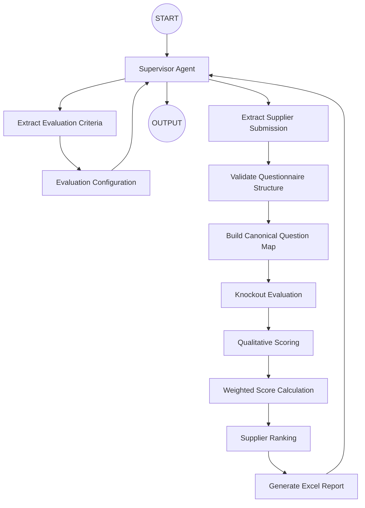

# 07. QI Studio Orchestration Blueprint

**Document Version:** 1.0

**Status:** Architecture Frozen

**Parent Document:** Software Design Specification (SDS)

---

# Purpose

This document defines the implementation blueprint of the RFP Qualitative Evaluation Agent within **GEP Quantum Intelligence Studio (QI Studio)**.

Unlike previous architecture documents, this chapter maps directly to the implementation.

Every node described in this document corresponds to a physical node within the QI Studio orchestration.

No implementation decisions shall be made outside this document.

---

# Design Objectives

The orchestration has been designed to achieve the following objectives.

- Simple orchestration
- Single responsibility per node
- Deterministic execution
- Minimal LLM usage
- Easy debugging
- Easy maintenance
- Reusable nodes
- Enterprise scalability

---

# High-Level Orchestration



---

# Node Inventory

| ID | Node | Type |
|----|------|------|
| N-001 | START | Start |
| N-002 | Supervisor | Agent |
| N-003 | Extract Evaluation Criteria | Agent |
| N-004 | Evaluation Configuration | Agent |
| N-005 | Extract Supplier Submission | Agent |
| N-006 | Validate Questionnaire Structure | Script |
| N-007 | Build Canonical Question Map | Script |
| N-008 | Knockout Evaluation | Script |
| N-009 | Qualitative Scoring | Agent |
| N-010 | Weighted Score Calculation | Script |
| N-011 | Supplier Ranking | Script |
| N-012 | Generate Excel Report | Agent |
| N-013 | OUTPUT | Output |

---

# Node Execution Order

Execution follows the sequence below.

```text
START

↓

Supervisor

↓

Extract Evaluation Criteria

↓

Evaluation Configuration

↓

Supervisor

↓

Extract Supplier Submission

↓

Validate Questionnaire Structure

↓

Canonical Question Map

↓

Knockout Evaluation

↓

Qualitative Scoring

↓

Weighted Score Calculation

↓

Supplier Ranking

↓

Generate Excel Report

↓

Supervisor

↓

OUTPUT
```

---

# Node Responsibilities

## START

Type

Start Node

Purpose

Initialises the orchestration.

Responsibilities

- Accept user interaction
- Initialise Flow Variables
- Transfer control to the Supervisor

---

## Supervisor

Type

Agent

Purpose

Conversation controller.

Responsibilities

- Greeting
- Routing
- State management
- Handoffs
- User interaction
- Follow-up questions

Produces

```
flow.conversationState
```

---

## Extract Evaluation Criteria

Type

Agent

Purpose

Read the Evaluation Criteria workbook.

Produces

```
flow.criteria
```

Consumes

```
Evaluation Workbook
```

---

## Evaluation Configuration

Type

Agent

Purpose

Finalise business evaluation settings.

Produces

```
flow.evaluationConfiguration
```

Consumes

```
flow.criteria
```

---

## Extract Supplier Submission

Type

Agent

Purpose

Read supplier workbooks.

Produces

```
flow.suppliers
```

Consumes

```
Supplier Workbooks
```

---

## Validate Questionnaire Structure

Type

Script

Purpose

Validate supplier responses against the Evaluation Criteria.

Produces

```
validationResult
```

---

## Build Canonical Question Map

Type

Script

Purpose

Merge supplier answers with evaluation criteria.

Produces

```
canonicalQuestionMap
```

---

## Knockout Evaluation

Type

Script

Purpose

Evaluate all configured knockout rules.

Produces

```
knockoutResult
```

---

## Qualitative Scoring

Type

Agent

Purpose

Assign qualitative scores using the approved evaluation criteria.

Produces

```
scoringResult
```

---

## Weighted Score Calculation

Type

Script

Purpose

Calculate weighted supplier scores.

Produces

```
weightedScores
```

---

## Supplier Ranking

Type

Script

Purpose

Rank suppliers.

Produces

```
rankingResult
```

---

## Generate Excel Report

Type

Agent

Purpose

Generate the final procurement evaluation report.

Produces

```
flow.report
```

---

## OUTPUT

Type

Output

Purpose

Return results to the user.

---

# Node Connections

| From | To |
|--------|-----|
| START | Supervisor |
| Supervisor | Extract Evaluation Criteria |
| Extract Evaluation Criteria | Evaluation Configuration |
| Evaluation Configuration | Supervisor |
| Supervisor | Extract Supplier Submission |
| Extract Supplier Submission | Validate Questionnaire Structure |
| Validate Questionnaire Structure | Build Canonical Question Map |
| Build Canonical Question Map | Knockout Evaluation |
| Knockout Evaluation | Qualitative Scoring |
| Qualitative Scoring | Weighted Score Calculation |
| Weighted Score Calculation | Supplier Ranking |
| Supplier Ranking | Generate Excel Report |
| Generate Excel Report | Supervisor |
| Supervisor | OUTPUT |

---

# Retry Strategy

| Node Type | Retry Policy |
|------------|--------------|
| Agent | Retry once |
| Script | No retry |
| Output | No retry |
| Start | No retry |

---

# Error Handling

Every processing node enables **Error Handling**.

Failures return to the Supervisor.

The Supervisor determines:

- Retry
- Ask user to re-upload
- Abort workflow

The orchestration shall never terminate unexpectedly.

---

# Variable Ownership

| Variable | Owner |
|----------|--------|
| flow.criteria | Extract Evaluation Criteria |
| flow.evaluationConfiguration | Evaluation Configuration |
| flow.suppliers | Extract Supplier Submission |
| validationResult | Validate Questionnaire Structure |
| canonicalQuestionMap | Build Canonical Question Map |
| knockoutResult | Knockout Evaluation |
| scoringResult | Qualitative Scoring |
| weightedScores | Weighted Score Calculation |
| rankingResult | Supplier Ranking |
| flow.report | Generate Excel Report |

Every variable has exactly one producer.

---

# QI Studio Design Rules

The following implementation rules shall be followed throughout development.

1. Every node shall have a single responsibility.
2. Every Agent node shall define a structured output wherever applicable.
3. Every Script node shall use documented input and output variables.
4. Rule Nodes shall only perform routing decisions.
5. Flow Variables shall be the only communication mechanism between nodes.
6. Business logic shall reside in Script Nodes wherever deterministic implementation is possible.
7. LLM reasoning shall be restricted to semantic interpretation only.
8. Error Handling shall be enabled for all Agent Nodes.
9. Every node shall include a descriptive name matching this specification.

---

# Implementation Freeze

The node names, execution order, responsibilities and ownership defined within this document constitute the implementation baseline for Version 1.0.

No changes shall be made unless:

- A QI Studio limitation prevents implementation.
- A defect prevents correct execution.
- A new business requirement is formally approved.

This document shall serve as the construction blueprint for the QI Studio orchestration.
