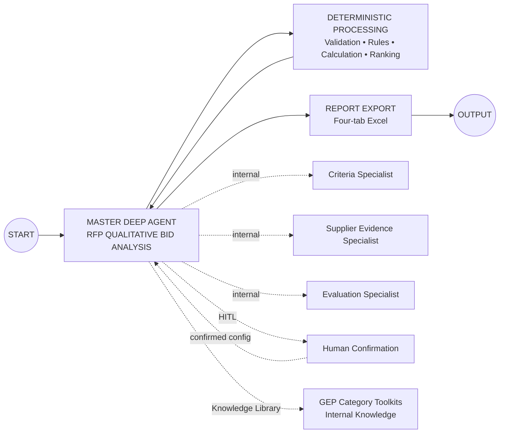
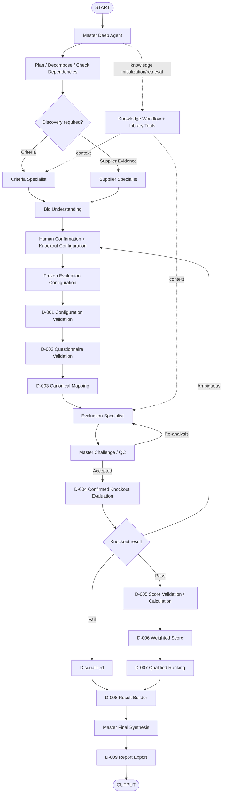

# 07. QI Studio Orchestration Blueprint

**Document Version:** 1.4  
**Status:** Business architecture + implementation baseline  
**Updated:** 23 Aug 2026

## Purpose

The canvas remains compact. The primary orchestration intelligence lives inside one Master Deep Agent. The Master has three direct specialist sub-agents and uses Knowledge Library tools for GEP internal domain knowledge. Deterministic processing handles validation, confirmed knockout rules, calculations and ranking.

This document defines the **solution architecture**. It does not claim that every QI Studio runtime capability shown here has already been runtime-tested.

## Canvas-Level Architecture



## Deep Agent Responsibilities

The Master shall:

- understand intent;
- plan and decompose tasks;
- dynamically delegate to specialists;
- exploit parallelism for independent tasks;
- respect dependencies;
- use file/document capabilities;
- initialize and use Knowledge Library tools according to the current knowledge workflow;
- generate the Bid Clarification Package;
- obtain human confirmation;
- challenge specialist outputs;
- request targeted re-analysis;
- synthesize the final procurement result.

Tool discovery for **system actions** is conditional on needing such an action, but when a system action is needed the supplied system-tool contract requires the sequence:

```text
SearchSystemTools
      ↓
GetSystemToolSchema
      ↓
ExecuteSystemTool
```

Knowledge-related agent invocations have a separate mandatory initialization rule:

```text
get-knowledge-workflow-instructions
      ↓
get_library_metadata
      ↓
source-specific knowledge tools
```

## Specialist 1 — RFP & Evaluation Criteria Analyst

Determines what the RFP/evaluation framework requires. It may use relevant GEP knowledge for terminology and contextual guidance.

It must not convert knowledge-only recommendations into authoritative evaluation rules without human confirmation.

## Specialist 2 — Supplier Response & Evidence Analyst

Determines what each supplier actually submitted. It is source-first. GEP knowledge should generally not be used to rewrite, supplement or infer supplier evidence.

## Specialist 3 — Qualitative Evaluation & Comparison Analyst

Evaluates supplier responses against the confirmed framework and may retrieve relevant GEP category toolkits, benchmarks and approved guidance.

It produces semantic score recommendations, evidence, rationale, strengths, weaknesses, risks and comparisons. It does not perform authoritative arithmetic, weighting, ranking or confirmed knockout execution.

## GEP Knowledge Library

GEP knowledge is a capability/tool layer, not a fourth sub-agent.

### Knowledge rules

1. For any knowledge-related agent invocation, call `get-knowledge-workflow-instructions` first.
2. Call `get_library_metadata` after that initialization step.
3. Use only the tools permitted by the returned knowledge metadata/`target_functions`.
4. For data-search knowledge, call `get_data_search_fields` before search execution.
5. Preserve mandatory `default_filters` exactly when returned for a data-search source.
6. Never fabricate IDs, schema fields or relationships.
7. Use knowledge as context, benchmark or guidance.
8. Never silently override the RFP or human-confirmed configuration.
9. Preserve material source/reference provenance.

### Authority model

```text
Human-Confirmed Evaluation Configuration
                 ↑
                 │ authoritative run rules
RFP / Sourcing Documents
                 ↑
                 │ source evaluation requirements
GEP Knowledge Library
                 │ contextual guidance
                 ↓
Semantic AI Evaluation
```

## Human-in-the-Loop Gate

The Master creates a Bid Clarification Package containing discovered files, suppliers, evaluation framework, scoring/weights, candidate knockouts, proposed acceptance conditions, GEP context used, ambiguities and missing information.

The user confirms/corrects the understanding and confirms/adds/removes/changes knockout requirements and acceptance conditions.

The Master must not start the evaluation run until material configuration is approved.

## Deterministic Node Inventory

| ID | Node | Type | Responsibility |
|---|---|---|---|
| D-001 | Configuration Validation | Script | Validate confirmed rules/configuration |
| D-002 | Questionnaire Validation | Script | Validate structural coverage |
| D-003 | Canonical Mapping | Script | Build canonical model |
| D-004 | Knockout Evaluation | Script | Execute confirmed acceptance conditions |
| D-005 | Score Validation / Calculation | Script | Validate score ranges and calculate totals |
| D-006 | Weighted Score Calculation | Script | Apply weights |
| D-007 | Supplier Ranking | Script | Rank qualified suppliers |
| D-008 | Evaluation Result Builder | Script | Assemble deterministic result contract |
| D-009 | Report Export | Export capability | Render four-tab workbook |

## Recommended Execution Pattern



## Dynamic Delegation Rules

| Request | Behaviour |
|---|---|
| Criteria-only | Criteria Specialist; initialize/use knowledge only when relevant |
| Supplier extraction | Supplier Specialist; source-first |
| Full bid analysis | Criteria + Supplier → HITL → Evaluation |
| Follow-up explanation | Stored evaluation state; avoid re-extraction |
| Weight-change scenario | New configuration/version → deterministic recalculation |
| Material ambiguity | Human confirmation gate |

## Error Handling

Agent failure: targeted retry/re-analysis.

Knowledge retrieval failure: continue only if the missing knowledge is non-material; otherwise surface a business-language issue.

Script failure: structured error; never silently continue with partial deterministic results.

Configuration failure: return to human confirmation.

Ambiguous knockout: return to human confirmation.

Report failure: retry report generation without rerunning evaluation.

## Implementation Rules

1. One Master Deep Agent.
2. Three direct specialist sub-agents maximum.
3. GEP knowledge is a capability layer, not a fourth agent.
4. Dynamic delegation inside the Master.
5. Human confirmation is a formal gate.
6. Candidate knockouts are not authoritative until confirmed.
7. Confirmed rules are executed deterministically.
8. Arithmetic and ranking are deterministic.
9. Supplier source evidence remains source-faithful.
10. GEP knowledge never silently overrides the RFP/configuration.
11. Specialist outputs are structured and evidence-backed.
12. Report generation cannot alter evaluation data.
13. Runtime-specific QI Studio behaviour must be validated separately from this business architecture.
