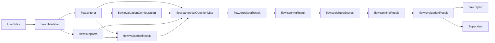

# 08. Flow Variables

**Document Version:** 1.1

**Status:** Architecture Baseline Updated

**Parent Document:** Software Design Specification (SDS)

---

# Purpose

This document defines every Flow Variable used by the RFP Qualitative Evaluation Agent.

Version 1.1 introduces `flow.fileIntake` to support flexible user-provided Excel files while preserving strict downstream contracts.

Flow Variables are the shared communication mechanism between modules.

---

# Design Principles

1. Single Producer
2. Multiple Consumers
3. Immutable Source Data
4. Explicit Contracts
5. Stable Interfaces
6. Provenance Preservation
7. Explicit Uncertainty

No undocumented Flow Variables shall be introduced during implementation.

---

# Flow Variable Lifecycle



---

# Flow Variable Inventory

| Variable | Producer | Consumers |
|---|---|---|
| flow.conversationState | Supervisor | Supervisor |
| flow.fileIntake | File Intake & Discovery | Supervisor, Criteria Processing, Supplier Processing |
| flow.criteria | Criteria Processing | Evaluation Configuration, Validation, Canonical Mapping |
| flow.evaluationConfiguration | Evaluation Configuration | Evaluation Engine |
| flow.suppliers | Supplier Processing | Validation, Canonical Mapping, Evaluation Engine |
| flow.validationResult | Validation | Canonical Mapping, Supervisor |
| flow.canonicalQuestionMap | Canonical Mapping | Knockout Evaluation, Qualitative Scoring |
| flow.knockoutResult | Knockout Evaluation | Qualitative Scoring, Ranking |
| flow.scoringResult | Qualitative Scoring | Weighted Score Calculation |
| flow.weightedScores | Weighted Score Calculation | Supplier Ranking |
| flow.rankingResult | Supplier Ranking | Evaluation Result Builder |
| flow.evaluationResult | Evaluation Engine / Result Builder | Report Generator, Supervisor, Q&A |
| flow.report | Report Generator | Supervisor, Q&A |

---

# Variable Specifications

## flow.conversationState

Purpose:

Tracks the current orchestration state.

Producer:

Supervisor

Example:

```json
{
  "state": "ASSESSING_INPUT"
}
```

Supported states:

```text
INITIAL
WAITING_FOR_FILES
DISCOVERING_FILES
ASSESSING_INPUT
CLARIFICATION_REQUIRED
PROCESSING_CRITERIA
CONFIGURING_EVALUATION
WAITING_FOR_SUPPLIERS
PROCESSING_SUPPLIERS
RUNNING_EVALUATION
GENERATING_REPORT
COMPLETED
POST_EVALUATION
FILE_DISCOVERY_ERROR
CRITERIA_ERROR
SUPPLIER_ERROR
EVALUATION_ERROR
```

---

## flow.fileIntake

Purpose:

Represents the system's structured understanding of uploaded files and workbook structures before business processing.

Producer:

File Intake & Discovery

Consumers:

- Supervisor
- Criteria Processing
- Supplier Processing

Lifecycle:

Created after file discovery and treated as immutable for the current intake set.

Required information:

- session/intake identifier
- files[]
- classification status
- material ambiguities
- completeness assessment inputs

Each file may contain:

- fileId
- fileName
- mimeType
- fileRole
- classificationConfidence
- classificationReason
- supplierName
- sheets[]
- provenance

Each sheet may contain:

- sheetName
- sheetRole
- confidence
- reason
- detected headers
- source dimensions where available
- provenance

Possible file roles:

```text
evaluation_criteria
supplier_submission
combined_evaluation_and_supplier
supporting_document
unknown
```

Possible sheet roles:

```text
evaluation_criteria
supplier_response
technical_response
commercial_response
company_profile
references
coverage
instructions
supporting_information
irrelevant
unknown
```

Unknown values shall be represented as `null` rather than fabricated.

---

## flow.criteria

Purpose:

Represents normalized evaluation criteria extracted from discovered source material.

Producer:

Criteria Processing

Consumers:

- Evaluation Configuration
- Validation
- Canonical Mapping

Lifecycle:

Created once for an evaluation configuration cycle and immutable thereafter.

Contents:

- metadata
- sections
- questions
- stable question IDs
- source numbering where available
- weights
- guidance
- rubrics
- knockout candidates
- provenance
- inference indicators

---

## flow.evaluationConfiguration

Purpose:

Represents business-approved evaluation rules.

Producer:

Evaluation Configuration

Consumer:

Evaluation Engine

Contents:

- approved
- weights
- knockout rules
- excluded questions
- included sections
- acceptance conditions
- configuredBy
- configuredAt

This is the principal mutable business configuration object.

---

## flow.suppliers

Purpose:

Contains normalized supplier response objects.

Producer:

Supplier Processing

Consumers:

- Validation
- Canonical Mapping
- Evaluation Engine

Lifecycle:

Immutable after extraction for the current source set.

One logical object per supplier.

---

## flow.validationResult

Purpose:

Stores structural validation findings.

Producer:

Validate Questionnaire Structure

Consumers:

- Canonical Mapping
- Supervisor

Contents:

- valid
- errors[]
- warnings[]
- missingQuestions[]
- extraQuestions[]
- mappingIssues[]
- sourceIssues[]

---

## flow.canonicalQuestionMap

Purpose:

Provides the single canonical representation of every evaluation question/requirement used downstream.

Producer:

Canonical Mapping

Consumers:

- Knockout Evaluation
- Qualitative Scoring

Contains:

- stable question ID
- source question number
- section
- question text
- supplier name
- supplier answer
- answered
- criteria
- weight
- scoring guidance
- knockout rules
- provenance
- mapping confidence

---

## flow.knockoutResult

Purpose:

Stores knockout evaluation results.

Producer:

Knockout Evaluation

Consumers:

- Qualitative Scoring
- Supplier Ranking

Contains:

- supplierName
- passed
- status
- failedQuestions[]
- expected conditions
- actual evidence
- reason
- confidence where applicable

---

## flow.scoringResult

Purpose:

Stores qualitative evaluation scores and evidence.

Producer:

Qualitative Scoring

Consumer:

Weighted Score Calculation

Contains:

- supplierName
- questionScores[]
- score
- maxScore
- reasoning
- evidence
- strengths
- weaknesses
- scoring confidence

---

## flow.weightedScores

Purpose:

Stores deterministic weighted numerical results.

Producer:

Weighted Score Calculation

Consumer:

Supplier Ranking

Contains:

- supplierName
- sectionScores[]
- overallWeightedScore
- calculation metadata

---

## flow.rankingResult

Purpose:

Stores deterministic supplier ranking.

Producer:

Supplier Ranking

Consumer:

Evaluation Result Builder

Contains:

- rank
- supplierName
- score
- status
- tie handling
- ordering rationale

Disqualified suppliers do not receive a qualified rank.

---

## flow.evaluationResult

Purpose:

Represents the complete procurement evaluation.

Producer:

Evaluation Result Builder / Evaluation Engine

Consumers:

- Supervisor
- Report Generator
- Post-Evaluation Q&A

Contains:

- summary
- supplier summaries
- rankings
- scores
- knockout results
- recommendations
- strengths
- weaknesses
- risks
- negotiation opportunities
- provenance/audit metadata

---

## flow.report

Purpose:

Represents generated deliverables.

Producer:

Report Generator

Consumers:

- Supervisor
- Q&A

Contains:

- generatedAt
- generatedBy
- reportVersion
- reportType
- downloadReference
- status

---

# Variable Ownership Rules

1. Every variable has exactly one producer.
2. Producers modify only their own variables.
3. Consumers treat variables as read-only.
4. Source variables remain immutable.
5. Unknown information is never silently fabricated.
6. Material inference retains confidence and provenance.

---

# Naming Convention

```text
flow.<businessObject>
```

Examples:

```text
flow.fileIntake
flow.criteria
flow.suppliers
flow.evaluationResult
flow.report
```

Temporary script variables shall not become Flow Variables unless consumed by another module.

---

# Summary

`flow.fileIntake` is the new abstraction boundary between user-provided files and the strict internal procurement model.

All downstream Flow Variables retain the original single-producer, immutable-source and explicit-contract principles.
