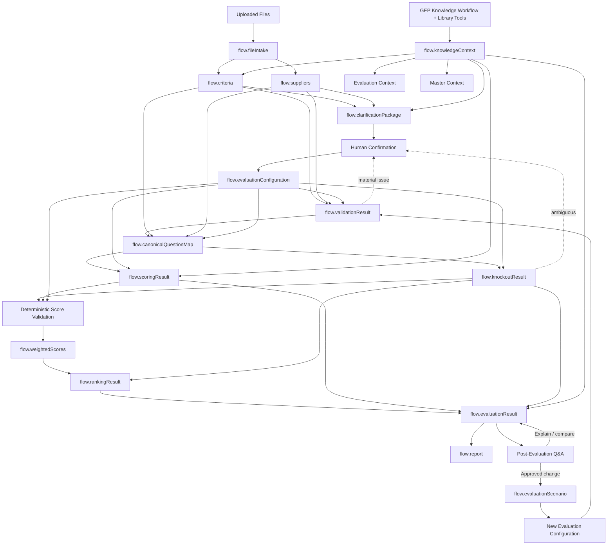

# 08. Flow Variables

**Document Version:** 1.4  
**Status:** Business data-contract baseline + current runtime mapping  
**Updated:** 23 Aug 2026

## Purpose

Flow Variables separate source discovery, GEP domain context, human-confirmed configuration, semantic evaluation, deterministic processing and reporting.

This document describes the intended **business data contract**. Only a small subset of generic Flow Variable behaviour has currently been runtime-tested. See the runtime test log and current verification ledger before treating a platform detail as proven.

## Core Lifecycle



## Flow Variable Inventory

| Variable | Producer | Main consumers |
|---|---|---|
| flow.conversationState | Master | Master |
| flow.fileIntake | Discovery | Master, Criteria, Supplier |
| flow.criteria | Criteria Specialist | Master, Validation, Canonical Mapping |
| flow.suppliers | Supplier Specialist | Master, Validation, Canonical Mapping |
| flow.knowledgeContext | Knowledge workflow / Master | Master, Criteria, Evaluation, clarification |
| flow.clarificationPackage | Master | Human confirmation |
| flow.evaluationConfiguration | Human confirmation / Master | Validation, Canonical Mapping, Knockout, Scoring, Weighting |
| flow.validationResult | Validation | Master, Canonical Mapping |
| flow.canonicalQuestionMap | Canonical Mapping | Knockout, Scoring |
| flow.knockoutResult | Knockout Script | Result Builder, Ranking |
| flow.scoringResult | Evaluation Specialist | Score Calculation |
| flow.weightedScores | Weighted Calculation | Ranking, Result Builder |
| flow.rankingResult | Ranking Script | Result Builder |
| flow.evaluationResult | Result Builder | Master, Report, Q&A |
| flow.report | Report Generator | Master, Q&A |
| flow.evaluationScenario | Scenario workflow | Master, Result Builder, Q&A |

## flow.knowledgeContext

Purpose: store relevant GEP internal knowledge retrieved for the current task/run.

Contains, where available:

- knowledge source/file/reference ID
- category/toolkit name
- relevant excerpt or structured finding
- source location
- retrieval reason
- relevance
- methodology/benchmark type
- confidence

Knowledge context is **not supplier evidence** and is not an evaluation rule by itself.

It may inform semantic interpretation, benchmarking and rationale. Material business-rule changes require human confirmation.

### Knowledge workflow rule

For any knowledge-related agent invocation:

```text
get-knowledge-workflow-instructions
        ↓
get_library_metadata
        ↓
source-specific knowledge tools
```

For data-search sources:

```text
get_library_metadata
        ↓
get_data_search_fields
        ↓
execute_search_query
```

If `default_filters` are provided by the data-search schema, they are mandatory access-control filters and must be retained as specified in the supplied tool contract.

## flow.evaluationConfiguration

Authoritative business-rule object for one run.

```json
{
  "configurationId": "CFG-001",
  "version": 1,
  "approved": true,
  "approvedBy": "human",
  "scoring": {"scaleMin": 0, "scaleMax": 5, "rubric": []},
  "weights": [],
  "knockoutRules": [],
  "excludedQuestions": [],
  "includedSections": [],
  "specialInstructions": [],
  "knowledgePolicy": "context_only",
  "confirmationNotes": []
}
```

If no knockouts are approved:

```json
"knockoutRules": []
```

The object is frozen after approval. A changed rule/weight creates a new scenario.

## flow.scoringResult

Contains semantic qualitative assessment from the Evaluation Specialist:

- supplier
- question ID
- score recommendation
- max score
- reasoning
- supplier evidence
- relevant GEP context references
- strengths
- weaknesses
- confidence

The score recommendation is not the authoritative arithmetic result.

## Deterministic Variables

`flow.weightedScores` and `flow.rankingResult` are generated only by deterministic processing in the business architecture.

No LLM may modify these values directly.

## Ownership Rules

1. Every Flow Variable should have exactly one intentional producer.
2. Consumers treat shared objects as read-only contracts.
3. Source data is immutable.
4. GEP knowledge context is separate from supplier evidence.
5. Human-confirmed configuration is immutable after freeze.
6. Deterministic outputs are immutable after generation.
7. Unknown information is explicit.
8. Material inference retains provenance/confidence.
9. Scenario changes create new lineage.

## Runtime qualification note

The current platform tests have only proven a narrow Human Input → Flow Variable write path. The broader create/write/read/transform lifecycle of arbitrary Flow Variables remains a dedicated runtime test item.
