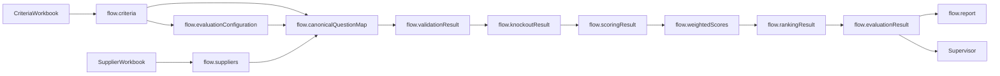

# 08. Flow Variables

**Document Version:** 1.0

**Status:** Architecture Frozen

**Parent Document:** Software Design Specification (SDS)

---

# Purpose

This document defines every Flow Variable used by the RFP Qualitative Evaluation Agent.

Flow Variables serve as the exclusive communication mechanism between modules within the QI Studio orchestration.

Every Flow Variable has:

- A single producer
- One or more consumers
- A defined lifecycle
- A documented JSON schema
- A clearly defined business purpose

No undocumented Flow Variables shall be introduced during implementation.

---

# Design Principles

The Flow Variable architecture follows five core principles.

## 1. Single Producer

Every Flow Variable has exactly one owner responsible for creating and updating it.

No other module may modify that variable.

---

## 2. Multiple Consumers

A Flow Variable may be consumed by multiple downstream modules.

Consumers may read the variable but shall never modify it.

---

## 3. Immutable Source Data

Data extracted from uploaded workbooks remains immutable.

Source data shall never be modified after extraction.

---

## 4. Explicit Contracts

Every Flow Variable must conform to a documented JSON schema.

No implicit fields shall exist.

---

## 5. Stable Interfaces

Flow Variable structures constitute public interfaces between modules.

Breaking changes require an SDS version update.

---

# Flow Variable Lifecycle



---

# Flow Variable Inventory

| Variable | Producer | Consumers |
|------------|-----------|------------|
| flow.conversationState | Supervisor | Supervisor |
| flow.criteria | Criteria Processing | Evaluation Configuration, Evaluation Engine |
| flow.evaluationConfiguration | Evaluation Configuration | Evaluation Engine |
| flow.suppliers | Supplier Processing | Evaluation Engine |
| flow.validationResult | Validation | Canonical Mapping |
| flow.canonicalQuestionMap | Canonical Mapping | Knockout Evaluation |
| flow.knockoutResult | Knockout Evaluation | Qualitative Scoring |
| flow.scoringResult | Qualitative Scoring | Weighted Score Calculation |
| flow.weightedScores | Weighted Score Calculation | Supplier Ranking |
| flow.rankingResult | Supplier Ranking | Evaluation Result Builder |
| flow.evaluationResult | Evaluation Engine | Report Generator, Supervisor, Q&A |
| flow.report | Report Generator | Supervisor |

---

# Variable Specifications

---

## flow.conversationState

### Purpose

Tracks the current orchestration state.

### Producer

Supervisor

### Consumers

Supervisor

### Lifecycle

Entire conversation.

### Example

```json
{
  "state": "WAITING_FOR_SUPPLIERS"
}
```

---

## flow.criteria

### Purpose

Represents the extracted Evaluation Criteria workbook.

### Producer

Criteria Processing

### Consumers

Evaluation Configuration

Evaluation Engine

### Lifecycle

Created once.

Immutable thereafter.

### Contents

- Metadata
- Sections
- Questions
- Weights
- Guidance
- Knockout candidates

---

## flow.evaluationConfiguration

### Purpose

Represents the business-approved evaluation configuration.

### Producer

Evaluation Configuration Module

### Consumers

Evaluation Engine

### Lifecycle

Created after criteria extraction.

May be regenerated before supplier evaluation.

### Contents

- Approved weights
- Knockout questions
- Expected knockout answers
- Included sections
- Excluded questions
- Evaluation settings

---

## flow.suppliers

### Purpose

Contains extracted supplier response objects.

### Producer

Supplier Processing

### Consumers

Evaluation Engine

### Lifecycle

Created after supplier extraction.

Immutable.

One object per supplier.

---

## flow.validationResult

### Purpose

Stores questionnaire validation results.

### Producer

Validate Questionnaire Structure

### Consumers

Canonical Mapping

### Contents

- Validation status
- Structural errors
- Missing questions
- Extra questions
- Warnings

---

## flow.canonicalQuestionMap

### Purpose

Provides the single canonical representation of every evaluation question.

### Producer

Canonical Mapping

### Consumers

Knockout Evaluation

### Lifecycle

Immutable.

Acts as the single source of truth for downstream evaluation.

Contains

- Question
- Supplier Answer
- Evaluation Criteria
- Weight
- Knockout Rules

---

## flow.knockoutResult

### Purpose

Stores knockout evaluation results.

### Producer

Knockout Evaluation

### Consumers

Qualitative Scoring

Contains

- Supplier status
- Failed questions
- Failure reasons
- Pass/Fail outcome

---

## flow.scoringResult

### Purpose

Stores qualitative evaluation scores.

### Producer

Qualitative Scoring

### Consumers

Weighted Score Calculation

Contains

- Question scores
- Reasoning
- Evidence
- Strengths
- Weaknesses

---

## flow.weightedScores

### Purpose

Stores weighted numerical scores.

### Producer

Weighted Score Calculation

### Consumers

Supplier Ranking

Contains

- Section scores
- Overall scores
- Weighted totals

---

## flow.rankingResult

### Purpose

Stores supplier rankings.

### Producer

Supplier Ranking

### Consumers

Evaluation Result Builder

Contains

- Rank
- Supplier
- Total Score
- Tie handling
- Ordering rationale

---

## flow.evaluationResult

### Purpose

Represents the complete procurement evaluation.

### Producer

Evaluation Engine

### Consumers

Supervisor

Report Generator

Post Evaluation Q&A

### Lifecycle

Created once.

Immutable.

Contains

- Supplier summaries
- Rankings
- Scores
- Knockout results
- Recommendations
- Strengths
- Weaknesses
- Risks
- Negotiation opportunities

---

## flow.report

### Purpose

Represents generated deliverables.

### Producer

Report Generator

### Consumers

Supervisor

Contains

- Excel workbook
- Report metadata
- Generation timestamp
- Download reference

---

# Variable Ownership Rules

The following rules apply to every Flow Variable.

1. Every variable has exactly one producer.
2. Producers may modify only their own variables.
3. Consumers shall treat variables as read-only.
4. Source variables remain immutable after extraction.
5. Runtime variables may only be modified by their owning module.

---

# Naming Convention

All Flow Variables shall follow the naming convention:

```
flow.<businessObject>
```

Examples

```
flow.criteria

flow.suppliers

flow.report

flow.evaluationResult
```

Temporary variables inside Script Nodes should never become Flow Variables unless consumed by another module.

---

# Future Expansion

The Flow Variable model has been designed to support future enhancements including:

- Multi-round evaluations
- Human approvals
- Collaborative scoring
- External ERP integrations
- RAG-based supplier enrichment
- Audit trails
- Versioned evaluation sessions

These capabilities can be introduced without breaking existing interfaces.

---

# Summary

Flow Variables form the communication backbone of the RFP Qualitative Evaluation Agent.

By enforcing single ownership, immutable source data, explicit contracts and stable interfaces, the architecture achieves predictable execution, modular implementation and enterprise-grade maintainability.

This document constitutes the authoritative reference for all shared data objects used throughout the orchestration.
