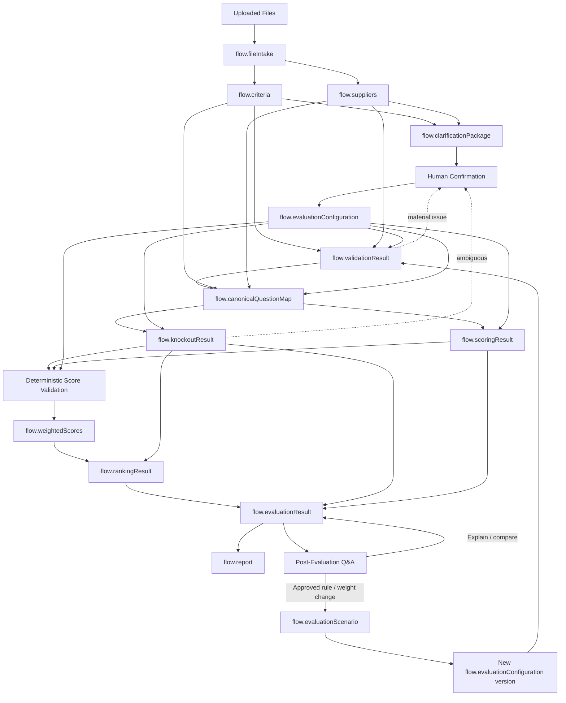

# 08. Flow Variables

**Document Version:** 1.2

**Status:** Deep Agent + HITL Data Contract Baseline

**Parent Document:** Software Design Specification (SDS)

---

# Purpose

This document defines the shared Flow Variables for the RFP Qualitative Bid Analysis Agent.

The architecture uses Flow Variables to separate source discovery, human-confirmed configuration, deterministic evaluation and reporting.

---

# Core Lifecycle



---

# Flow Variable Inventory

| Variable | Producer | Main consumers |
|---|---|---|
| flow.conversationState | Master | Master |
| flow.fileIntake | Discovery | Master, Criteria, Supplier |
| flow.criteria | Criteria Specialist | Master, Validation, Canonical Mapping |
| flow.suppliers | Supplier Specialist | Master, Validation, Canonical Mapping |
| flow.clarificationPackage | Master | Human confirmation workflow |
| flow.evaluationConfiguration | Human confirmation workflow | Validation, Canonical Mapping, Knockout, Scoring, Weighting |
| flow.validationResult | Validation | Master, Canonical Mapping |
| flow.canonicalQuestionMap | Canonical Mapping | Knockout, Scoring |
| flow.knockoutResult | Knockout Script | Scoring, Ranking, Result Builder |
| flow.scoringResult | Evaluation Specialist | Score Calculation |
| flow.weightedScores | Weighted Calculation | Ranking, Result Builder |
| flow.rankingResult | Ranking Script | Result Builder |
| flow.evaluationResult | Result Builder | Master, Report, Q&A |
| flow.report | Report Generator | Master, Q&A |
| flow.evaluationScenario | Scenario Manager / Master | Master, Result Builder, Q&A |

---

# flow.conversationState

Purpose: current workflow state.

Example:

```json
{
  "state": "HUMAN_CONFIRMATION",
  "runId": "RUN-001",
  "scenarioId": "SCN-001"
}
```

Key states:

```text
INITIAL
WAITING_FOR_FILES
DISCOVERING
PLANNING
DISCOVERY_SPECIALISTS
BUILDING_UNDERSTANDING
CLARIFICATION_PACKAGE
HUMAN_CONFIRMATION
KNOCKOUT_CONFIGURATION
CONFIGURATION_VALIDATION
EVALUATION_READY
EVALUATING
MASTER_QC
TARGETED_REANALYSIS
DETERMINISTIC_PROCESSING
HUMAN_EXCEPTION
SYNTHESIS
GENERATING_REPORT
COMPLETED
POST_EVALUATION
SCENARIO_REEVALUATION
ERROR
```

---

# flow.fileIntake

Purpose: structured understanding of uploaded files/sheets.

Required concepts:

- intakeId
- files[]
- fileRole
- classificationConfidence
- classificationReason
- supplierName
- sheets[]
- materialAmbiguities[]
- missingInformation[]
- provenance

Unknown values are `null`, not fabricated.

Immutable after acceptance for the intake set.

---

# flow.criteria

Purpose: normalized source evaluation framework.

Contains:

- metadata
- sections
- questions
- stable question IDs
- source numbering
- weights
- scoring rubric
- guidance
- knockout candidates
- provenance
- inference indicators

Immutable source object.

---

# flow.suppliers

Purpose: normalized supplier response/evidence objects.

Contains:

- supplierId
- supplierName
- sourceFiles
- sections
- question mappings
- original answer text
- answered flag
- evidence/provenance
- mapping confidence

Supplier response text is immutable after extraction.

---

# flow.clarificationPackage

Purpose: human-readable and structured statement of the agent's current understanding before evaluation.

Contains:

- identified files and roles
- supplier identities
- evaluation sections/questions
- scoring scale/rubric detected
- weights detected
- candidate knockouts
- proposed acceptance conditions
- ambiguities
- missing information
- explicit/inferred indicators
- confirmation items

This object is generated by the Master and presented to the human evaluator.

---

# flow.evaluationConfiguration

Purpose: authoritative human-confirmed evaluation rules.

Example structure:

```json
{
  "configurationId": "CFG-001",
  "version": 1,
  "approved": true,
  "approvedBy": "human",
  "approvedAt": "",
  "scoring": {
    "scaleMin": 0,
    "scaleMax": 5,
    "rubric": []
  },
  "weights": [],
  "knockoutRules": [],
  "excludedQuestions": [],
  "includedSections": [],
  "specialInstructions": [],
  "sourceAssumptions": []
}
```

The object is frozen after approval for that run.

If no knockouts are approved:

```json
"knockoutRules": []
```

---

# flow.validationResult

Contains:

- valid
- errors[]
- warnings[]
- missingQuestions[]
- extraQuestions[]
- mappingIssues[]
- configurationIssues[]
- sourceIssues[]

A material error prevents deterministic evaluation.

---

# flow.canonicalQuestionMap

Purpose: single normalized representation used downstream.

Each record contains:

- questionId
- questionNumber
- section
- questionText
- supplierId
- supplierName
- supplierAnswer
- answered
- confirmed weight
- scoring rubric
- confirmed knockout status
- acceptance condition
- criteria source
- supplier source
- mapping confidence

---

# flow.knockoutResult

Contains supplier-level and question-level outcomes.

Possible statuses:

```text
PASS
FAIL
AMBIGUOUS
NOT_APPLICABLE
```

Every material outcome includes:

- supplier
- question/rule ID
- acceptance condition
- actual evidence
- decision
- reason
- source reference

---

# flow.scoringResult

Contains semantic qualitative assessment.

Each question-level score contains:

- supplier
- question ID
- score recommendation
- max score
- reasoning
- evidence
- strengths
- weaknesses
- confidence

This is not the authoritative arithmetic result.

---

# flow.weightedScores

Contains deterministic results:

- supplier
- section scores
- overall weighted score
- calculation inputs
- formula metadata
- validation status

---

# flow.rankingResult

Contains:

- qualified ranks
- supplier ID/name
- score
- qualification status
- tie handling
- deterministic ordering information

Disqualified suppliers do not receive a qualified rank.

---

# flow.evaluationResult

Contains the complete run:

- run/scenario metadata
- confirmed configuration reference
- supplier summaries
- qualification status
- knockout results
- scores
- rankings
- strengths
- weaknesses
- risks
- negotiation opportunities
- recommendations
- provenance/audit metadata

---

# flow.report

Contains:

- reportVersion
- generatedAt
- generatedBy
- reportType
- tabs
- downloadReference
- status
- sourceRunId

Required tabs:

```text
Executive Summary
Supplier Profiles
Q&A Scorecard
Score Legend
```

---

# flow.evaluationScenario

Purpose: preserve scenario lineage for approved post-evaluation changes.

Example:

```json
{
  "scenarioId": "SCN-002",
  "parentScenarioId": "SCN-001",
  "changeType": "WEIGHT_CHANGE",
  "changes": [],
  "createdAt": "",
  "status": "READY"
}
```

The original scenario is never overwritten.

---

# Ownership Rules

1. Every Flow Variable has exactly one producer.
2. Consumers treat shared objects as read-only.
3. Source data is immutable.
4. Confirmed configuration is immutable after freeze.
5. Scenario changes create new lineage.
6. Unknown information is represented explicitly.
7. Material inference retains provenance/confidence.
