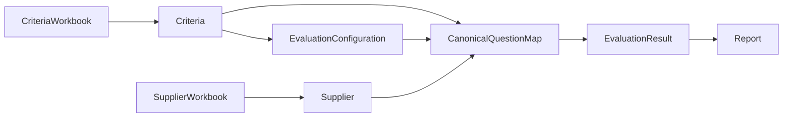

# 09. JSON Schemas

**Document Version:** 1.0

**Status:** Architecture Frozen

**Parent Document:** Software Design Specification (SDS)

---

# Purpose

This document defines the canonical JSON schemas exchanged between all modules within the RFP Qualitative Evaluation Agent.

These schemas constitute the official data contracts for Version 1.0.

Every Agent, Script, Rule and Report Generator shall produce or consume objects conforming to these specifications.

No undocumented fields shall be introduced during implementation.

---

# Design Principles

The schema design follows five principles.

## Canonical Representation

Every business object has exactly one canonical schema.

---

## Explicit Contracts

Every field has a defined meaning.

Implicit fields are prohibited.

---

## Stable Interfaces

Schemas shall remain backward compatible throughout Version 1.x.

---

## Business-Oriented Structure

Objects represent procurement concepts rather than implementation details.

---

## Extensible Design

Future versions may add optional fields without breaking existing consumers.

---

# Schema Relationships



---

# Schema 1 — Criteria

```json
{
  "metadata": {
    "eventName": "",
    "version": "",
    "questionCount": 0,
    "sectionCount": 0
  },
  "sections": [
    {
      "sectionId": "",
      "sectionName": "",
      "questions": [
        {
          "questionNumber": "",
          "questionText": "",
          "guidance": "",
          "defaultWeight": 0,
          "knockoutCandidate": false
        }
      ]
    }
  ]
}
```

---

# Schema 2 — Evaluation Configuration

```json
{
  "approved": true,
  "weights": [
    {
      "questionNumber": "",
      "weight": 0
    }
  ],
  "knockoutRules": [
    {
      "questionNumber": "",
      "expectedAnswer": "",
      "mandatory": true
    }
  ],
  "excludedQuestions": [],
  "includedSections": [],
  "configuredBy": "",
  "configuredAt": ""
}
```

---

# Schema 3 — Supplier

```json
{
  "supplierName": "",
  "metadata": {
    "questionCount": 0,
    "sectionCount": 0
  },
  "sections": [
    {
      "sectionName": "",
      "questions": [
        {
          "questionNumber": "",
          "questionText": "",
          "answer": "",
          "answered": true
        }
      ]
    }
  ]
}
```

---

# Schema 4 — Validation Result

```json
{
  "valid": true,
  "errors": [],
  "warnings": [],
  "missingQuestions": [],
  "extraQuestions": []
}
```

---

# Schema 5 — Canonical Question Map

```json
{
  "questions": [
    {
      "questionNumber": "",
      "sectionName": "",
      "questionText": "",
      "supplierName": "",
      "supplierAnswer": "",
      "answered": true,
      "criteria": {
        "weight": 0,
        "guidance": "",
        "knockout": false
      }
    }
  ]
}
```

---

# Schema 6 — Knockout Result

```json
{
  "suppliers": [
    {
      "supplierName": "",
      "passed": true,
      "failedQuestions": [
        {
          "questionNumber": "",
          "expectedAnswer": "",
          "actualAnswer": "",
          "reason": ""
        }
      ]
    }
  ]
}
```

---

# Schema 7 — Scoring Result

```json
{
  "suppliers": [
    {
      "supplierName": "",
      "questionScores": [
        {
          "questionNumber": "",
          "score": 0,
          "maxScore": 0,
          "reasoning": "",
          "strengths": [],
          "weaknesses": []
        }
      ]
    }
  ]
}
```

---

# Schema 8 — Weighted Scores

```json
{
  "suppliers": [
    {
      "supplierName": "",
      "sectionScores": [
        {
          "sectionName": "",
          "weightedScore": 0
        }
      ],
      "overallWeightedScore": 0
    }
  ]
}
```

---

# Schema 9 — Ranking Result

```json
{
  "rankings": [
    {
      "rank": 1,
      "supplierName": "",
      "score": 0,
      "status": "Qualified"
    }
  ]
}
```

---

# Schema 10 — Evaluation Result

```json
{
  "summary": {
    "supplierCount": 0,
    "qualifiedSuppliers": 0,
    "evaluationDate": ""
  },
  "suppliers": [
    {
      "supplierName": "",
      "rank": 0,
      "qualified": true,
      "overallScore": 0,
      "strengths": [],
      "weaknesses": [],
      "risks": [],
      "negotiationOpportunities": [],
      "recommendation": ""
    }
  ]
}
```

---

# Schema 11 — Report

```json
{
  "generatedAt": "",
  "generatedBy": "",
  "reportVersion": "1.0",
  "reportType": "Excel",
  "downloadReference": "",
  "status": "Generated"
}
```

---

# Validation Rules

The following validation rules apply to every schema.

## Required Fields

All mandatory fields shall always be present.

---

## Null Handling

Unknown values shall use:

```json
null
```

Empty strings shall only be used when the value genuinely exists but is blank.

---

## Arrays

Arrays shall always exist.

Empty arrays are preferred over omitted properties.

Example

```json
{
  "warnings": []
}
```

---

## Booleans

Boolean values shall never be represented as strings.

Correct

```json
true
```

Incorrect

```json
"true"
```

---

## Numbers

Weights and scores shall always be numeric.

---

# Versioning

Every schema shall remain compatible throughout Version 1.x.

Breaking schema changes require:

- New SDS version
- Updated node specifications
- Updated implementation
- Updated regression tests

---

# Ownership

| Schema | Owner |
|----------|--------|
| Criteria | Criteria Processing |
| Evaluation Configuration | Evaluation Configuration |
| Supplier | Supplier Processing |
| Validation Result | Validation Node |
| Canonical Question Map | Canonical Mapping |
| Knockout Result | Knockout Evaluation |
| Scoring Result | Qualitative Scoring |
| Weighted Scores | Weighted Calculation |
| Ranking Result | Ranking Engine |
| Evaluation Result | Evaluation Engine |
| Report | Report Generator |

---

# Summary

The JSON schemas defined within this document represent the canonical interfaces between every module of the RFP Qualitative Evaluation Agent.

They ensure consistent communication, simplify validation, enable deterministic processing, and establish a stable contract between the architecture and the implementation.

All subsequent node specifications shall reference these schemas directly.
