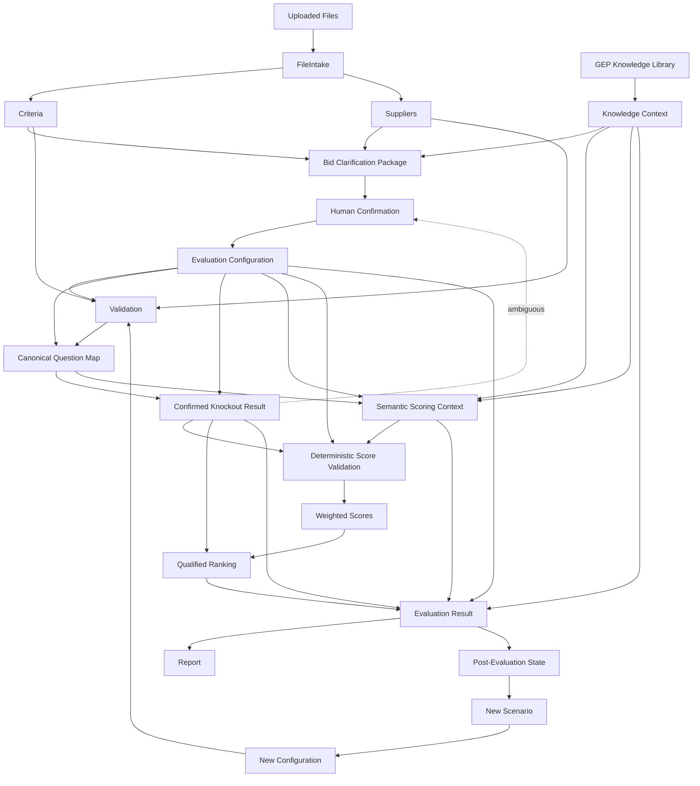

# 09. JSON Schemas

**Document Version:** 1.3

**Status:** Deep Agent + GEP Knowledge + HITL Contract Baseline

## Purpose

These contracts separate source facts, GEP knowledge context, human-confirmed evaluation configuration, semantic scoring and deterministic results.

## Schema Relationships



## GEP Knowledge Context Schema

```json
{
  "knowledgeContextId": "",
  "retrievalStatus": "COMPLETE",
  "sources": [
    {
      "sourceId": "",
      "sourceName": "",
      "category": "",
      "referenceType": "toolkit",
      "relevance": 0.0,
      "retrievalReason": "",
      "sourceLocation": null,
      "materialFinding": "",
      "confidence": 0.0
    }
  ],
  "usagePolicy": "CONTEXT_ONLY"
}
```

Knowledge context may inform semantic reasoning but cannot silently create evaluation rules.

## Schema 1 — File Intake

```json
{
  "intakeId": "",
  "files": [],
  "materialAmbiguities": [],
  "missingInformation": [],
  "discoveryStatus": "Complete"
}
```

## Schema 2 — Criteria

```json
{
  "metadata": {},
  "sections": [
    {
      "sectionId": "",
      "sectionName": "",
      "questions": [
        {
          "questionId": "",
          "questionNumber": null,
          "questionText": "",
          "guidance": null,
          "defaultWeight": null,
          "scoringRubric": null,
          "knockoutCandidate": false,
          "candidateAcceptanceCondition": null,
          "source": {},
          "inference": {"isInferred": false, "confidence": 1.0}
        }
      ]
    }
  ]
}
```

Candidate knockout status is informational only.

## Schema 3 — Supplier

```json
{
  "supplierId": "",
  "supplierName": "",
  "sections": [
    {
      "sectionName": "",
      "questions": [
        {
          "questionId": null,
          "questionNumber": null,
          "questionText": "",
          "answer": null,
          "answered": false,
          "source": {}
        }
      ]
    }
  ]
}
```

Supplier answer text remains source-faithful.

## Schema 4 — Bid Clarification Package

```json
{
  "packageId": "",
  "runId": "",
  "identifiedFiles": [],
  "identifiedSuppliers": [],
  "evaluationUnderstanding": {
    "sections": [],
    "questionCount": 0,
    "scoringScale": null,
    "scoringRubric": null,
    "weights": []
  },
  "knowledgeContext": {"knowledgeContextId": null, "materialSources": []},
  "knockoutCandidates": [],
  "ambiguities": [],
  "missingInformation": [],
  "explicitFacts": [],
  "inferences": [],
  "confirmationItems": [],
  "status": "AWAITING_HUMAN_CONFIRMATION"
}
```

## Schema 5 — Evaluation Configuration

```json
{
  "configurationId": "",
  "version": 1,
  "approved": false,
  "approvedBy": null,
  "approvedAt": null,
  "runId": "",
  "scoring": {"scaleMin": null, "scaleMax": null, "rubric": []},
  "weights": [],
  "knockoutRules": [],
  "excludedQuestions": [],
  "includedSections": [],
  "specialInstructions": [],
  "knowledgePolicy": "CONTEXT_ONLY",
  "sourceAssumptions": [],
  "confirmationNotes": []
}
```

If no knockouts are confirmed, `knockoutRules` shall be an empty array.

## Schema 6 — Validation Result

```json
{"valid": true, "errors": [], "warnings": [], "missingQuestions": [], "extraQuestions": [], "mappingIssues": [], "configurationIssues": [], "sourceIssues": []}
```

## Schema 7 — Canonical Question Map

```json
{
  "questions": [
    {
      "questionId": "",
      "questionNumber": null,
      "sectionName": "",
      "questionText": "",
      "supplierId": "",
      "supplierName": "",
      "supplierAnswer": null,
      "answered": false,
      "mappingConfidence": 1.0,
      "criteria": {"weight": null, "guidance": null, "scoringRubric": null, "knockoutConfirmed": false, "acceptanceCondition": null},
      "source": {"criteriaSource": {}, "supplierSource": {}}
    }
  ]
}
```

## Schema 8 — Knockout Result

```json
{
  "suppliers": [
    {
      "supplierId": "",
      "supplierName": "",
      "qualified": true,
      "status": "PASS",
      "failedRules": [],
      "ambiguousRules": [],
      "decisions": []
    }
  ]
}
```

Allowed statuses: `PASS`, `FAIL`, `AMBIGUOUS`, `NOT_APPLICABLE`.

## Schema 9 — Scoring Result

```json
{
  "suppliers": [
    {
      "supplierId": "",
      "supplierName": "",
      "questionScores": [
        {
          "questionId": "",
          "questionNumber": null,
          "score": null,
          "maxScore": null,
          "reasoning": "",
          "evidence": "",
          "knowledgeReferences": [],
          "strengths": [],
          "weaknesses": [],
          "confidence": 0.0,
          "source": {}
        }
      ]
    }
  ]
}
```

The score recommendation is semantic output. It becomes numerically authoritative only after deterministic validation/calculation against the approved configuration.

## Schema 10 — Weighted Scores

```json
{
  "suppliers": [
    {
      "supplierId": "",
      "supplierName": "",
      "sectionScores": [],
      "overallWeightedScore": 0,
      "calculationStatus": "VALID"
    }
  ]
}
```

## Schema 11 — Ranking Result

```json
{"rankings": [], "disqualifiedSuppliers": [], "tieHandling": ""}
```

Disqualified suppliers do not receive a qualified rank.

## Schema 12 — Evaluation Result

```json
{
  "runId": "",
  "scenarioId": "",
  "configurationId": "",
  "summary": {},
  "suppliers": [],
  "knowledgeReferences": [],
  "audit": {"configurationVersion": 1, "sourceReferences": [], "assumptions": []}
}
```

## Schema 13 — Evaluation Scenario

```json
{"scenarioId": "", "parentScenarioId": null, "runId": "", "changeType": "WEIGHT_CHANGE", "changes": [], "createdAt": "", "status": "READY"}
```

## Schema 14 — Report

```json
{
  "generatedAt": "",
  "generatedBy": "",
  "reportVersion": "1.3",
  "reportType": "Excel",
  "sourceRunId": "",
  "sourceScenarioId": "",
  "tabs": ["Executive Summary", "Supplier Profiles", "Q&A Scorecard", "Score Legend"],
  "downloadReference": "",
  "status": "Generated"
}
```

## Report Data Contract

### Executive Summary
Consumes ranking/status, section scores, critical findings, recommendation and knockout status.

### Supplier Profiles
Consumes supplier-level results, strengths, weaknesses, risks, section scores and recommendation.

### Q&A Scorecard
Consumes canonical question map + scoring result and preserves original supplier response, score and evaluator comment/rationale.

### Score Legend
Consumes the confirmed scoring scale/rubric and methodology actually used in the run.

## Schema Validation Rules

1. Required fields must exist.
2. Unknown source values use `null`.
3. Arrays always exist.
4. Numeric fields are numeric.
5. Confidence represents interpretation certainty, not evaluation quality.
6. Material provenance is retained.
7. Knowledge references are separate from supplier evidence.
8. Confirmed configuration must have `approved=true` before evaluation.
9. A knockout rule requires an acceptance condition unless another approved decision method exists.
10. No deterministic ranking may be produced while material validation errors remain.
11. Scenario changes retain parent lineage.
12. GEP knowledge cannot silently change the evaluation configuration.

## Ownership

| Schema | Owner |
|---|---|
| File Intake | Discovery |
| Criteria | Criteria Specialist |
| Supplier | Supplier Specialist |
| Knowledge Context | Knowledge tools / Master |
| Bid Clarification Package | Master |
| Evaluation Configuration | Human confirmation workflow / Master |
| Validation Result | Validation Script |
| Canonical Question Map | Canonical Mapping Script |
| Knockout Result | Knockout Script |
| Scoring Result | Evaluation Specialist |
| Weighted Scores | Weighted Calculation |
| Ranking Result | Ranking Script |
| Evaluation Result | Result Builder |
| Scenario | Master / Scenario workflow |
| Report | Report Generator |
