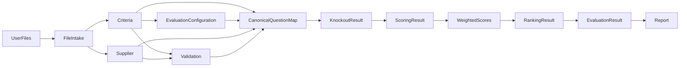

# 09. JSON Schemas

**Document Version:** 1.1

**Status:** Architecture Baseline Updated

**Parent Document:** Software Design Specification (SDS)

---

# Purpose

This document defines the canonical JSON contracts exchanged between modules.

Version 1.1 adds the File Intake and Discovery contract and extends downstream schemas to preserve provenance, stable identifiers and confidence where inference is used.

No undocumented fields shall be introduced during implementation.

---

# Design Principles

1. Canonical representation
2. Explicit contracts
3. Stable interfaces
4. Business-oriented structures
5. Extensibility
6. Source provenance
7. Explicit uncertainty

---

# Schema Relationships



---

# Schema 1 — File Intake

```json
{
  "intakeId": "",
  "files": [
    {
      "fileId": "",
      "fileName": "",
      "mimeType": "",
      "fileRole": "supplier_submission",
      "classificationConfidence": 0.0,
      "classificationReason": "",
      "supplierName": null,
      "provenance": {
        "source": "uploaded_file"
      },
      "sheets": [
        {
          "sheetName": "",
          "sheetRole": "supplier_response",
          "confidence": 0.0,
          "reason": "",
          "headers": [],
          "rowCount": 0,
          "columnCount": 0,
          "provenance": {}
        }
      ]
    }
  ],
  "materialAmbiguities": [],
  "missingInformation": [],
  "discoveryStatus": "Complete"
}
```

Allowed `fileRole` values:

```text
evaluation_criteria
supplier_submission
combined_evaluation_and_supplier
supporting_document
unknown
```

Allowed `sheetRole` values:

```text
evaluation_criteria
supplier_response
technical_response
commercial_response
company_profile
references
coverage
instructions
supporting_information
irrelevant
unknown
```

---

# Schema 2 — Criteria

```json
{
  "metadata": {
    "eventName": null,
    "version": null,
    "questionCount": 0,
    "sectionCount": 0,
    "sourceFiles": []
  },
  "sections": [
    {
      "sectionId": "",
      "sectionName": "",
      "questions": [
        {
          "questionId": "",
          "questionNumber": null,
          "questionText": "",
          "guidance": null,
          "defaultWeight": null,
          "scoringRubric": null,
          "knockoutCandidate": false,
          "source": {
            "fileId": null,
            "sheetName": null,
            "location": null
          },
          "inference": {
            "isInferred": false,
            "confidence": 1.0
          }
        }
      ]
    }
  ]
}
```

---

# Schema 3 — Evaluation Configuration

```json
{
  "approved": false,
  "weights": [
    {
      "questionId": "",
      "questionNumber": null,
      "weight": 0
    }
  ],
  "knockoutRules": [
    {
      "questionId": "",
      "questionNumber": null,
      "acceptanceCondition": "",
      "mandatory": true
    }
  ],
  "excludedQuestions": [],
  "includedSections": [],
  "configuredBy": "",
  "configuredAt": ""
}
```

---

# Schema 4 — Supplier

```json
{
  "supplierId": "",
  "supplierName": "",
  "metadata": {
    "questionCount": 0,
    "sectionCount": 0,
    "sourceFiles": []
  },
  "sections": [
    {
      "sectionName": "",
      "questions": [
        {
          "questionId": null,
          "questionNumber": null,
          "questionText": "",
          "answer": null,
          "answered": false,
          "source": {
            "fileId": null,
            "sheetName": null,
            "location": null
          }
        }
      ]
    }
  ]
}
```

---

# Schema 5 — Validation Result

```json
{
  "valid": true,
  "errors": [],
  "warnings": [],
  "missingQuestions": [],
  "extraQuestions": [],
  "mappingIssues": [],
  "sourceIssues": []
}
```

---

# Schema 6 — Canonical Question Map

```json
{
  "questions": [
    {
      "questionId": "",
      "questionNumber": null,
      "sectionName": "",
      "questionText": "",
      "supplierId": "",
      "supplierName": "",
      "supplierAnswer": null,
      "answered": false,
      "mappingConfidence": 1.0,
      "criteria": {
        "weight": null,
        "guidance": null,
        "scoringRubric": null,
        "knockout": false,
        "acceptanceCondition": null
      },
      "source": {
        "criteriaSource": {},
        "supplierSource": {}
      }
    }
  ]
}
```

---

# Schema 7 — Knockout Result

```json
{
  "suppliers": [
    {
      "supplierId": "",
      "supplierName": "",
      "passed": true,
      "status": "Qualified",
      "failedQuestions": [
        {
          "questionId": "",
          "questionNumber": null,
          "acceptanceCondition": "",
          "actualAnswer": null,
          "evidence": "",
          "reason": ""
        }
      ]
    }
  ]
}
```

---

# Schema 8 — Scoring Result

```json
{
  "suppliers": [
    {
      "supplierId": "",
      "supplierName": "",
      "questionScores": [
        {
          "questionId": "",
          "questionNumber": null,
          "score": 0,
          "maxScore": 0,
          "reasoning": "",
          "evidence": "",
          "strengths": [],
          "weaknesses": [],
          "confidence": 0.0
        }
      ]
    }
  ]
}
```

---

# Schema 9 — Weighted Scores

```json
{
  "suppliers": [
    {
      "supplierId": "",
      "supplierName": "",
      "sectionScores": [
        {
          "sectionName": "",
          "weightedScore": 0
        }
      ],
      "overallWeightedScore": 0
    }
  ]
}
```

---

# Schema 10 — Ranking Result

```json
{
  "rankings": [
    {
      "rank": 1,
      "supplierId": "",
      "supplierName": "",
      "score": 0,
      "status": "Qualified"
    }
  ]
}
```

A disqualified supplier may be included for reporting but shall not receive a qualified rank.

---

# Schema 11 — Evaluation Result

```json
{
  "summary": {
    "supplierCount": 0,
    "qualifiedSuppliers": 0,
    "evaluationDate": "",
    "sourceFiles": []
  },
  "suppliers": [
    {
      "supplierId": "",
      "supplierName": "",
      "rank": null,
      "qualified": true,
      "overallScore": 0,
      "strengths": [],
      "weaknesses": [],
      "risks": [],
      "negotiationOpportunities": [],
      "recommendation": ""
    }
  ]
}
```

---

# Schema 12 — Report

```json
{
  "generatedAt": "",
  "generatedBy": "",
  "reportVersion": "1.1",
  "reportType": "Excel",
  "downloadReference": "",
  "status": "Generated"
}
```

---

# Schema Validation Rules

## Required Fields

Mandatory fields shall always be present.

## Null Handling

Unknown values use:

```json
null
```

Empty strings are used only when a source field exists but is blank.

## Arrays

Arrays shall always exist.

## Booleans

Boolean values shall be actual booleans, not strings.

## Numbers

Weights, scores and confidence values shall be numeric.

## Confidence

Confidence represents interpretation certainty, not evaluation quality.

## Provenance

Material extracted or inferred fields should retain source information sufficient for traceability.

---

# Versioning

Schemas are the official V1.1 interfaces between modules.

Breaking changes require a new SDS version and corresponding node specifications.

Optional fields may be added in compatible minor revisions.

---

# Ownership

| Schema | Owner |
|---|---|
| File Intake | File Intake & Discovery |
| Criteria | Criteria Processing |
| Evaluation Configuration | Evaluation Configuration |
| Supplier | Supplier Processing |
| Validation Result | Validation Node |
| Canonical Question Map | Canonical Mapping |
| Knockout Result | Knockout Evaluation |
| Scoring Result | Qualitative Scoring |
| Weighted Scores | Weighted Calculation |
| Ranking Result | Ranking Engine |
| Evaluation Result | Evaluation Result Builder / Evaluation Engine |
| Report | Report Generator |

---

# Summary

The V1.1 schemas introduce a controlled discovery contract that allows flexible Excel inputs without weakening downstream data discipline.

File discovery may be probabilistic, but once data enters the normalized contracts, evaluation remains structured, explainable and deterministic wherever possible.
