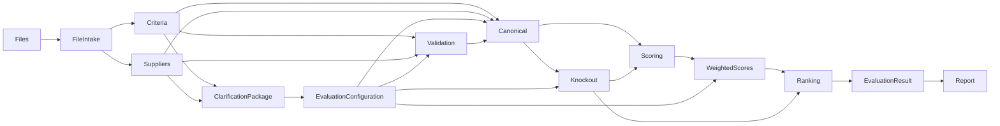

# 09. JSON Schemas

**Document Version:** 1.2

**Status:** Deep Agent + HITL Contract Baseline

**Parent Document:** Software Design Specification (SDS)

---

# Purpose

This document defines the canonical JSON contracts exchanged between modules of the RFP Qualitative Bid Analysis Agent.

The contracts explicitly separate source facts, agent interpretation, human-confirmed evaluation configuration, semantic scoring and deterministic results.

---

# Schema Relationships



---

# Schema 1 — File Intake

```json
{
  "intakeId": "",
  "files": [
    {
      "fileId": "",
      "fileName": "",
      "mimeType": "",
      "fileRole": "unknown",
      "classificationConfidence": 0.0,
      "classificationReason": "",
      "supplierName": null,
      "provenance": {
        "source": "uploaded_file",
        "location": null
      },
      "sheets": [
        {
          "sheetName": "",
          "sheetRole": "unknown",
          "confidence": 0.0,
          "reason": "",
          "headers": [],
          "rowCount": 0,
          "columnCount": 0,
          "provenance": {}
        }
      ]
    }
  ],
  "materialAmbiguities": [],
  "missingInformation": [],
  "discoveryStatus": "Complete"
}
```

Allowed file roles:

```text
evaluation_criteria
supplier_submission
combined_evaluation_and_supplier
supporting_document
unknown
```

Allowed sheet roles:

```text
evaluation_criteria
supplier_response
technical_response
commercial_response
company_profile
references
coverage
instructions
supporting_information
irrelevant
unknown
```

---

# Schema 2 — Criteria

```json
{
  "metadata": {
    "eventName": null,
    "version": null,
    "questionCount": 0,
    "sectionCount": 0,
    "sourceFiles": []
  },
  "sections": [
    {
      "sectionId": "",
      "sectionName": "",
      "questions": [
        {
          "questionId": "",
          "questionNumber": null,
          "questionText": "",
          "guidance": null,
          "defaultWeight": null,
          "scoringRubric": null,
          "knockoutCandidate": false,
          "candidateAcceptanceCondition": null,
          "source": {
            "fileId": null,
            "sheetName": null,
            "location": null
          },
          "inference": {
            "isInferred": false,
            "confidence": 1.0
          }
        }
      ]
    }
  ]
}
```

Candidate knockout status is informational only. It is not authoritative until included in the confirmed Evaluation Configuration.

---

# Schema 3 — Supplier

```json
{
  "supplierId": "",
  "supplierName": "",
  "metadata": {
    "questionCount": 0,
    "sectionCount": 0,
    "sourceFiles": []
  },
  "sections": [
    {
      "sectionName": "",
      "questions": [
        {
          "questionId": null,
          "questionNumber": null,
          "questionText": "",
          "answer": null,
          "answered": false,
          "source": {
            "fileId": null,
            "sheetName": null,
            "location": null
          }
        }
      ]
    }
  ]
}
```

Supplier answer text must remain source-faithful.

---

# Schema 4 — Bid Clarification Package

```json
{
  "packageId": "",
  "runId": "",
  "identifiedFiles": [],
  "identifiedSuppliers": [],
  "evaluationUnderstanding": {
    "sections": [],
    "questionCount": 0,
    "scoringScale": null,
    "scoringRubric": null,
    "weights": []
  },
  "knockoutCandidates": [
    {
      "questionId": "",
      "questionNumber": null,
      "requirement": "",
      "source": {},
      "agentReason": "",
      "confidence": 0.0,
      "proposedAcceptanceCondition": null
    }
  ],
  "ambiguities": [],
  "missingInformation": [],
  "explicitFacts": [],
  "inferences": [],
  "confirmationItems": [],
  "status": "AWAITING_HUMAN_CONFIRMATION"
}
```

---

# Schema 5 — Evaluation Configuration

```json
{
  "configurationId": "",
  "version": 1,
  "approved": false,
  "approvedBy": null,
  "approvedAt": null,
  "runId": "",
  "scoring": {
    "scaleMin": null,
    "scaleMax": null,
    "rubric": []
  },
  "weights": [
    {
      "questionId": "",
      "weight": 0
    }
  ],
  "knockoutRules": [
    {
      "ruleId": "",
      "questionId": "",
      "questionNumber": null,
      "requirement": "",
      "acceptanceCondition": "",
      "mandatory": true
    }
  ],
  "excludedQuestions": [],
  "includedSections": [],
  "specialInstructions": [],
  "sourceAssumptions": [],
  "confirmationNotes": []
}
```

If no knockouts are confirmed, `knockoutRules` shall be an empty array.

---

# Schema 6 — Validation Result

```json
{
  "valid": true,
  "errors": [],
  "warnings": [],
  "missingQuestions": [],
  "extraQuestions": [],
  "mappingIssues": [],
  "configurationIssues": [],
  "sourceIssues": []
}
```

---

# Schema 7 — Canonical Question Map

```json
{
  "questions": [
    {
      "questionId": "",
      "questionNumber": null,
      "sectionName": "",
      "questionText": "",
      "supplierId": "",
      "supplierName": "",
      "supplierAnswer": null,
      "answered": false,
      "mappingConfidence": 1.0,
      "criteria": {
        "weight": null,
        "guidance": null,
        "scoringRubric": null,
        "knockoutConfirmed": false,
        "acceptanceCondition": null
      },
      "source": {
        "criteriaSource": {},
        "supplierSource": {}
      }
    }
  ]
}
```

---

# Schema 8 — Knockout Result

```json
{
  "suppliers": [
    {
      "supplierId": "",
      "supplierName": "",
      "qualified": true,
      "status": "PASS",
      "failedRules": [],
      "ambiguousRules": [],
      "decisions": [
        {
          "ruleId": "",
          "questionId": "",
          "acceptanceCondition": "",
          "actualAnswer": null,
          "evidence": "",
          "status": "PASS",
          "reason": "",
          "source": {}
        }
      ]
    }
  ]
}
```

Allowed status values:

```text
PASS
FAIL
AMBIGUOUS
NOT_APPLICABLE
```

---

# Schema 9 — Scoring Result

```json
{
  "suppliers": [
    {
      "supplierId": "",
      "supplierName": "",
      "questionScores": [
        {
          "questionId": "",
          "questionNumber": null,
          "score": null,
          "maxScore": null,
          "reasoning": "",
          "evidence": "",
          "strengths": [],
          "weaknesses": [],
          "confidence": 0.0,
          "source": {}
        }
      ]
    }
  ]
}
```

The score recommendation is semantic output. It becomes numerically authoritative only after deterministic validation/calculation against the approved configuration.

---

# Schema 10 — Weighted Scores

```json
{
  "suppliers": [
    {
      "supplierId": "",
      "supplierName": "",
      "sectionScores": [
        {
          "sectionName": "",
          "weightedScore": 0,
          "weight": 0
        }
      ],
      "overallWeightedScore": 0,
      "calculationStatus": "VALID"
    }
  ]
}
```

---

# Schema 11 — Ranking Result

```json
{
  "rankings": [
    {
      "rank": 1,
      "supplierId": "",
      "supplierName": "",
      "score": 0,
      "status": "Qualified"
    }
  ],
  "disqualifiedSuppliers": [],
  "tieHandling": ""
}
```

Disqualified suppliers do not receive a qualified rank.

---

# Schema 12 — Evaluation Result

```json
{
  "runId": "",
  "scenarioId": "",
  "configurationId": "",
  "summary": {
    "supplierCount": 0,
    "qualifiedSuppliers": 0,
    "disqualifiedSuppliers": 0,
    "evaluationDate": "",
    "sourceFiles": []
  },
  "suppliers": [
    {
      "supplierId": "",
      "supplierName": "",
      "rank": null,
      "qualificationStatus": "Qualified",
      "overallScore": null,
      "strengths": [],
      "weaknesses": [],
      "risks": [],
      "negotiationOpportunities": [],
      "recommendation": "",
      "knockoutSummary": []
    }
  ],
  "audit": {
    "configurationVersion": 1,
    "sourceReferences": [],
    "assumptions": []
  }
}
```

---

# Schema 13 — Evaluation Scenario

```json
{
  "scenarioId": "",
  "parentScenarioId": null,
  "runId": "",
  "changeType": "WEIGHT_CHANGE",
  "changes": [],
  "createdAt": "",
  "status": "READY"
}
```

---

# Schema 14 — Report

```json
{
  "generatedAt": "",
  "generatedBy": "",
  "reportVersion": "1.2",
  "reportType": "Excel",
  "sourceRunId": "",
  "sourceScenarioId": "",
  "tabs": [
    "Executive Summary",
    "Supplier Profiles",
    "Q&A Scorecard",
    "Score Legend"
  ],
  "downloadReference": "",
  "status": "Generated"
}
```

---

# Report Data Contract

### Executive Summary
Consumes supplier ranking/status, section scores, key findings, recommendation and knockout status.

### Supplier Profiles
Consumes supplier-level score/status, strengths, weaknesses, risks, section scores and recommendation.

### Q&A Scorecard
Consumes canonical question map + scoring result and preserves the original supplier response, score and evaluator comment/rationale.

### Score Legend
Consumes the confirmed scoring scale/rubric and configuration metadata actually used in the run.

The report generator must not invent methodology text.

---

# Schema Validation Rules

1. Required fields must exist.
2. Unknown source values use `null`.
3. Empty strings are used only where a source field exists but is blank.
4. Arrays always exist.
5. Booleans are actual booleans.
6. Numeric fields are numeric.
7. Confidence represents interpretation certainty, not evaluation quality.
8. Material provenance is retained.
9. Confirmed configuration must have `approved=true` before evaluation.
10. A knockout rule must have an acceptance condition unless the business process explicitly defines another decision method.
11. No deterministic ranking may be produced when material validation errors remain.
12. Scenario changes must retain parent scenario lineage.

---

# Ownership

| Schema | Owner |
|---|---|
| File Intake | Discovery |
| Criteria | Criteria Specialist |
| Supplier | Supplier Specialist |
| Bid Clarification Package | Master |
| Evaluation Configuration | Human confirmation workflow / Master |
| Validation Result | Validation Script |
| Canonical Question Map | Canonical Mapping Script |
| Knockout Result | Knockout Script |
| Scoring Result | Evaluation Specialist |
| Weighted Scores | Weighted Calculation Script |
| Ranking Result | Ranking Script |
| Evaluation Result | Result Builder |
| Evaluation Scenario | Master / Scenario workflow |
| Report | Report Generator |
