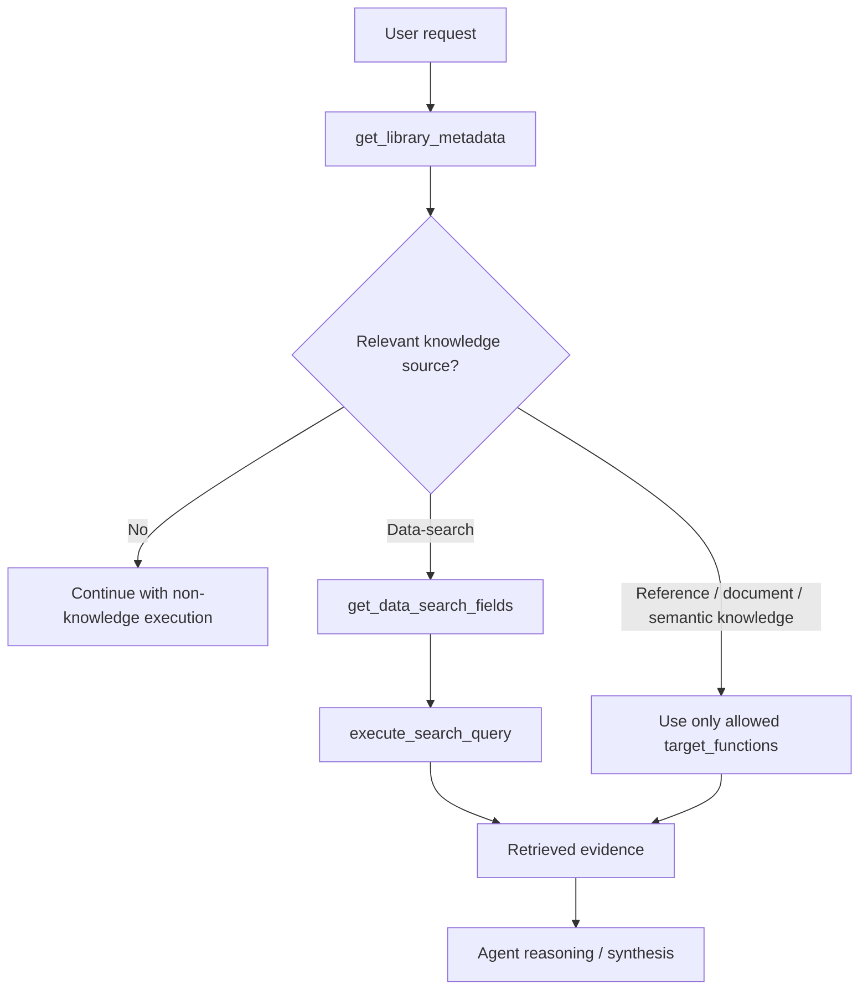

# 10. QI Studio Nodes, Agent Tools & Verification Register

**Document Version:** 1.0  
**Status:** Working implementation evidence register  
**Scope:** QI Studio orchestration nodes and Agent-node tools captured during the current design investigation.

This document records what has been explicitly observed or supplied so far. It deliberately separates confirmed platform behaviour from items that still require direct UI evidence or runtime testing.

---

## 1. Evidence Status Model

| Status | Meaning |
|---|---|
| Confirmed | Behaviour or configuration explicitly shown in the supplied QI Studio UI or platform documentation excerpt. |
| Working understanding | Strong implementation interpretation derived from the supplied evidence, but still worth validating at runtime. |
| Pending evidence | Mentioned or visible as a capability, but detailed behaviour/configuration has not yet been captured. |
| Runtime validation | Requires an actual execution test rather than UI inspection alone. |

---

# 2. Orchestration Nodes Captured

## 2.1 Decision Tree node

**Node type:** Decision Tree  
**Platform status:** Experimental / Alpha, based on supplied UI.

### Purpose

A Decision Tree is a mini flow-builder inside one node. It allows a state-driven decision graph instead of one fixed action. The runtime walks the internal steps based on state gathered or derived during execution.

### Canvas concepts

- **Start** - entry point for the internal tree.
- **Add Node / Add step** - adds an internal step.
- **Fit / Auto-layout** - organizes the graph.
- **Memory Keys / state** - shared variables read and written by the tree.
- **Issues / validation** - detects problems such as disconnected steps or missing produced keys.

### Supported step types captured

| Step | Purpose |
|---|---|
| Ask user | Talk to the user, send a message, and capture the response into state. |
| Tool call | Run a backend tool with templated parameters and write the result into state. |
| Compute | Derive or transform state without user interaction. |
| Condition | Branch into different paths based on state. |
| Done | End the internal flow successfully / at end. |

### Cross-step concepts

- **Produces keys** - state keys a step fills when it completes. These help gate ordering and prevent loops.
- **State / Memory keys** - shared values carried by the tree. Steps read values using `{{path}}` and write or clear state.
- **Extra conditions** - optional gates in addition to the normal graph path.
- **Message template** - user-facing text with state interpolation.
- **Notes for the LLM** - natural-language instructions for interpreting the user's response.
- **Require reflection before this step fires** - an additional safety pause intended mainly for irreversible actions.

### Condition operators captured

- Equals
- Not Equals
- Greater Than or Equal To
- Less Than or Equal To
- Greater Than
- Less Than
- Contains
- Is Empty
- Is Not Empty

### Decision branch model captured

A condition step may contain named paths. The UI shows path-specific rules and an `else` path. The first matching path wins according to the displayed ordering.

### Status

**Confirmed from supplied platform documentation and UI screenshots.**

### Remaining validation

- Exact runtime state schema for Decision Tree memory keys.
- Whether all step types expose identical state/update semantics.
- Exact persistence/serialization format of an internal Decision Tree.
- Runtime behaviour when a tree has cycles or missing produces keys.
- Exact limits on tree depth / number of steps / paths.

---

## 2.2 Approval node

**Node type:** Approval

### Purpose

Pauses orchestration and waits for a person to approve or reject before execution continues. This is the human checkpoint intended for sensitive or irreversible actions.

### Configuration captured

| Setting | Observed behaviour |
|---|---|
| Approval Message | User-facing message explaining what requires approval. |
| Approve Button | Customizable approval label. Default shown as `Approve`. |
| Reject Button | Customizable rejection label. Default shown as `Reject`. |
| Approved route | Outgoing path used when the user approves. |
| Rejected route | Outgoing path used when the user rejects. |
| Advanced | Contains State Update and Output Variables. |
| Output variable shown | `decision` of type `string`. |

### Routing rule

The approved handle should connect to the continuation of the workflow. The rejected handle should connect to an alternative path or an end node.

### Example alternative labels

- Send it / Hold
- Publish / Cancel

### Status

**Confirmed from supplied platform documentation and UI screenshot.**

### Remaining validation

- Exact output schema beyond the displayed `decision` string.
- Whether approval identity, timestamp, comments, or actor metadata are automatically available.
- Retry/timeout behaviour if the approver does not respond.
- Multiple approver / sequential approval support.
- Whether approval state survives a resumed execution without additional configuration.

---

## 2.3 Human Input node

**Node type:** Human Input

### Purpose

Pauses the workflow, asks a person a free-text question, stores the answer, and allows subsequent orchestration steps to use the response.

### Configuration captured

| Setting | Observed behaviour |
|---|---|
| Question | Prompt shown to the person. |
| Save Response As | Variable holding the response, e.g. `system / humanInput`. |
| Advanced > State Update | Available. No updates configured in the supplied example. |
| Output Variables | Includes `input` object and `variableTarget` string in the displayed node. |

### Conceptual distinction

Use **Human Input** for collecting free-form human information.

Use **Approval** for an explicit yes/no decision that routes to Approved or Rejected.

### Status

**Confirmed from supplied platform documentation and UI screenshot.**

### Remaining validation

- Exact response object structure and fields.
- Handling of attachments or structured widget responses through Human Input.
- Timeout / cancellation behaviour.
- Whether the response variable automatically persists across resumed runs.

---

# 3. Agent Node - Tool Management Model Captured

The supplied Agent-node tool-management UI shows that tools are attached to an agent and configured individually.

## 3.1 Tool configuration fields observed

| Field | Description |
|---|---|
| Tool Name | Lowercase letters, numbers and underscores only. |
| Description | Natural-language instructions describing the tool's purpose and usage. |
| Tool Parameters | Parameters configured through Visual Editor or JSON Schema. |
| Parameter types | `string`, `number`, `boolean`, `object`, `array<string>`, `array<number>`, `array<boolean>`, `array<object>`, `array<array>`. |
| Required | Per-parameter required toggle is available. |
| Configure Values | Available for parameter configuration / defaults. |
| Handoff Target Node | Available for Handoff tools. |
| State Update | Available to update orchestration state. |
| Variable Path | Exposed for saving tool results / outputs. |
| Include Thoughts | Optional per-tool setting. |
| Human-in-the-Loop | Optional per-tool pause. |
| Response Filtering | Supports include/exclude field patterns. |
| Store Tool Output | Optional storage of full response for later use. |
| Return Direct | Optional direct return of the tool response without further processing. |

### Status

**Confirmed from supplied Agent-node configuration screenshots.**

---

# 4. Agent Node - System Tool Inventory Captured

The supplied `Select Tools` screenshots show the following tools under the **System** tab.

## Handoff / orchestration

1. `Handoff`

## Knowledge tools

2. `Get Library Metadata`  
3. `Get Data Search Fields`  
4. `Search Knowledge`  
5. `Get Reference File`  
6. `Get Table Schema`  
7. `Resolve Field Value`  
8. `Search Table Data`  
9. `get-knowledge-workflow-instructions`

## Memory / persistence tools

10. `Recall Memory`  
11. `Save Memory`  
12. `Update Memory`  
13. `Set In Memory`  
14. `Get From Memory`

## Export / document tools

15. `Export PowerPoint V2`  
16. `Export Excel V2`  
17. `Export PDF V2`  
18. `Export Word V2`  
19. `Export HTML V2`  
20. `Extract Document to Markdown`  
21. `Export File`  
22. `Export to CSV`  
23. `Export to Excel`  
24. `Export to PowerPoint`  
25. `Export to Word`

## Web / communication / files

26. `Web Search`  
27. `Send Email`  
28. `Conversation Attachment`

## System tool discovery / execution

29. `Search System Tools`  
30. `Get System Tool Schema`  
31. `Execute System Tool`

### Important inventory note

The screenshots document the **System** tool catalogue visible at the time of capture. The screenshots also show separate `Shared`, `MCP`, and `Quantum MCP` tabs, but no complete inventory for those tabs has yet been captured.

### Status

**Confirmed inventory for visible System-tab tools.**

### Pending evidence

Detailed configuration and runtime semantics have not yet been captured for every tool above. The next detailed tool captures should therefore be added to this register one tool at a time rather than inferred from names alone.

---

# 5. Detailed Tool Evidence Captured

## 5.1 Handoff

**Observed tool name:** `handoff_to_node`

### Description

`Hands off execution to the node`

### Configuration captured

- Tool name: `handoff_to_node`
- Description: `Hands off execution to the node`
- Tool parameters are configurable.
- Parameter editor supports typed fields.
- Handoff Target Node selector is available.
- State Update section is available.
- Variable path is exposed for the tool result.
- Advanced options include **Include Thoughts** and **Human-in-the-Loop**.

### Evidence from screenshot

The configured variable path is shown in the form:

```text
{{nodes.<agent_node>....toolResults.handoff_to_node}}
```

The exact node identifier is environment-specific and should not be hard-coded into the generic platform specification.

### Status

**Confirmed UI capability; runtime semantics still require testing.**

### Pending

- Exact required input contract for the handoff target.
- Exact output contract.
- Whether handoff immediately terminates the current agent execution context.
- Behaviour when target node is unavailable or misconfigured.
- Interaction with tool-level Human-in-the-Loop.

---

## 5.2 Get Library Metadata

**Tool name**

```text
get_library_metadata
```

### Purpose

Retrieves metadata for one or more knowledge libraries so the agent can identify the applicable knowledge sources before using source-specific knowledge tools.

### Captured operating instructions

The supplied configuration contains the following workflow:

1. **Always start here** - call `get_library_metadata` before responding to a knowledge-dependent request and do not proceed until metadata is retrieved.
2. **Identify knowledge sources** - parse the returned JSON array and extract source-level metadata.
3. **For data-search knowledge** - call `get_data_search_fields` for full schema and enforcement rules.
4. **Knowledge selection** - use the source description and knowledge name to determine which source is applicable.
5. **Call only allowed tools** - `target_functions` defines the exact tools permitted for a knowledge source.

### Response fields documented in the tool description

- `library_id`
- `knowledge_id`
- `knowledge_name`
- `description`
- `knowledge_type`
- `target_functions`

For data-search knowledge, additional context can include:

- `module_id`
- `entity`
- `app_name`
- `app_display_name`
- `module_name`
- `module_display_name`
- `app_category`
- `data_search_description`
- `default_filters` when configured

### Hard rules captured

- Never fabricate IDs, column names, values, or relationships.
- Never mix tools across different knowledge sources.
- Never use LLM training data to fill knowledge-data gaps; use only retrieved content.
- Copy IDs and parameters exactly as returned by metadata.
- For data-search rows with `default_filters`, follow the enforcement rules returned by `get_data_search_fields`.

### Parameter

```text
library_ids: array<string>
```

The supplied UI shows this parameter as read-only and allows the agent to decide its value.

### Advanced settings observed

- Include Thoughts: ON
- Response Filtering: Exclude Fields
- Field Patterns: empty in captured example
- Store Tool Output: OFF
- Return Direct: OFF
- Human-in-the-Loop: OFF

### Status

**Confirmed from supplied tool configuration screenshot.**

---

## 5.3 Get Data Search Fields

**Tool name**

```text
get_data_search_fields
```

### Purpose

Returns the schema for a `data-search` knowledge source, including allowed fields, owning application/module context, and mandatory filters when configured.

### Input

```text
knowledge_id: string
```

The `knowledge_id` must come from `get_library_metadata`.

### Returns

The tool description documents:

- `knowledge_id`
- `module_id`
- `entity`
- `app_name`
- `app_display_name`
- `module_name`
- `module_display_name`
- `app_category`
- `description`
- `selected_properties`
- `default_filters` when configured

### Data-search execution rules

`module_id` and `entity` are passed into `execute_search_query` unchanged.

`selected_properties` defines the fields/columns permitted in filters, projections, or aggregations.

When `default_filters` exists, it is a pre-serialized JSON string containing an `advancedFilters` array already in `execute_search_query` format.

### Mandatory filter enforcement

When `default_filters` is present:

1. Parse the JSON string.
2. Include every filter object as-is in `advancedFilters` of every `execute_search_query` call.
3. AND-compose those mandatory filters with user-supplied filters.
4. Never drop, omit, weaken, rewrite, or otherwise alter the mandatory filters.
5. Treat these filters as access-control controls.

### Required workflow

```text
get_library_metadata
        ↓
get_data_search_fields
        ↓
execute_search_query
```

### Advanced settings observed

- Include Thoughts: ON
- Response Filtering: Exclude Fields
- Field Patterns: empty in captured example
- Store Tool Output: OFF
- Return Direct: OFF
- Human-in-the-Loop: OFF

### Status

**Confirmed from supplied tool configuration screenshot.**

### Critical implementation interpretation

This tool is not merely schema discovery. When `default_filters` is configured, it is part of the access-control enforcement path and must be preserved for every subsequent search execution.

---

# 6. Knowledge Workflow - Current Working Model

Based on the tools captured so far, the current working sequence is:



This flow should remain subordinate to the actual `target_functions` returned by metadata. Tool availability alone does not authorize a tool call for a particular knowledge source.

---

# 7. Current Evidence-Governance Understanding

The platform/tool evidence captured in this investigation supports the following implementation principles:

1. Knowledge sources are identified before source-specific retrieval.
2. The agent should not fabricate knowledge-source identifiers or schemas.
3. Tool use is constrained by source metadata and `target_functions`.
4. Data-search access-control filters must be retained exactly when configured.
5. Human Input is for collecting information.
6. Approval is for an explicit human decision gate.
7. Decision Tree is for internal state-driven branching and mini-flows.
8. Handoff is for transferring execution to another node.

These principles should be treated as implementation rules where backed by the captured platform instructions, while runtime-specific details remain subject to testing.

---

# 8. Pending / Remaining Evidence Queue

The following work remains based strictly on what has been captured so far.

## 8.1 Node-level evidence still needed

- Full detailed configuration and runtime behaviour of the **Agent node itself**.
- Remaining core orchestration nodes not yet captured with screenshots/documentation.
- Exact state-update semantics across nodes.
- Exact output-variable semantics across nodes.
- Node error / retry semantics.
- Timeout and resume behaviour for HITL nodes.
- Serialization of Decision Tree internals.

## 8.2 Agent-tool evidence still needed

Detailed screenshots / definitions have not yet been captured for:

- Search Knowledge
- Get Reference File
- Get Table Schema
- Resolve Field Value
- Search Table Data
- Recall Memory
- Save Memory
- Update Memory
- Export PowerPoint V2
- Export Excel V2
- Export PDF V2
- Export Word V2
- Export HTML V2
- Extract Document to Markdown
- Web Search
- Set In Memory
- Get From Memory
- Send Email
- Conversation Attachment
- Export File
- Export to CSV
- Export to Excel
- Export to PowerPoint
- Export to Word
- Search System Tools
- Get System Tool Schema
- Execute System Tool
- get-knowledge-workflow-instructions

## 8.3 Tool catalogue tabs still needing capture

- Shared tools
- MCP tools
- Quantum MCP tools

The current register intentionally does **not** invent the contents of those tabs.

## 8.4 Runtime validation still needed

Even for tools whose UI has already been documented, runtime tests should verify:

- Parameter validation.
- Required vs optional behaviour.
- Output shape.
- Variable-path persistence.
- State updates.
- Include Thoughts impact.
- Response filtering.
- Store Tool Output.
- Return Direct.
- Human-in-the-Loop pauses.
- Error propagation.
- Retry behaviour.
- Resumption after pause.
- Permissions / access-control behaviour.

---

# 9. Documentation Discipline Going Forward

For every newly supplied tool or node screenshot, add a dedicated subsection to this file containing:

1. Exact tool/node name.
2. Exact configured description.
3. Parameters and types.
4. Required/optional status.
5. State updates.
6. Output variables.
7. Advanced settings.
8. Routing / execution semantics where applicable.
9. Known hard rules.
10. Evidence status.
11. Remaining runtime questions.

Do not infer missing parameters or behaviour from the tool name. Record only what is evidenced, and mark interpretation or runtime assumptions explicitly.

---

# 10. Change Log

### 2026-08-23

Added the first consolidated QI Studio node and Agent-tool evidence register covering:

- Decision Tree node
- Approval node
- Human Input node
- Agent tool-management UI model
- System tool inventory visible in supplied screenshots
- Handoff
- Get Library Metadata
- Get Data Search Fields
- Knowledge workflow and access-control rules
- Pending evidence and runtime-validation queue
