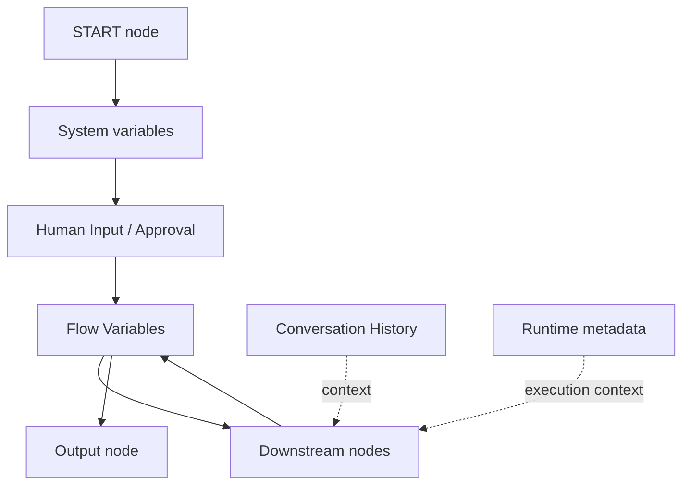

# 11. Runtime Variables, State & End-to-End Test Playbook

**Document Version:** 1.0  
**Status:** Confirmed platform evidence baseline + runtime test methodology  
**Scope:** QI Studio orchestration variable scopes, node outputs, state propagation and repeatable end-to-end testing.

## 1. Purpose

This document establishes the current understanding of how QI Studio separates platform-managed variables, workflow-owned state, conversation history and runtime metadata. It also defines the testing pattern to use while reverse-engineering node behaviour.

The key principle is:

> **A node executing successfully is not the same as a workflow producing the intended user-visible output.**
>
> Execution state must be explicitly mapped into Flow Variables or node/output contracts before downstream nodes can reliably consume it.

---

# 2. Variable Scope Model

The Variables UI exposes five logical areas:

1. **Flow**
2. **System**
3. **Conversation History**
4. **Runtime**
5. **All** as the aggregate view

These areas should not be treated as interchangeable storage locations.

## 2.1 Flow Variables

Flow variables are orchestration-owned state created through the Variables UI.

The Add New Variable dialog confirms:

| Property | Confirmed options |
|---|---|
| Variable Name | User-defined |
| Type | String, Number, Boolean, Array, Object |
| Scope | Flow or System |
| Description | Optional |
| Default Value | Optional |

**Current implementation rule:** use **Flow scope** for normal workflow-owned state unless System-scope custom variables have been explicitly tested and documented.

Examples:

- `flow.startTestResult`
- `flow.agentResult`
- `flow.approvalDecision`
- `flow.evaluationConfiguration`
- `flow.evaluationResult`

## 2.2 System Variables

The Variables UI currently exposes eight system variables. They are marked read-only.

| System variable | Type | Meaning | Ownership |
|---|---|---|---|
| `system.userQuery` | string | User's incoming request | Engine |
| `system.sessionId` | string | Current session identifier | Engine |
| `system.timestamp` | number | Execution timestamp / epoch representation | Engine |
| `system.dateTime.utcNow` | string | UTC ISO timestamp captured at run start | Engine |
| `system.attachments` | array | Incoming user attachments | Engine |
| `system.files` | array | Files available/created within the workflow context | Engine |
| `system.humanInput` | string | Human input collected during a paused workflow | Engine |
| `system.uiAction` | object | UI action payload | Engine |

These are platform-managed state surfaces. Nodes may populate some of them, but the workflow should not assume they are writable through ordinary Flow Variable updates.

## 2.3 Conversation History

The Variables UI exposes:

`conversationHistory`

Type: `BaseMessage[]` / conversation-history structure.

This represents conversation context rather than ordinary application state.

The UI also indicates that agent nodes can expose per-agent conversation histories in addition to the root conversation history.

**Do not use conversation history as a substitute for explicit Flow Variables.** A workflow value that downstream nodes must reliably consume should have a deliberate variable/state contract.

## 2.4 Runtime Variables

The Runtime tab exposes read-only execution metadata, including:

- `runtime.envVars.baseURL`
- `runtime.headers.Authorization`
- `runtime.workflowMetaData.workflowId`
- `runtime.workflowMetaData.moduleId`
- `runtime.workflowMetaData.bpc`
- `runtime.workflowMetaData.environment`
- `runtime.workflowMetaData.version`
- `runtime.workflowMetaData.agentName`

Runtime variables describe where/how the orchestration is executing. They should be treated as metadata, not business state.

## 2.5 Scope Decision Rule

Use the following default classification:

| Requirement | Correct location |
|---|---|
| User request supplied at run start | System |
| Session / engine metadata | System / Runtime |
| Current conversation messages | Conversation History |
| Workflow business state | Flow |
| Deterministic calculation result | Flow |
| Human-confirmed configuration | Flow |
| Generated report / result object | Flow |
| Execution environment metadata | Runtime |

### Open question

The UI permits choosing **System** scope in the Add New Variable dialog. The semantics and persistence rules for user-created System-scope variables have not yet been runtime-verified. Until verified, do not use this scope for production workflow state.

---

# 3. Node Output vs Workflow Variable

A node can expose output values without those values automatically becoming the final user-visible response.

The START-node runtime test demonstrated this distinction.

Example execution state:

```text
nodes.start.success = true
nodes.start.interface.inputs.message = "hi"
system.userQuery = "hi"
```

A Human Input step subsequently produced:

```text
nodes.human_input_0.input = "START_TEST"
system.humanInput = "START_TEST"
```

The overall execution completed successfully, but the Output node initially returned:

`No response content found in the execution result. Please try again.`

### Root cause

The workflow had successfully collected a value, but the Output node had not been explicitly configured to consume a variable containing the intended final response.

### Confirmed design lesson

> **Execution success, node output and final response are three separate concerns.**

A proper data path is:

```text
Node executes
    ↓
Node produces output
    ↓
Output/state contract captures the value
    ↓
Flow Variable or downstream node consumes the value
    ↓
Output node is explicitly configured to return it
```

---

# 4. Confirmed Human Input Behaviour

The Human Input node documentation and UI show:

- It pauses orchestration.
- It asks a person a free-form question.
- It stores the answer into a configured variable.
- The displayed example uses `system.humanInput`.
- Its output variables include `input` and `variableTarget`.
- It can expose State Update configuration.

A runtime test confirmed the following:

```json
{
  "hitlType": "human_input",
  "message": "Please enter \"START_TEST\"",
  "variableTarget": "system.humanInput"
}
```

After the user entered `START_TEST`:

```text
system.humanInput = START_TEST
```

And the node reported success:

```text
nodes.human_input_0.success = true
```

### Human Input vs Approval

Use Human Input when the workflow needs information.

Use Approval when the workflow needs a binary decision with routing.

```text
Human Input
    answer → variable

Approval
    Approve → Approved route
    Reject  → Rejected route
```

---

# 5. START Node End-to-End Test

## 5.1 Objective

Verify that the START node correctly accepts its inputs, exposes them through runtime state, and can pass information to a downstream node and ultimately to the Output node.

## 5.2 Minimal test flow

```text
START
  ↓
HUMAN INPUT
  ↓
FLOW VARIABLE ASSIGNMENT
  ↓
OUTPUT
```

## 5.3 Test configuration

### START

Message:

```text
hi
```

Expected observable state:

```text
system.userQuery = "hi"
```

### HUMAN INPUT

Question:

```text
Please enter START_TEST
```

Save response as:

```text
system.humanInput
```

Expected observable state:

```text
system.humanInput = "START_TEST"
```

### FLOW VARIABLE

Create:

```text
Name: startTestResult
Type: String
Scope: Flow
Description: Stores the result of the START node end-to-end test.
```

The test flow should explicitly copy:

```text
flow.startTestResult = system.humanInput
```

### OUTPUT

Configure the Output node to consume:

```text
flow.startTestResult
```

Expected user-visible result:

```text
START_TEST
```

## 5.4 Pass criteria

The test passes only when all of the following are true:

1. START executes successfully.
2. The original input is visible in the expected system state.
3. Human Input pauses and resumes correctly.
4. The entered response appears in `system.humanInput`.
5. The response is explicitly transferred into a Flow Variable.
6. The Output node explicitly consumes that Flow Variable.
7. The user sees `START_TEST` as the final response.

## 5.5 Failure interpretation

| Observation | Likely problem |
|---|---|
| START fails | START configuration or runtime issue |
| START succeeds but no userQuery | Input/state exposure issue |
| Human Input does not pause | HITL/resume issue |
| Human Input succeeds but variable is empty | Save Response As / variable-target issue |
| Flow variable is empty | Missing State Update / assignment path |
| Everything executes but Output says no response content | Output node has no response variable configured |

---

# 6. General Node Test Pattern

Every node should be tested at four levels.

## Level 1 - UI Contract

Record:

- visible configuration fields
- parameter types
- required/optional flags
- available output variables
- available state updates
- routing handles
- advanced options

## Level 2 - Runtime Contract

Run the smallest possible test and record:

- node input
- node output
- node success/failure
- state changes
- variable changes
- pause/resume metadata, if applicable

## Level 3 - Downstream Contract

Test whether another node can actually consume the value.

A value existing in raw execution JSON is not enough.

## Level 4 - User-visible Contract

Verify the actual final behaviour presented to the person interacting with the orchestration.

Only after Level 4 should behaviour be marked runtime-confirmed.

---

# 7. Evidence Recording Standard

Each investigated capability should be recorded with:

```text
Node / Tool
Purpose
UI evidence
Observed configuration
Input contract
Output contract
State effects
Routing effects
Runtime evidence
Known limitations
Open questions
Test case
Expected result
Actual result
Status
```

Use these statuses consistently:

- **Confirmed** - directly demonstrated by supplied UI/platform evidence.
- **Working understanding** - strongly supported interpretation, not yet fully runtime-proven.
- **Runtime confirmed** - successfully demonstrated in an execution test.
- **Pending evidence** - capability known but insufficient evidence.
- **Contradicted** - a prior assumption was disproven by later evidence.

---

# 8. Current Verified State Architecture



The architectural rule is:

> **System and Runtime provide engine context. Flow Variables carry workflow state. Conversation History carries conversational context. Output requires an explicit response source.**

---

# 9. Immediate Next Tests

1. **Flow Variable lifecycle**: create → write → read → output.
2. **Output node contract**: identify exactly how variables are selected as final response content.
3. **State Update semantics**: confirm how a node writes to a Flow Variable.
4. **System-scope custom variable**: determine whether user-created System variables are permitted, persistent, writable and exposed like built-in System variables.
5. **Agent node**: test how agent output maps into Flow Variables and Output.
6. **Approval node**: verify decision value, routing and resume state.
7. **Tool node**: verify tool result storage, variable path, Return Direct and Response Filtering.

---

# 10. Non-Negotiable Testing Rule

Never mark a node as fully understood solely because:

- the UI displays an option,
- the node returns `success: true`, or
- a value exists somewhere in the execution JSON.

A capability is considered **runtime confirmed** only after the full intended data path has been demonstrated end-to-end.
