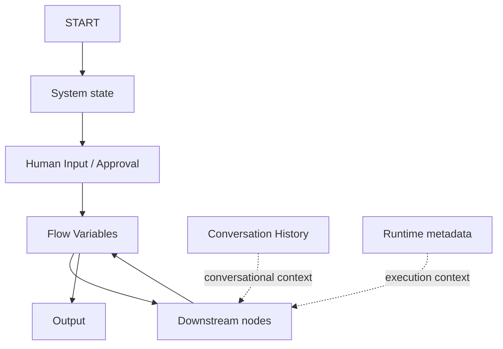

# 12. End-to-End Node Test Log

**Document Version:** 1.0  
**Status:** Active runtime test record  
**Scope:** End-to-end validation of QI Studio orchestration nodes, variable propagation, node outputs and final Output behaviour.  
**Started:** 23 Aug 2026

This log records actual runtime executions. It is intentionally separate from the platform capability register so that observed execution evidence can be distinguished from UI-only configuration evidence.

---

# 1. Testing Standard

A node is not considered fully understood merely because:

- the UI exposes a configuration option,
- the node returns `success: true`, or
- a value appears somewhere in the execution JSON.

A capability becomes **Runtime Confirmed** only when the intended data path is demonstrated end-to-end and the downstream/user-visible result is correct.

Each test therefore records four layers:

1. **UI contract** - what the node exposes.
2. **Runtime contract** - what the execution actually produces.
3. **Downstream contract** - whether another node can consume the value.
4. **User-visible contract** - whether the final Output behaves as intended.

---

# 2. Test Status Model

| Status | Meaning |
|---|---|
| PASS - Runtime Confirmed | End-to-end behaviour successfully demonstrated. |
| PASS - Runtime Partial | Core execution works, but an important downstream or edge behaviour remains untested. |
| FAIL | Expected behaviour was not achieved. |
| BLOCKED | Test could not be completed because another component/configuration was missing. |
| PENDING | Test has been designed but not yet executed. |
| SUPERSEDED | Earlier assumption/test design was replaced by later evidence. |

---

# 3. TEST-START-001 - START → Human Input → Flow Variable → Output

## 3.1 Objective

Verify the complete path from the START node through Human Input, into a user-created Flow Variable, and finally into the Output node.

This test is specifically designed to prove that workflow state must be explicitly mapped to a Flow Variable before the Output node can reliably return it.

## 3.2 Test topology

```text
START
  ↓
HUMAN INPUT
  ↓
FLOW VARIABLE
  ↓
OUTPUT
```

## 3.3 Configuration used

### START node

Input message:

```text
hello
```

Expected engine exposure:

```text
system.userQuery = "hello"
```

### Human Input node

Question:

```text
Please enter "START_TEST"
```

Save Response As:

```text
flow.startTestResponse
```

The Flow Variable had been created through the Variables UI as:

```text
Name: startTestResponse
Type: String
Scope: Flow
```

### Output node

The Output node was explicitly configured to return the Flow Variable:

```text
flow.startTestResponse
```

Expected final user-visible response:

```text
START_TEST
```

---

# 4. Actual Runtime Result

## 4.1 Overall execution

```text
status = completed
```

The complete orchestration finished successfully.

## 4.2 START runtime evidence

The execution result showed:

```json
{
  "nodeId": "start",
  "nodeType": "start",
  "name": "start",
  "type": "start",
  "success": true,
  "interface": {
    "inputs": {
      "message": "hello"
    }
  }
}
```

This confirms that START received the supplied input and executed successfully.

The same execution also exposed:

```text
system.userQuery = "hello"
```

### START conclusion

**PASS - Runtime Confirmed**

The START node accepts the incoming message and exposes the expected system-level request state.

---

# 5. Human Input Runtime Evidence

The runtime resume state showed:

```json
{
  "hitlType": "human_input",
  "message": "Please enter \"START_TEST\"",
  "variableTarget": "flow.startTestResponse"
}
```

This proves that the workflow entered a Human Input checkpoint and that the checkpoint was configured to write to a Flow Variable rather than the built-in `system.humanInput` variable.

After the user supplied the response, the node result showed:

```json
{
  "input": "START_TEST",
  "variableTarget": "flow.startTestResponse",
  "success": true,
  "name": "human_input_0",
  "type": "human_input"
}
```

The final workflow state contained:

```json
{
  "flow": {
    "startTestResponse": "START_TEST"
  }
}
```

### Human Input conclusion

**PASS - Runtime Confirmed**

The Human Input node can pause execution, resume after a user response, and populate a user-created Flow Variable with the response.

This is stronger evidence than the earlier UI-only observation that the Human Input node can save a response to `system.humanInput`.

---

# 6. Output Runtime Evidence

The Output node completed successfully and produced:

```json
{
  "nodeType": "output",
  "nodeId": "output_0",
  "name": "output_0",
  "type": "output",
  "success": true,
  "output": {
    "messages": "START_TEST",
    "selectedAgentId": "...",
    "selectedAgentName": "rfp-qualitative-agent"
  }
}
```

The important field is:

```text
output.messages = "START_TEST"
```

The final visible response therefore came from the explicitly configured Flow Variable.

### Output conclusion

**PASS - Runtime Confirmed**

The Output node can consume an explicitly configured Flow Variable and expose its value as final response content.

---

# 7. Test Result Matrix

| Test element | Expected | Actual | Status |
|---|---|---|---|
| START receives message | `hello` | `hello` | PASS |
| START succeeds | `true` | `true` | PASS |
| START exposes user query | `system.userQuery = hello` | Confirmed | PASS |
| Human Input pauses workflow | HITL checkpoint | Confirmed | PASS |
| Human Input captures answer | `START_TEST` | `START_TEST` | PASS |
| Human Input writes Flow Variable | `flow.startTestResponse` | Confirmed | PASS |
| Flow variable contains answer | `START_TEST` | `START_TEST` | PASS |
| Output consumes Flow Variable | Explicit mapping | Confirmed | PASS |
| Output returns response | `START_TEST` | `START_TEST` | PASS |
| Workflow completes | `completed` | `completed` | PASS |

### Overall result

**PASS - Runtime Confirmed**

---

# 8. Important Findings

## 8.1 Flow Variables are real runtime state

The test proves that a Flow Variable created in the Variables UI is not merely a design-time placeholder. Once a Human Input node targets it, the value appears in the runtime `flow` state and remains available to downstream processing.

Confirmed runtime path:

```text
Human Input response
      ↓
flow.startTestResponse
      ↓
Output node
      ↓
output.messages
```

## 8.2 Output must have an explicit response source

An earlier test run produced the user-facing error:

```text
No response content found in the execution result. Please try again.
```

The workflow itself had executed successfully, but the Output node had not been given the variable that contained the intended response.

This establishes an important architectural rule:

> **Successful execution does not automatically imply valid final response content.**

The Output node needs an explicit response source.

## 8.3 Node output and Flow Variable state are different layers

The Human Input node exposes its own output object:

```text
nodes.human_input_0.input
nodes.human_input_0.variableTarget
```

At the same time, the workflow state contains:

```text
flow.startTestResponse
```

These are related but distinct runtime surfaces.

## 8.4 Conversation history is not equivalent to workflow state

The execution's root `conversationHistory` still contained the original START message (`hello`). The Human Input answer (`START_TEST`) was not automatically represented there as an ordinary conversational message.

Therefore:

```text
Conversation History ≠ Flow State
```

Use Flow Variables for workflow state that downstream nodes must consume reliably.

## 8.5 Human Input can target Flow scope

The UI documentation/example showed `system.humanInput`, but this runtime test proves that the Human Input node can instead target a user-created Flow Variable.

This distinction must be preserved in future documentation:

```text
Built-in example:
system.humanInput

Runtime-confirmed custom workflow state:
flow.startTestResponse
```

---

# 9. Earlier Failed/Partial Test - START → Human Input → Output Without Explicit Output Mapping

This earlier run is retained because it is valuable evidence of the failure mode.

Observed runtime behaviour:

```text
START success = true
Human Input success = true
system.humanInput = START_TEST
workflow status = completed
```

But the user-visible response was:

```text
No response content found in the execution result. Please try again.
```

### Interpretation

The failure was not caused by START or Human Input execution.

The problem was downstream response resolution: the Output node did not have an explicit response variable/content source configured.

### Status

**SUPERSEDED by TEST-START-001, but retained as a regression test case.**

---

# 10. Regression Test Derived From This Finding

## TEST-OUTPUT-001

Purpose: verify that the Output node does not silently infer the desired response from arbitrary node state.

### Test

1. Run START.
2. Capture a value in Human Input.
3. Do not configure Output with that variable.
4. Complete the orchestration.

### Expected behaviour to document

The Output node should either:

- require a response source during configuration/validation, or
- return a clear `No response content found` result at runtime.

### Status

**Pending formal rerun**

The earlier run strongly suggests this behaviour, but the regression should be intentionally rerun and recorded as a dedicated test.

---

# 11. Next End-to-End Tests

The next tests should build progressively from the confirmed state model rather than testing isolated controls.

## TEST-FLOW-002 - Flow Variable Lifecycle

```text
Create Flow Variable
      ↓
Write value
      ↓
Read value downstream
      ↓
Return value
```

Objective: prove create → write → read → output without Human Input being the only writer.

## TEST-SYSTEM-003 - Built-in vs Custom System Variable

Determine whether a user-created System-scope variable behaves differently from built-in read-only System variables.

Questions:

- Can it be written by State Update?
- Does it persist across node boundaries?
- Does it survive HITL resume?
- Is it readable through the same expression syntax?
- Is it exposed as read-only in the Variables UI after creation?

## TEST-AGENT-004 - Agent Output Contract

```text
START
  ↓
Agent
  ↓
Flow Variable
  ↓
Output
```

Determine:

- what the Agent node returns,
- what appears under `nodes.<agent>.` runtime state,
- how an Agent result is mapped to a Flow Variable,
- whether the Agent's conversation history is separate from root conversation history,
- how Output consumes the Agent result.

## TEST-APPROVAL-005 - Approval Contract

```text
START
  ↓
APPROVAL
  ├── Approved → continuation
  └── Rejected → alternative/end
```

Determine:

- exact `decision` value,
- routing semantics,
- resume metadata,
- persistence across the pause,
- whether decision metadata includes actor/time information.

## TEST-TOOL-006 - Agent Tool Result Contract

For a simple tool:

```text
Agent
  ↓
Tool
  ↓
Store Tool Output / Variable Path
  ↓
Downstream node
  ↓
Output
```

Test separately:

- normal tool result,
- `Store Tool Output`,
- variable path,
- `Return Direct`,
- Response Filtering,
- tool-level Human-in-the-Loop,
- State Update.

---

# 12. Current Verified Architecture



### Current architectural rule

> **System and Runtime provide engine context. Flow Variables carry workflow state. Conversation History carries conversational context. Nodes can expose runtime outputs, but downstream data paths should be explicit. Output requires an explicit response source.**

---

# 13. Evidence Handling Rule

When later evidence conflicts with an earlier assumption:

1. Keep the earlier observation in the test history.
2. Mark it as `SUPERSEDED` or `CONTRADICTED`.
3. Record the newer runtime evidence.
4. Update the platform understanding document.
5. Never silently delete a failed test that explains why the current design exists.

This keeps the repository useful as a reverse-engineering record rather than merely a final-state design document.
