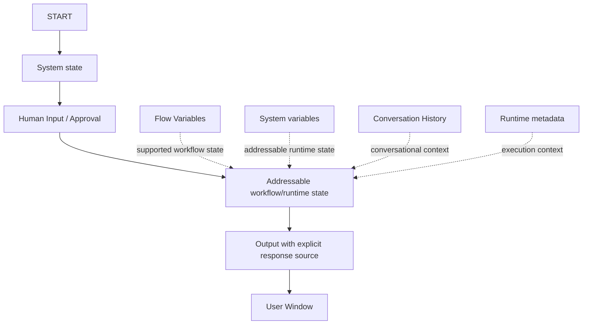

# 12. End-to-End Node Test Log

**Document Version:** 1.2  
**Status:** Active runtime test record  
**Scope:** End-to-end validation of QI Studio orchestration nodes, variable propagation, node outputs and final Output behaviour.  
**Started:** 23 Aug 2026

This log records actual runtime executions. It is intentionally separate from the platform capability register so that observed execution evidence can be distinguished from UI-only configuration evidence.

---

# 1. Testing Standard

A node is not considered fully understood merely because:

- the UI exposes a configuration option,
- the node returns `success: true`, or
- a value appears somewhere in the execution JSON.

A capability becomes **Runtime Confirmed** only when the intended data path is demonstrated end-to-end and the downstream/user-visible result is correct.

Each test therefore records four layers:

1. **UI contract** - what the node exposes.
2. **Runtime contract** - what the execution actually produces.
3. **Downstream contract** - whether another node can consume the value.
4. **User-visible contract** - whether the final Output behaves as intended.

---

# 2. Test Status Model

| Status | Meaning |
|---|---|
| PASS - Runtime Confirmed | End-to-end behaviour successfully demonstrated. |
| PASS - Runtime Partial | Core execution works, but an important downstream or edge behaviour remains untested. |
| FAIL | Expected behaviour was not achieved. |
| BLOCKED | Test could not be completed because another component/configuration was missing. |
| PENDING | Test has been designed but not yet executed. |
| SUPERSEDED | Earlier assumption/test design was replaced by later evidence. |

---

# 3. TEST-START-001 - START → Human Input → Flow Variable → Output

## 3.1 Objective

Verify the complete path from the START node through Human Input, into a user-created Flow Variable, and finally into the Output node.

## 3.2 Configuration

START message:

```text
hello
```

Human Input question:

```text
Please enter "START_TEST"
```

Human Input Save Response As:

```text
flow.startTestResponse
```

Flow Variable:

```text
Name: startTestResponse
Type: String
Scope: Flow
```

Output response source:

```text
{{flow.startTestResponse}}
```

Expected final user-visible response:

```text
START_TEST
```

## 3.3 Runtime evidence

The run completed successfully and the START node reported `success: true` with:

```text
system.userQuery = "hello"
```

The Human Input checkpoint recorded:

```text
hitlType = human_input
variableTarget = flow.startTestResponse
```

The Human Input result recorded:

```text
input = START_TEST
variableTarget = flow.startTestResponse
success = true
```

The Flow state in the successful Flow-target execution contained:

```text
flow.startTestResponse = START_TEST
```

The Output node returned:

```text
output.messages = START_TEST
```

and the User Window displayed:

```text
START_TEST
```

### Current status

**PASS - Runtime Partial**

START and Human Input targeting a Flow Variable are runtime-confirmed. Final Output visibility is also confirmed, but the exact Output resolution path is kept under controlled comparison because a later test produced the same final response from `system.humanInput` while the Flow Variable remained empty.

---

# 4. TEST-START-002 - START → Human Input(system.humanInput) → Output(system.humanInput)

## 4.1 Objective

Determine whether the built-in System variable `system.humanInput` can be used directly as the Output response source, and compare that behaviour against the Flow Variable path.

## 4.2 Controlled change from TEST-START-001

Everything was kept identical except:

Human Input Save Response As changed from:

```text
flow.startTestResponse
```

to:

```text
system.humanInput
```

Output response reference changed to:

```text
{{system.humanInput}}
```

No other workflow configuration was intentionally changed.

## 4.3 Actual runtime result

The execution returned:

```json
{
  "flow": {
    "startTestResponse": ""
  },
  "system": {
    "userQuery": "hello",
    "humanInput": "START_TEST"
  },
  "nodes": {
    "start": {
      "success": true
    },
    "human_input_0": {
      "input": "START_TEST",
      "variableTarget": "system.humanInput",
      "success": true
    },
    "output_0": {
      "success": true,
      "output": {
        "messages": "START_TEST"
      }
    }
  },
  "status": "completed"
}
```

The checkpoint state explicitly recorded:

```text
hitlType = human_input
message = Please enter "START_TEST"
variableTarget = system.humanInput
```

The User Window displayed:

```text
START_TEST
```

## 4.4 Key observation

The final execution envelope simultaneously showed:

```text
flow.startTestResponse = ""
system.humanInput = "START_TEST"
output.messages = "START_TEST"
```

Therefore, the Flow Variable was not required for this particular successful output path.

## 4.5 What this proves

**Runtime Confirmed for this exact path:**

1. Human Input can write to `system.humanInput`.
2. The value survives the HITL pause/resume.
3. Output can consume `{{system.humanInput}}` directly.
4. Output can return the resolved value as `output.messages`.
5. The User Window displays the resolved value.

## 4.6 What this does NOT prove

This run does **not** prove that Output automatically searches System variables. The Output node was explicitly configured with:

```text
{{system.humanInput}}
```

It also does not prove identical lifecycle semantics between built-in System variables and user-created Flow Variables.

### Status

**PASS - Runtime Confirmed**

---

# 5. Comparison - Flow Variable vs System Variable Output Path

| Aspect | TEST-START-001 | TEST-START-002 |
|---|---|---|
| Human Input target | `flow.startTestResponse` | `system.humanInput` |
| Human response | `START_TEST` | `START_TEST` |
| Final target state | Flow Variable populated in preceding Flow-target run | System variable populated |
| Output expression | `{{flow.startTestResponse}}` | `{{system.humanInput}}` |
| Output success | Yes | Yes |
| `output.messages` | `START_TEST` | `START_TEST` |
| User Window | `START_TEST` | `START_TEST` |
| Current status | Runtime Partial pending isolated linkage test | Runtime Confirmed for exact path |

### Updated architectural implication

The evidence now supports the more precise rule:

> **The Output node requires an explicit response source. The source is not limited to Flow Variables; at least the built-in `system.humanInput` variable can be addressed explicitly.**

The full set of supported response-source expressions remains to be mapped.

---

# 6. Earlier Failure - No Explicit Output Mapping

An earlier run had:

```text
START success = true
Human Input success = true
system.humanInput = START_TEST
workflow status = completed
```

but the User Window returned:

```text
No response content found in the execution result. Please try again.
```

This is retained as a valuable regression case.

### Current interpretation

The failure occurred because the intended response value had not been explicitly configured as the Output response source.

### Status

**SUPERSEDED as a working explanation, retained as regression evidence.**

The direct `{{system.humanInput}}` test now provides controlled evidence that explicit response-source configuration resolves the response correctly.

---

# 7. Important Runtime Findings

## 7.1 Flow Variables are real runtime state

The earlier Flow-target Human Input test demonstrated that a user-created Flow Variable can contain the Human Input response and appear in runtime `flow` state.

## 7.2 Built-in System variables can be explicit response sources

TEST-START-002 demonstrates direct consumption of:

```text
{{system.humanInput}}
```

by the Output node.

## 7.3 Output resolution is explicit

The current evidence supports this model:

```text
Node / HITL produces value
        ↓
Addressable runtime variable
        ↓
Output configured with explicit response source
        ↓
output.messages
        ↓
User Window
```

## 7.4 Node output and workflow state are separate surfaces

Human Input exposes node-level runtime values such as:

```text
nodes.human_input_0.input
nodes.human_input_0.variableTarget
```

while the targeted value is also visible in workflow/runtime state:

```text
flow.startTestResponse
```

or:

```text
system.humanInput
```

## 7.5 Conversation History is not the same as workflow state

The tested execution retained the original START message (`hello`) in root `conversationHistory`. The Human Input response did not automatically become an ordinary root conversation message.

Therefore:

```text
Conversation History ≠ Workflow State
```

---

# 8. Regression Test - Explicit vs Missing Output Source

## TEST-OUTPUT-001

### Case A - Missing response source

Run START and Human Input, but leave Output without an explicit response source.

Expected based on the earlier observed run:

```text
No response content found in the execution result. Please try again.
```

Status:

**PENDING intentional rerun**

### Case B - Explicit System variable

```text
{{system.humanInput}}
```

Observed:

```text
START_TEST
```

Status:

**Runtime Confirmed through TEST-START-002**

### Case C - Explicit Flow variable

```text
{{flow.startTestResponse}}
```

with the Flow Variable populated by Human Input.

Status:

**PENDING controlled rerun to isolate and prove the Flow Variable → Output linkage.**

---

# 9. Next End-to-End Tests

## TEST-FLOW-002 - Flow Variable Lifecycle

```text
Create Flow Variable
      ↓
Write value
      ↓
Read value downstream
      ↓
Return value
```

Objective: prove create → write → read → output without Human Input being the only writer.

## TEST-SYSTEM-003 - Built-in vs Custom System Variable

Test a user-created System-scope variable against built-in `system.humanInput`.

Questions:

- Can it be written by State Update?
- Does it persist across node boundaries?
- Does it survive HITL resume?
- Is it addressable with the same expression syntax?
- Does it become read-only in the Variables UI?

## TEST-AGENT-004 - Agent Output Contract

```text
START
  ↓
Agent
  ↓
Explicit response source / Flow Variable
  ↓
Output
```

Determine the Agent node runtime output, variable mapping, and Output consumption contract.

## TEST-APPROVAL-005 - Approval Contract

```text
START
  ↓
APPROVAL
  ├── Approved → continuation
  └── Rejected → alternative/end
```

Determine exact decision value, routing, resume state and metadata.

## TEST-TOOL-006 - Agent Tool Result Contract

Test normal tool result, Store Tool Output, Variable Path, Return Direct, Response Filtering, tool-level HITL, and State Update.

---

# 10. Current Verified Architecture



### Current architectural rule

> **System and Runtime provide engine context. Flow Variables carry workflow state. Conversation History carries conversational context. Nodes can expose runtime outputs, but downstream data paths should be explicit. The Output node requires an explicit response source, and that source can be a Flow Variable or another addressable runtime variable.**

---

# 11. Evidence Handling Rule

When later evidence conflicts with an earlier assumption:

1. Keep the earlier observation in the test history.
2. Mark it as `SUPERSEDED` or `CONTRADICTED`.
3. Record the newer runtime evidence.
4. Update the platform understanding document.
5. Never silently delete a failed test that explains why the current design exists.

---

# 12. Latest Runtime Evidence Record - TEST-START-002

**Execution time:** 23 Aug 2026 14:17:54 UTC  
**Input:** `hello`  
**Human response:** `START_TEST`

Controlled configuration:

```text
Human Input → system.humanInput
Output → {{system.humanInput}}
```

Key returned state:

```text
flow.startTestResponse = ""
system.humanInput = "START_TEST"
nodes.human_input_0.input = "START_TEST"
nodes.human_input_0.variableTarget = "system.humanInput"
nodes.human_input_0.success = true
nodes.output_0.success = true
nodes.output_0.output.messages = "START_TEST"
status = completed
```

User Window:

```text
START_TEST
```

### Final status

**TEST-START-002: PASS - Runtime Confirmed**

This is the authoritative runtime evidence for:

```text
Human Input → system.humanInput → explicitly configured Output → User Window
```

The Flow Variable path remains separate and should not be inferred from this result.