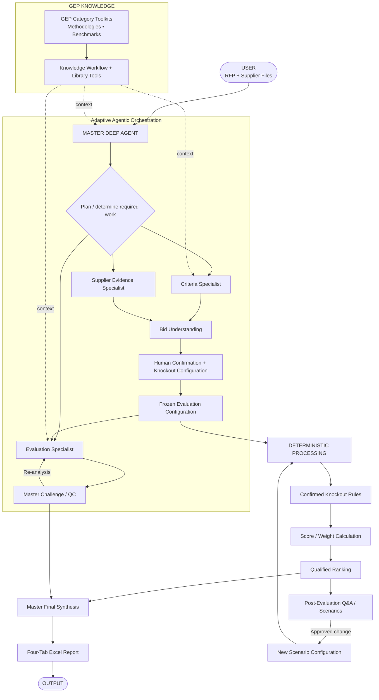

# RFP Qualitative Bid Analysis Agent

## Software Design Specification (SDS)

**Project Codename:** Project Athena

**Version:** 1.3

**Status:** Deep Agent + GEP Knowledge + Human-in-the-Loop Architecture Baseline

**Platform:** GEP Quantum Intelligence Studio (QI Studio)

## Purpose

This repository contains the architecture, requirements, orchestration, data contracts and implementation specifications for the RFP Qualitative Bid Analysis Agent.

The solution combines agentic orchestration, GEP internal knowledge, human governance and deterministic evaluation processing.

## V1.3 Product Principle

```text
Upload the files you already have
        ↓
Agent understands them
        ↓
Relevant GEP knowledge enriches interpretation
        ↓
Agent shows what it understood
        ↓
Human confirms / corrects + defines knockouts
        ↓
Evaluation configuration freezes
        ↓
Agent evaluates using evidence + approved context
        ↓
Deterministic rules / scoring / weighting / ranking
        ↓
Master explains the result
        ↓
Four-tab Excel report
```

Users are not required to know internal filenames, sheet names, column names or templates.

## Core Architecture



## GEP Knowledge Layer

GEP category toolkits and internal knowledge are accessed through Knowledge Library tools. They are a **contextual capability layer**, not a fourth sub-agent.

### Current knowledge-tool initialization rule

For every knowledge-related agent invocation, the current supplied platform contract requires:

```text
get-knowledge-workflow-instructions
        ↓
get_library_metadata
        ↓
source-specific knowledge tools
```

For data-search knowledge, the known sequence continues through `get_data_search_fields` before search execution. Mandatory `default_filters`, when supplied by the schema, are treated as access-control constraints.

Knowledge can inform category interpretation, benchmarks, evaluation guidance, methodology, terminology and procurement synthesis.

Knowledge cannot silently override the RFP, supplier evidence or human-confirmed evaluation configuration.

## Authority Model

```text
Human-confirmed Evaluation Configuration — run authority
                    ↑
RFP / Sourcing Documents — source requirements
                    ↑
GEP Knowledge — contextual guidance / benchmark
                    ↓
AI Semantic Interpretation
```

## Master Deep Agent

One Master Deep Agent is responsible for planning, dynamic delegation, tool and knowledge selection, dependency management, reconciliation, HITL, challenge/QC and final synthesis.

It has at most three direct specialist sub-agents.

## Three Specialist Agents

### 1. RFP & Evaluation Criteria Analyst

Determines what is being evaluated. It may use relevant GEP context but does not create authoritative rules from knowledge alone.

### 2. Supplier Response & Evidence Analyst

Determines what each supplier actually submitted. It is source-first and preserves supplier wording/provenance. It does not score or rank.

### 3. Qualitative Evaluation & Comparison Analyst

Evaluates supplier responses against the confirmed framework using relevant GEP category context. It produces semantic score recommendations, evidence, rationale, strengths, weaknesses, risks and comparisons. It does not own arithmetic, weighting, ranking or confirmed knockout execution.

## Human-in-the-Loop Gate

Before the first evaluation run, the Master creates a **Bid Clarification Package** containing:

- files and detected roles
- suppliers
- evaluation sections/questions
- detected scoring scale/rubric
- detected weights
- candidate knockout requirements
- proposed acceptance conditions
- relevant GEP context used
- ambiguities
- missing information
- explicit facts vs inferred interpretations

The human confirms/corrects the understanding, confirms/modifies scoring and weights, confirms/removes/adds knockout requirements and acceptance conditions, and provides material special instructions.

If the human confirms there are no knockouts, the configuration contains an explicit empty knockout rule set.

## Deterministic Boundary

Semantic qualitative evaluation is AI reasoning and is not mathematically deterministic. Once the human-confirmed configuration and structured semantic score outputs are fixed, the following are deterministic:

- validation
- confirmed knockout execution
- score validation/calculation
- weighting
- ranking
- result assembly

LLMs are never the authoritative arithmetic or ranking engine.

## Standard Output Workbook

The approved output contract contains exactly four primary tabs:

1. **Executive Summary**
2. **Supplier Profiles**
3. **Q&A Scorecard**
4. **Score Legend**

The visual hierarchy and formatting follow the approved reference workbook. The report generator is presentation-only and cannot change evaluation logic.

## Post-Evaluation Scenarios

Completed evaluations remain available for conversational analysis. Approved rule/weight changes create new scenario lineage and preserve the original result.

## Platform Reverse-Engineering Documents

The following maintain platform facts separately from the frozen business architecture:

```text
10 - QI Studio Nodes, Agent Tools & Verification Register.md
11 - Runtime Variables, State & End-to-End Test Playbook.md
12 - End-to-End Node Test Log.md
13 - Current Understanding & Verification Ledger.md
```

`13 - Current Understanding & Verification Ledger.md` is the canonical control document for current understanding, conflicts and pending verification.

## Architecture Invariants

1. One Master Deep Agent.
2. Maximum three direct specialist sub-agents.
3. GEP knowledge is a capability layer, not a fourth agent.
4. Dynamic delegation rather than a rigid pipeline.
5. Human confirmation before the first evaluation run.
6. Human-confirmed knockout rules only.
7. Confirmed configuration is frozen during a run.
8. Deterministic validation, knockout execution, arithmetic, weighting and ranking.
9. Supplier source evidence remains source-faithful.
10. GEP knowledge never silently overrides source or confirmed configuration.
11. Master challenge/QC before final synthesis.
12. Four-tab standardized report.
13. Scenario lineage for approved re-evaluation.
14. No silent invention of procurement rules or supplier facts.
15. Platform runtime claims must be supported by evidence or explicitly marked pending.

## Source of Truth Rule

Implementation in QI Studio shall follow the latest architecture and contract documents in this repository. If a QI Studio limitation requires deviation, the deviation should be documented and tested rather than silently introduced.

## Intended Outcome

> **AI interprets supplier evidence using the confirmed framework and relevant GEP knowledge. Human confirms material evaluation rules. Deterministic logic executes the decision. AI explains the outcome.**
