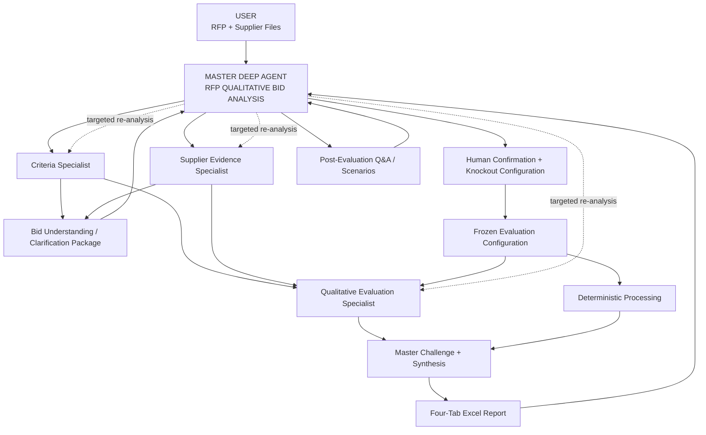

# RFP Qualitative Bid Analysis Agent

## Software Design Specification (SDS)

**Project Codename:** Project Athena

**Version:** 1.2

**Status:** Deep Agent + Human-in-the-Loop Architecture Baseline

**Platform:** GEP Quantum Intelligence Studio (QI Studio)

---

## Purpose

This repository contains the architecture, requirements, orchestration, data contracts and implementation specifications for the **RFP Qualitative Bid Analysis Agent**.

The solution is designed to automate qualitative supplier evaluation while preserving procurement governance, source traceability, deterministic calculations and human control over material evaluation rules.

This repository is the architectural source of truth for implementation.

---

# V1.2 Product Principle

The user experience is intentionally simple:

```text
Upload the files you already have
        ↓
Agent understands them
        ↓
Agent shows what it understood
        ↓
Human confirms / corrects + defines knockouts
        ↓
Agent evaluates
        ↓
Deterministic scoring + ranking
        ↓
Four-tab Excel report
```

Users are not required to know internal filenames, sheet names, column names or templates.

---

# Core Architecture



---

# Master Deep Agent

There is **one Master Deep Agent**.

It is responsible for:

- understanding the request
- planning the work
- deciding which specialist agents are needed
- delegating work
- exploiting parallelism where tasks are independent
- managing dependencies
- creating the Bid Clarification Package
- managing human confirmation
- challenging specialist results
- requesting targeted re-analysis
- synthesizing the final procurement output

The Master has **at most three direct specialist sub-agents** in V1.

---

# Three Specialist Agents

## 1. RFP & Evaluation Criteria Analyst

**Question:** What are we supposed to evaluate?

Discovers:

- sections
- questions
- criteria
- weights
- scoring rubric
- mandatory/candidate knockout requirements
- acceptance-condition candidates
- source provenance

It does not score suppliers.

## 2. Supplier Response & Evidence Analyst

**Question:** What did each supplier actually submit?

Discovers:

- supplier identity
- response boundaries
- original response wording
- evidence
- provenance
- unanswered questions
- mapping confidence

It does not score or rank suppliers.

## 3. Qualitative Evaluation & Comparison Analyst

**Question:** How well does each supplier perform against the confirmed framework?

Produces:

- criterion-level qualitative assessment
- score recommendation
- rationale
- evidence
- strengths
- weaknesses
- risks
- gaps
- supplier comparison

It does not own arithmetic, weighting, ranking or confirmed knockout execution.

---

# Human-in-the-Loop Gate

The agent does **not** immediately start scoring after discovering files.

It first produces a **Bid Clarification Package** containing:

- files and detected roles
- suppliers
- evaluation sections/questions
- detected scoring scale/rubric
- detected weights
- candidate knockout requirements
- proposed acceptance conditions
- ambiguities
- missing information
- explicit facts vs inferred interpretations

The human evaluator then:

- confirms/corrects the understanding
- confirms/modifies scoring/weights
- confirms/removes candidate knockouts
- adds additional knockout requirements
- confirms acceptance conditions
- provides material special instructions

Only then is the Evaluation Configuration frozen and the evaluation run authorized.

If the human says **there are no knockouts**, the configuration contains an explicit empty knockout rule set. The agent never invents one.

---

# Deterministic Boundary

The system deliberately separates semantic reasoning from deterministic execution.

```text
AI
→ discovers and interprets evidence

HUMAN
→ confirms material evaluation rules

DETERMINISTIC PROCESSING
→ validates, executes confirmed knockouts, calculates scores, weights and ranks

AI
→ explains and synthesizes the result
```

LLMs are never the authoritative arithmetic or ranking engine.

---

# Evaluation Pipeline

```text
Raw Files
↓
Master Planning
↓
Criteria + Supplier Discovery
↓
Bid Understanding Package
↓
Human Confirmation
↓
Frozen Evaluation Configuration
↓
Validation
↓
Canonical Evaluation Model
↓
Confirmed Knockout Evaluation
↓
Qualitative Evaluation
↓
Deterministic Score / Weight Calculation
↓
Deterministic Ranking
↓
Master Challenge + Synthesis
↓
Report
```

---

# Standard Output Workbook

The approved output contract contains four primary tabs:

### 1. Executive Summary

Decision-maker view containing:

- supplier qualification/status
- ranking
- overall score
- section-level comparison
- critical findings
- recommendation
- knockout summary

### 2. Supplier Profiles

Supplier-by-supplier view containing:

- rank/status
- overall score
- summary
- strengths
- weaknesses
- risks
- section scores
- recommendation

### 3. Q&A Scorecard

Detailed audit/evaluation view containing, for every question:

- section
- question
- supplier response
- score
- evaluator comment/rationale
- evidence where required

Supplier response wording remains source-faithful.

### 4. Score Legend

Contains the actual scoring scale/rubric and methodology used for the run.

It must not claim an unapproved scoring methodology.

The workbook's visual hierarchy and formatting follow the approved reference workbook design.

---

# Post-Evaluation Scenarios

The completed evaluation remains available for conversational analysis.

Examples:

- "Why did Supplier B rank third?"
- "Compare Supplier A and C on implementation."
- "Show the knockout failure for Supplier B."
- "What happens if implementation weight becomes 30%?"
- "Regenerate the report."

Weight/rule changes create a new scenario and preserve the original result.

---

# Repository Documents

```text
01-Executive-Summary.md
02-Business Requirements.md
03-Solution-Overview.md
04-System-Architecture.md
05-Conversation-State-Machine.md
05A-Data-Flow-Architecture.md
06-Overall-Orchestration.md
07-QI Studio Orchestration Blueprint.md
08 – Flow Variables.md
09-JSON Schemas.md
```

These documents form the V1.2 implementation contract.

---

# Architecture Invariants

1. One Master Deep Agent.
2. Maximum three direct specialist sub-agents.
3. Dynamic delegation rather than a rigid three-agent pipeline.
4. Human confirmation before the first evaluation run.
5. Human-confirmed knockout rules only.
6. Confirmed configuration is frozen during a run.
7. Deterministic validation, arithmetic, weighting and ranking.
8. Source response preservation and provenance.
9. Master challenge/QC before final synthesis.
10. Four-tab standardized report.
11. Scenario lineage for approved re-evaluation.
12. No silent invention of procurement rules or supplier facts.

---

# Source of Truth Rule

Implementation in QI Studio shall follow the latest architecture and contract documents in this repository.

If a QI Studio limitation requires deviation, the deviation should be documented and tested rather than silently introduced.

---

# Intended Outcome

The final experience should feel simple to the procurement user while the complexity remains inside the system:

```text
Upload
  ↓
Understand
  ↓
Confirm
  ↓
Evaluate
  ↓
Validate
  ↓
Rank
  ↓
Report
```

> **AI interprets the evidence. Human confirms the evaluation rules. Deterministic logic executes the decision. AI explains the outcome.**
